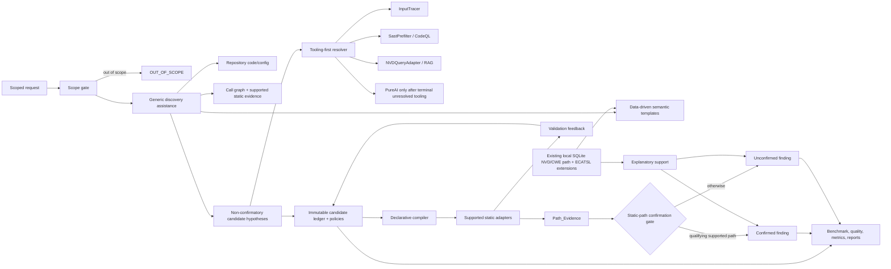

# Technical Design: Evidence-Constrained Taint Specification Learning

## Overview

Evidence-Constrained Adaptive Taint Specification Learning (ECATSL) learns narrow, declarative-only taint specifications from repository evidence and a versioned local vulnerability knowledge database. It is an orchestration, evidence, and audit layer over existing HOS-LS capabilities—not a second scanner, an external catalog service, or a duplicated ingestion pipeline.

The confirmation boundary is strict:

- **Only** `Path_Evidence` produced by a supported `Static_Analysis_Adapter` can establish controllability or a `Confirmed_Finding`.
- A confirming path identifies an entry/source, ordered propagation steps, a sink, and sanitizer absence or failure. A blocking sanitizer makes that path unconfirmed.
- Catalog records, semantic templates, generic endpoint/entrypoint discovery, configuration observations, LLM output, and unsupported-adapter output can create or rank non-confirmatory `Candidate` hypotheses and provide explanation. They never prove controllability or confirmation.
- ECATSL explicitly supports **framework-agnostic automated** endpoint/entrypoint discovery over repository code, repository configuration, call graph, supported static analysis, and data-driven semantic templates. It requires no user-authored per-route configuration.
- The prohibition is narrow: ECATSL rejects only brittle, enumerated, per-route hard-coded rules or patterns that do not generalize across supported repository evidence and force users to maintain individual routes. It does **not** prohibit generic code/config/call-graph/static-analysis discovery, nor data-driven semantic templates.

### Initial scope

The first release supports Python and exactly these mappings:

| CWE | Focus | Reused evidence surface |
|---|---|---|
| CWE-89 | SQL injection | `InputTracer.verify_sql_injection_prerequisites`; SAST/CodeQL output |
| CWE-78 | OS command injection | `InputTracer.trace_controllability`; SAST/CodeQL output |
| CWE-918 | SSRF | `InputTracer.verify_ssrp_prerequisites`; SAST/CodeQL output |

An out-of-scope language or CWE returns `OUT_OF_SCOPE` before downstream candidate, compilation, adapter, or finding work begins. Scope changes are predecessor-linked, provenance-recorded versions.

### Research findings informing reuse

Repository inspection establishes these concrete reuse points:

- `src/nvd/catalog_import.py` already imports official NVD JSON and MITRE CWE XML into SQLite, records source hashes, and performs idempotent SQLite upserts.
- `src/nvd/nvd_query_adapter.py` provides local SQLite CWE/CVE lookup, in-memory indexing, CVSS statistics, and cached queries. `src/nvd/etl_batch_import.py` also supplies existing resumable batch-ETL infrastructure.
- `src/analyzers/input_tracer.py` provides controllability tracing and prerequisite checks. Its results require normalization into the stricter ECATSL `Path_Evidence` contract; they are not automatically confirmation.
- `src/analyzers/sast_prefilter.py` provides existing CodeQL/SAST execution and SARIF hit normalization. ECATSL reuses it rather than adding an analysis runner.
- `src/analyzers/verification_adapter.py` already normalizes findings and initializes the local `NVDQueryAdapter`; ECATSL adds its proof gate after normalization rather than changing its existing general verification semantics.

These findings support a minimal extension to the existing offline SQLite catalog schema and import/query path. No new external store, network-time dependency during analysis, or parallel catalog pipeline is introduced.

## Architecture



### Pipeline stages

A pipeline-stage identity is its versioned input artifact identities/types, transformation purpose, and versioned output artifact identities/types. Equal identities are consolidated to one stage; a consolidation failure is recorded and allows both retained stages to execute.

1. **Scope gate** checks the immutable scope definition.
2. **Discovery assistance** derives possible endpoints, entrypoints, API roles, and hypotheses from repository code/configuration, call graph, supported static evidence, and retrieved semantic templates. It is generic, framework-agnostic, provenance-bearing, and non-confirmatory.
3. **Local catalog ingestion/retrieval** extends the current NVD/CWE SQLite path with version/provenance, normalization, canonicalization, ingestion reports, and template retrieval.
4. **Tooling-first resolution** exhausts applicable existing HOS-LS capability outcomes before any LLM attempt.
5. **Candidate lifecycle** creates immutable candidate versions and applies versioned acceptance/validation policies.
6. **Controlled compilation** emits evidence-bounded declarative rules only.
7. **Static validation** invokes existing InputTracer or CodeQL-oriented functionality through supported adapters.
8. **Confirmation** evaluates supported static `Path_Evidence` only.
9. **Evaluation/reporting** produces immutable benchmark/quality artifacts, measured metrics/costs, reuse inventory, and claim-safe reports.

### Design decisions

| Decision | Rationale |
|---|---|
| Generic discovery is allowed; brittle per-route enumeration is rejected | Meets the corrected route boundary while permitting scalable repository-driven analysis without user maintenance. |
| Extend existing local SQLite catalog | Reuses `CatalogImporter`, `NVDQueryAdapter`, and batch ETL; keeps analysis offline and avoids a new store or duplicated pipeline. |
| Templates rank hypotheses only | Prevents catalog semantics from becoming proof while making local knowledge useful for candidate generation. |
| Static adapters alone produce confirmation proof | Enforces the requirements’ evidence boundary and keeps LLM/catalog/discovery assistance non-authoritative. |
| Append-only ECATSL artifacts | Provides reproducible policy, evidence, and decision lineage without mutating historical state. |

### Reuse inventory

| Capability | Existing reuse | Minimal new responsibility |
|---|---|---|
| Catalog ingest/query | `CatalogImporter`, `NVDQueryAdapter`, `BatchImportManager` | Add ECATSL metadata tables/views and compatibility adapter; do not add a store. |
| Candidate discovery | repository parsers/config readers, call graph, static outputs | Normalize generic observations and rank hypotheses; no per-route config. |
| Static execution | `SastPrefilter` | Normalize supported CodeQL/SAST evidence into adapter results. |
| Controllability tracing | `InputTracer` | Adapt only qualifying traces into `Path_Evidence`. |
| Finding normalization | `VerificationAdapter` | Apply the stricter ECATSL confirmation predicate. |
| LLM fallback | existing PureAI/AI client telemetry | Enforce tool-completion precondition and record attempt provenance. |
| Benchmark inputs | existing `bench/` scripts/data | Add manifest, quality, and paired-evaluation metadata. |
| Persistence | existing SQLite/Pydantic dependencies | Add append-only ECATSL artifact tables and repository API. |

Before implementation, each row becomes a versioned `Reuse_Inventory` entry. A new abstraction requires the unmet interface, all evaluated reuse entries, and a distinct responsibility. An enumerated route-rule component is never an acceptable capability-gap remedy.

## Components and Interfaces

### Scope and orchestrator

`ECATSLService.analyze(request) -> AnalysisResult` validates the versioned scope, creates stage artifacts, and coordinates the single pipeline. `AnalysisRequest` contains repository reference, language, requested CWEs, and optional analysis configuration; it has no per-route configuration field. Out-of-scope input short-circuits all downstream work.

### Generic discovery assistance

```python
class DiscoveryAssistance(Protocol):
    def discover(
        self,
        repository_ref: RepositoryRef,
        scope: ScopeDefinition,
        catalog_context: CatalogContext,
    ) -> list[DiscoveryObservation]: ...

    def rank(
        self,
        observations: list[DiscoveryObservation],
        templates: list[TaintTemplate],
    ) -> list[CandidateHypothesis]: ...
```

`DiscoveryObservation` is derived from one or more of repository code, repository-contained configuration, call graph, supported static-analysis output, and semantic-template retrieval. It records locations, source content identities, producer/version, transformation history, and derivation kind. Endpoint or route metadata may be included as repository-derived context.

`DiscoveryPolicy.validate(strategy) -> ValidationResult` permits generic structural/configuration/call-graph/static-analysis strategies and data-driven templates. It rejects a strategy only when all of the following are true: it enumerates individual routes/patterns, is hard-coded rather than evidence/data-driven, does not generalize across supported evidence, and requires user maintenance of route entries. A generic parser for repository configuration or a framework-agnostic call-graph traversal is valid; user-authored route lists are not accepted.

Discovery may identify a possible source, sink, sanitizer, precondition, endpoint, or entrypoint. It produces only `CandidateHypothesis` with `Catalog_Evidence` and/or discovery provenance. It never emits a confirmed finding, controllability decision, or `Path_Evidence` proof.

### Local Vulnerability Knowledge Database

`VulnerabilityKnowledgeRepository` is a thin schema/API extension over the same SQLite database used by `CatalogImporter` and read by `NVDQueryAdapter`. Existing `cve`, `cwe`, `cvss`, `cve_cwe`, and `catalog_import` data remain canonical base catalog storage. The ECATSL migration adds metadata and derived-data tables, foreign-keyed where possible:

```text
catalog_import_version(import_id, source_kind, source_origin, source_identifier,
  source_revision, retrieved_at, retrieved_content_hash, license_metadata,
  import_tool_version, predecessor_id, created_at)
source_record(record_id, import_id, record_type, source_identifier,
  source_content_hash, raw_reference, integrity_status, provenance_json)
normalized_catalog_record(normalized_id, record_type, canonical_identifier,
  normalized_content_hash, normalization_profile_version, canonical_id,
  provenance_json)
catalog_duplicate(duplicate_id, canonical_id, source_record_id,
  reason, decision_provenance_json)
ingestion_run(run_id, import_id, profile_version, import_tool_version,
  prior_run_id, started_at, completed_at, content_hash)
ingestion_quality_report(report_id, run_id, counts_json, integrity_json,
  coverage_json, exclusions_json, content_hash)
taint_template(template_id, cwe_id, role, api_shape, parameter_shape,
  applicability_json, semantic_features_json, template_version, provenance_json)
template_retrieval(retrieval_id, cwe_id, query_identity, ranking_profile_version,
  result_template_ids_json, scores_json, provenance_json)
```

`CatalogImportService.ingest(source, profile) -> IngestionRun` delegates parsing/upserts to `CatalogImporter` or the compatible existing ETL source. It verifies supplied/retrieved content identities, writes a versioned import record, normalizes records deterministically, and writes a quality report. The service must not download or query an external source during repository analysis.

`NormalizationService.normalize(source_record, profile) -> NormalizedCatalogRecord` is deterministic: equal source content identity plus profile version always yields equal normalized content identity. Canonicalization retains one record for equal `(record_type, canonical_identifier)` or `(record_type, normalized_content_hash)` and preserves all duplicate source identities and decisions.

`TaintTemplateRepository.retrieve(cwe_id, applicability, context) -> list[RankedTemplate]` queries only in-scope CWE templates and ranks deterministically by semantic weakness-to-template relevance, documented applicability, and available catalog evidence. The ranking profile/version, inputs, result identities, and scores are provenance. Returned templates can rank candidates but cannot prove the candidate role or any vulnerability.

Repeated ingestion with the same source-record identities/content, profile version, and importer version is idempotent: existing canonical records remain and `new_canonical_record_count = 0`. New or content-changed records are selected incrementally against the latest completed run for that source.

### Candidate ledger and policies

`CandidateLedger.append(candidate_id, change, cause) -> CandidateRecord` creates immutable successor versions. Required fields include candidate type, confidence, evidence/counterexample references, applicability, CWE mapping, provenance, state, predecessor, timestamp, cause, and changed data. Creation failure rejects the proposal and records the failure.

`PolicyEngine.evaluate_acceptance(record, policy)` and `apply_validation(record, result, policy)` are deterministic pure functions. A policy outcome records policy version and exact input artifact identities. Failed policy application retains the preceding state; failed audit persistence after a successful outcome preserves that outcome and adds a missing-audit flag.

Catalog/discovery evidence can satisfy only policy conditions explicitly intended for hypothesis origin or ranking. It cannot satisfy a condition that establishes controllability or confirmation. Counterexamples retain contradictory role/applicability data and apply the recorded validation policy.

### Declarative compiler and static adapters

`CompilationInputValidator.validate(input) -> ValidationResult` allows only declared role, qualified API signature, parameter positions, applicability, and evidence-supported taint semantics. It rejects executable logic, callbacks, runtime generation, unsupported semantics, and unknown fields.

`DeclarativeCompiler.compile(accepted_records) -> CompilationResult` excludes unaccepted, rejected, adapter-excluded, and unsupported records. It records trigger/completion statuses and emits no executable behavior.

```python
class StaticAnalysisAdapter(Protocol):
    adapter_id: str
    version: str

    def supports(self, applicability: Applicability, semantics: TaintSemantics) -> bool: ...
    def analyze(
        self,
        spec: ConstrainedDeclarativeSpecification,
        repository_ref: RepositoryRef,
    ) -> list[ValidationResult | PathEvidence]: ...
```

- `InputTracerAdapter` delegates to `InputTracer` and converts only a trace that has an entry/source, ordered propagation, sink, and sanitizer status to `PathEvidence`.
- `CodeQLSastAdapter` delegates to `SastPrefilter.codeql_hard_analyze` or `cascade`, normalizing supported CodeQL-oriented path output without recreating query execution.

Adapters may consume repository-derived discovery hints to prioritize analysis, but hints cannot be substituted for a static path. If no adapter supports an accepted declaration, ECATSL records `UNSUPPORTED_ADAPTER`, retains the candidate, and creates no confirmed finding.

### Tooling-first resolver

`ToolingFirstResolver.resolve(api, context) -> ResolutionBundle` records execution or terminal `RESOLVED`, `UNRESOLVED`, `INAPPLICABLE`, `UNAVAILABLE`, or `FAILED` outcomes for every applicable HOS-LS SAST, CodeQL, InputTracer, PureAI multi-agent, RAG, and local NVD/CWE SQLite capability. Existing-tool resolution suppresses LLM use. A resolved result whose tooling record cannot be retained still suppresses LLM and flags the evaluation.

Only when all applicable outcomes are terminal but unresolved/unavailable/failed/inapplicable does ECATSL classify `Unknown_API` and permit `LLM_Resolution_Attempt`. LLM records model, inputs/outputs, tokens, cost, latency, outcome/failure data, and linked unresolved tooling records. Assertion-only or failed LLM output remains unaccepted without independently sufficient policy evidence.

### Confirmation and reporting

`FindingConfirmationService.classify(proposed, path, lineage) -> FindingClassification` is a pure predicate:

- `CONFIRMED` requires a supported adapter’s complete `PathEvidence`: provenance-linked entry/source, non-empty ordered propagation steps, sink, and sanitizer `ABSENT` or `FAILED`.
- `UNCONFIRMED` results from missing/incomplete/unsupported path data, missing source provenance, a `BLOCKING` sanitizer, or LLM/catalog/discovery-only support.
- Catalog information attaches only as `Explanatory_Support` with linked `Catalog_Record` provenance.

The classifier retains every available candidate/spec/validation/path identity. Metadata-write failures do not revert classification; they add missing-element flags.

`DatasetReleaseService`, `EvaluationService`, `OptimizationService`, and `ReportService` create immutable manifests/quality reports, group-aware splits, verified metrics, cost and complexity measures, and evidence-bounded comparison statements.

## Data Models

All versioned artifacts have `artifact_id`, `version`, canonical `content_hash`, UTC `created_at`, `predecessor_id` when applicable, and provenance. Canonical serialization is deterministic.

| Model | Core fields and invariants |
|---|---|
| `CandidateRecord` | Immutable candidate lifecycle state; evidence, counterexamples, applicability, CWE, policy decisions, predecessor/cause/diff. |
| `Evidence` / `Counterexample` | Typed payload, origin, retrieval time, ID/revision, content identity, transformation history. |
| `DiscoveryObservation` | Generic derivation kind, code/config/static locations, content identities, producer/version, links, and non-confirmatory status. |
| `CandidateHypothesis` | Proposed role/API/applicability, discovery/catalog evidence, ranking score/profile, and candidate provenance; never proof. |
| `DiscoveryStrategy` | Strategy identity, generic evidence inputs, data/template profile, and policy decision. It contains no user-maintained route list. |
| `CatalogImport` / `IngestionRun` | Source/revision/retrieval/hash/license/tool/profile identities, incremental basis, and version lineage. |
| `NormalizedCatalogRecord` / `CatalogDuplicate` | Record type, canonical identifier, normalized hash, profile version, canonical reference, duplicate sources, decision provenance. |
| `IngestionQualityReport` | Retrieved/imported/normalized/canonical/duplicate/missing/excluded counts, integrity results, coverage, reasons, import identities. |
| `TaintTemplate` / `TemplateRetrieval` | CWE, role/API/parameter semantic shape, documented applicability, template/ranking versions, scores, catalog/retrieval provenance. |
| `AcceptancePolicy` / `ValidationPolicy` | Versioned evidence predicates and result-to-state mappings. |
| `ConstrainedDeclarativeSpecification` | Candidate/spec version plus declarative role, signature, positions, applicability, and evidenced semantics only. |
| `ValidationResult` | Kind, adapter/version, observed/declaration data, outcome, linked artifacts, and provenance. |
| `PathEvidence` | Supported adapter/version, entry/source location and provenance, ordered steps, sink, sanitizer status, and static evidence identity. |
| `FindingClassification` | Status/reason, static path ID, artifact lineage, explanatory-support IDs, and missing metadata flags. |
| `ToolingResolutionRecord` / `LLMResolutionAttempt` | Capability/model identities, inputs/outputs, terminal outcome, cost, latency, failure data, and prerequisite links. |
| `ScopeDefinition` / `ReuseInventory` | Immutable language/CWE scope and versioned reuse/gap decisions. |
| `BenchmarkManifest` / `DataQualityReport` | Sample/pair/project-time/hash/source/catalog provenance, immutable splits, quality outcomes/exclusions. |
| `OptimizationExperiment` / `EvaluationReport` | Baseline/change, shared manifest/strata, paired metrics/environment/hashes/differences; verified metrics, cost, complexity, evidence limitations. |

## Correctness Properties

*A property is a characteristic or behavior that should hold true across all valid executions of a system—essentially, a formal statement about what the system should do. Properties bridge human-readable specifications and machine-verifiable correctness guarantees.*

### Property reflection

Candidate record, acceptance, and validation-update requirements are consolidated into lifecycle properties rather than repeated per event type. Static-path confirmation subsumes non-static-only, missing-path, blocking-sanitizer, and catalog/discovery negative cases while staying distinct from discovery-policy validation. Catalog normalization, deduplication, repeat ingestion, and incremental selection remain separate because none implies another. Discovery-policy and discovery-noninterference properties remain separate: the former protects generic discovery from over-broad prohibition, while the latter protects the confirmation boundary.

### Property 1: Candidate lifecycle is append-only and policy-bounded

For any candidate and sequence of evidence, counterexample, applicability, confidence, or state changes, each successful change creates a predecessor-linked immutable successor with the cause and changed data; insufficient or invalidating evidence yields the policy-prescribed unaccepted/rejected state and prevents compilation.

**Validates: Requirements 1.1, 1.3, 1.5, 1.6, 1.7, 3.1, 3.3, 3.4, 3.5, 3.6**

### Property 2: Evidence and policy provenance is complete

For any retrieved/transformed evidence or successful acceptance/validation decision, the candidate lineage contains source origin, retrieval time, identifier/revision, content identity, transformation history, policy version, policy outcome, and all input evidence or validation identities.

**Validates: Requirements 1.4, 3.8, 5.5**

### Property 3: Compilation is closed over safe eligible declarations

For any candidate set, compilation emits only accepted candidates with valid inputs, and every output contains only declared taint role, API signature, parameter positions, applicability, and evidence-supported semantics; unaccepted/rejected candidates cannot occur in output.

**Validates: Requirements 2.1, 2.2, 2.4**

### Property 4: Invalid declarative inputs are rejected and retained

For any compilation input with executable logic, callbacks, runtime generation, unknown fields, or unsupported semantics, validation rejects the input and retains a linked `ValidationResult` and `CandidateRecord` rather than emitting a specification.

**Validates: Requirements 2.5, 2.6**

### Property 5: Complete supported static paths are necessary and sufficient for confirmation

For any proposed finding and support set, the classification is `CONFIRMED` if and only if a supported adapter provides a complete `PathEvidence` with provenance-linked entry/source, ordered propagation steps, a sink, and sanitizer absence/failure. For any missing/incomplete/unsupported path, invalid source provenance, blocking sanitizer, LLM-only assertion, catalog evidence, or discovery observation, classification is `UNCONFIRMED`.

**Validates: Requirements 4.1, 4.2, 4.3, 4.5, 4.8, 11.12**

### Property 6: Finding decisions retain available lineage without rollback

For any completed classification and any available candidate, specification, validation, and path artifacts, all available identities are retained; if metadata persistence fails, the classification is unchanged and identifies each missing element.

**Validates: Requirements 4.6, 4.7**

### Property 7: Tooling resolution gates LLM fallback

For any API evaluation and applicable-tool set, an LLM attempt occurs only after every applicable capability has a terminal record; any successful existing-tool role/applicability resolution prevents LLM fallback, even when retention of that resolution record fails; all-terminal unresolved outcomes classify the API as `Unknown_API` and permit fallback.

**Validates: Requirements 5.1, 5.2, 5.3, 5.4**

### Property 8: LLM output cannot bypass evidence acceptance

For any failed or assertion-only LLM result and insufficient independent evidence, the candidate remains unaccepted.

**Validates: Requirements 5.7**

### Property 9: Scope gating short-circuits downstream work

For any language/CWE request outside a versioned scope, the result is `OUT_OF_SCOPE` and no candidate, specification, adapter, or finding artifact is produced; for any scope change, a provenance-linked successor scope version is created.

**Validates: Requirements 6.3, 6.4**

### Property 10: Reuse and stage consolidation are deterministic

For any ordered reuse inventory with matching interfaces, the first matching existing abstraction is selected; for any equal pipeline-stage identities, normal consolidation retains exactly one stage and a duplicate decision.

**Validates: Requirements 7.2, 7.4**

### Property 11: Evaluation and optimization reports are complete and claim-safe

For any evaluation and optimization data, required latency/token/cost/complexity metrics including zeroes are retained; an experiment is valid only with exactly one baseline and one changed configuration over the same manifest/strata; non-positive changes do not produce optimization claims, and positive claims include a linked experiment or disclose its absence.

**Validates: Requirements 8.1, 8.2, 8.3, 8.4, 8.5, 8.6**

### Property 12: Dataset canonicalization and transforms are reproducible

For any benchmark or catalog records, matching and mismatching content hashes yield exactly `VERIFIED` and `FAILED` integrity outcomes respectively; records with equal hash/type have one canonical record retaining every duplicate identity; equal inputs and transformation version produce equal output hashes.

**Validates: Requirements 9.4, 9.5, 9.6**

### Property 13: Benchmark split and version lineage are stable

For any samples sharing a project-time group, split assignment is identical; any tracked manifest-input change produces a new immutable manifest identity; every evaluation retains its manifest, quality report, and sample-hash lineage.

**Validates: Requirements 9.8, 9.9, 9.10, 9.11**

### Property 14: Verified metrics equal the reference calculation

For any benchmark labels, verified finding statuses, and non-empty evaluation strata, reported precision, recall, and F1 equal a reference confusion-matrix calculation and exactly one traceable metric result exists for each non-empty stratum.

**Validates: Requirements 10.1, 10.2, 10.3, 10.4**

### Property 15: Superiority claims are evidence-gated

For any comparison report, a superiority claim is emitted only when linked verified evidence is present and its limitations are stated; otherwise measured results and the limitation are reported without a superiority assertion.

**Validates: Requirements 10.5, 10.6, 10.7**

### Property 16: Catalog normalization, canonicalization, and ingestion are stable

For any catalog records, equal source content identity plus normalization-profile version yields equal normalized content identity; records sharing canonical identifier/type or normalized hash/type retain one canonical record and all duplicate sources; repeating an ingestion with equal source identities/content, profile, and importer version creates zero new canonical records; an incremental run selects only new or changed records.

**Validates: Requirements 11.2, 11.3, 11.4, 11.6, 11.7**

### Property 17: Template retrieval is relevance-ranked and provenance-linked

For any in-scope weakness identifier and applicable catalog/template set, retrieval returns templates ranked deterministically by semantic weakness-to-template relevance, documented applicability, and catalog evidence, with record, retrieval, ranking-profile, and score provenance.

**Validates: Requirements 11.8, 11.9**

### Property 18: Generic discovery is allowed; brittle per-route enumeration is rejected

For any discovery strategy, repository/configuration/call-graph/static evidence, and template inputs, framework-agnostic automated discovery may produce non-confirmatory hypotheses without user-authored per-route configuration. A strategy is rejected if and only if it is an enumerated, hard-coded, non-generalizing per-route rule or pattern that requires user maintenance; generic repository/config parsing, call-graph traversal, supported static analysis, and data-driven semantic templates remain permitted.

**Validates: Requirements 11.10, 11.11**

### Property 19: Assisted analysis preserves all proof boundaries

For any catalog-assisted or discovery-assisted candidate generation/ranking result, the resulting candidate retains evidence, provenance, reuse, scope, and policy constraints, and cannot become confirmed without the qualifying supported static `PathEvidence` required by Property 5.

**Validates: Requirements 11.13**

## Error Handling

| Failure | Required behavior |
|---|---|
| Candidate-record creation failure | Reject proposal and retain creation-failure audit data. |
| Acceptance/validation policy failure | Preserve prior state and attempt to retain failure provenance. |
| Provenance write failure after policy result | Preserve outcome and mark missing audit elements. |
| Unsafe compilation input | Reject it and retain linked `ValidationResult`. |
| Adapter unavailable, unsupported, or excludes candidate | Retain the validation outcome; no confirmed finding. |
| Static compile error/no path/parameter mismatch/sanitizer evidence | Retain result/counterexample, apply validation policy; blocking or absent qualifying path is unconfirmed. |
| Missing/invalid static source provenance | Do not manufacture `PathEvidence`; retain auditable failure and classify unconfirmed. |
| Generic discovery failure | Record the failure; omit that observation without changing static proof or classification. |
| Brittle enumerated per-route discovery strategy | Reject strategy with reason and provenance; do not reject generic discovery strategies. |
| User-authored per-route configuration | Reject as unsupported configuration; continue only with generic discovery where possible. |
| Catalog integrity/normalization failure | Record `FAILED` integrity or exclusion reason, exclude invalid record, and retain run/report provenance. |
| Duplicate catalog record | Retain canonical record and duplicate-source linkage; report deduplication decision/count. |
| Catalog import/query unavailable | Record terminal unavailable result, continue tooling-first state machine, and never substitute catalog data as proof. |
| LLM tooling or telemetry failure | Retain terminal failure when possible; never evade tooling-first ordering or acceptance policy. |
| Finding-lineage persistence failure | Preserve classification and mark missing metadata. |
| Scope version failure | Retain scope-change provenance and mark incomplete versioning. |
| Pipeline consolidation failure | Retain matching stages, record failure, permit execution. |
| Benchmark/report artifact failure | Do not claim unavailable metrics or superiority; issue partial report with explicit limitation. |

## Testing Strategy

Property-based testing applies because policy evaluation, candidate transitions, compiler validation, confirmation, catalog normalization/ingestion selection, template ranking, discovery policy, splitting, and metric calculation are deterministic logic over large input spaces. Use the project’s approved Python property-testing library (prefer `hypothesis` if already approved for the implementation) rather than implementing generators/framework behavior manually.

- **Property tests:** Implement Properties 1–19 as one property test each, with at least 100 iterations. Tag each test as `Feature: evidence-constrained-taint-spec-learning, Property N: <property title>`. Use pure functions, temporary SQLite databases, and fake adapters; do not execute CodeQL or an LLM 100 times.
- **Unit tests:** Cover record-creation, policy-audit, scope-version, consolidation, metadata-retention, and reporting failure injections; input-validation examples; initial-scope cardinality; reuse-inventory/new-abstraction governance; explanatory-support labels; unsupported-adapter behavior; and user-authored per-route configuration rejection.
- **Discovery tests:** Use temporary repositories/configuration fixtures and synthetic call graphs/static observations. Verify generic automated endpoint/entrypoint discovery across multiple shapes and frameworks without any user route configuration. Test that data-driven templates and generic configuration parsing are allowed. Test that only enumerated, hard-coded, non-generalizing, user-maintained per-route strategies are rejected.
- **Integration tests:** Stub `InputTracerAdapter` and `CodeQLSastAdapter` to verify delegation to `InputTracer` and `SastPrefilter`. Test local SQLite migration/import/query compatibility with `CatalogImporter` and `NVDQueryAdapter`; verify repeated and incremental ingests. Verify tooling-first ordering and mocked PureAI telemetry. No integration test may treat catalog, discovery, LLM, or unsupported adapter output as confirmation.
- **Data and benchmark tests:** Exercise hash mismatch, canonical duplicates, deterministic normalization/transforms, quality reports, group-stable splits, paired vulnerable/fixed samples, strata coverage, and reference confusion-matrix metrics.
- **Smoke tests:** Validate shipped scope, schema migration compatibility with existing SQLite catalog tables, reusable component availability, policy/schema serialization, absence of user-authored per-route configuration, and a single fake supported-adapter positive path. The smoke test also confirms a generic discovery observation alone remains unconfirmed.

All acceptance criteria not directly represented in a property are covered by the unit, integration, edge-case, or smoke tests above: record creation failure (1.2); adapter reuse/exclusion/support failure (2.3, 2.7, 2.8); policy failure/audit failure (3.2, 3.7, 3.9); explanatory catalog support (4.4); LLM telemetry (5.6); shipped scope cardinality (6.1, 6.2, 6.5); reuse governance/reporting/recovery (7.1, 7.3, 7.5, 7.6); release trade-offs (8.7); dataset release/completeness reports (9.1–9.3, 9.7); and local catalog import/run quality fields (11.1, 11.5).

This task changes `design.md` only, so implementation validation is not applicable. When implementation starts, use non-watch commands such as:

```powershell
poetry run pytest tests -q
poetry run flake8 src tests
poetry run mypy src
```
