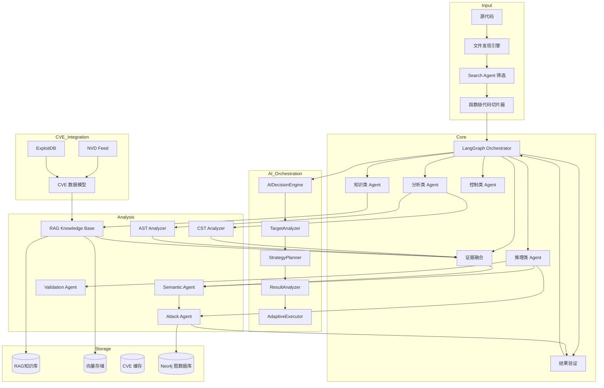
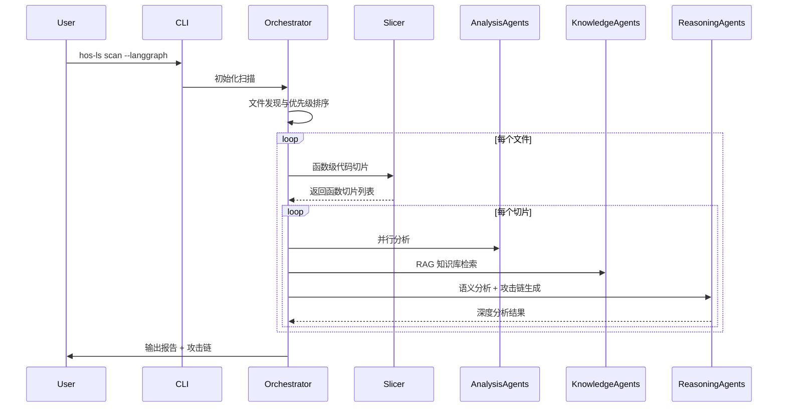

<div align="center">


# 🔒 HOS-LS v0.3.3.9

## AI 生成代码安全扫描工具

[](https://opensource.org/licenses/MIT)
[](https://github.com/psf/black)

**English** | [中文](README_CN.md)

</div>

---

## 📋 快速导航

- [核心特性](#-核心特性) - Search Agent、多维度分析、多语言支持
- [AI自适应工具编排](#-ai-自适应工具编排-v034-新增) - AI决策引擎、自适应执行
- [统一AI控制器](#-统一ai控制器-v034-新增) - 多provider支持、阿里云百炼
- [系统架构](#-系统架构) - LangGraph 流程控制、Multi-Agent 协作
- [插件系统扩展](#-插件系统扩展-v034-新增) - MCP工具、SKILL技能
- [工具对比](#-工具对比) - vs Semgrep/CodeQL/SonarQube
- [快速开始](#-快速开始) - 30秒上手
- [截断与断点续传](#-截断与断点续传) - 长时间扫描保护、断点恢复
- [扫描性能优化](#-扫描性能优化) - 批量并行、预扫描层、外部工具融合
- [安全编排架构](#-安全编排架构) - 工具链集成、攻击验证闭环
- [报告模块增强](#-报告模块增强-v0335-新增) - 多格式导出、可视化图表
- [详细配置](#-详细配置) - 配置文件参考
- [FAQ](#-faq) - 常见问题
- [路线图](#-路线图) - 版本规划

---

## 🎯 核心特性

### Search Agent 智能筛选 (v0.3.3 新增)

| 特性 | 说明 |
|------|------|
| 语义搜索 | 基于向量嵌入的代码检索，只分析 Top-K 相关文件 |
| 评分算法 | keyword_match×0.3 + call_chain×0.25 + historical×0.2 + file_type×0.15 + diff×0.1 |
| Merkle Tree | 增量索引，只更新变化文件 |

### 分层扫描架构 (v0.3.3 新增)

```
Stage 1: 静态规则（快） → 候选漏洞点
Stage 2: Search Agent 筛选 Top-K
Stage 3: AI 深度分析
Stage 4: Exploit 生成 + 验证
```

### 多 Agent 并行执行 (v0.3.3 新增)

| Agent | 名称 | 职责 |
|-------|------|------|
| 0 | 上下文分析 | 构建代码上下文 |
| 1 | 代码理解 | 深度理解代码逻辑 |
| 2 | 风险枚举 | 枚举潜在风险点 |
| 3-5 | 验证/攻击/对抗 | 并行执行，提升效率 |
| 6 | 最终裁决 | 综合判断 |

### 🤖 AI 自适应工具编排 (v0.3.3.9 新增)

| 组件 | 功能 |
|------|------|
| **AIDecisionEngine** | AI决策引擎，负责任务分析、策略规划和结果优化 |
| **TargetAnalyzer** | 目标分析器，识别目标类型、指纹和可测试性 |
| **StrategyPlanner** | 策略规划器，选择最优工具组合和扫描优先级 |
| **ResultAnalyzer** | 结果分析器，验证工具输出、识别高置信度发现 |
| **AdaptiveExecutor** | 自适应执行器，动态调整工具参数、智能重试 |

#### 工具联动AI决策点

| 决策点 | AI判断内容 | 后续行动 |
|-------|-----------|---------|
| 扫描前 | 目标类型识别 | 选择合适的工具集 |
| 扫描中 | 初步结果判断 | 调整扫描强度/切换工具 |
| 扫描后 | 结果可信度评估 | 决定是否需要AI深度分析 |
| 验证时 | 漏洞真实性判断 | 减少误报、提高置信度 |
| 降级时 | 原因分析与替代选择 | 切换到替代工具或方法 |

### 多维度安全分析

| 维度 | 核心能力 |
|------|----------|
| **静态分析** | AST/CST 深度分析、函数级代码切片、多阶段扫描（轻量定位→精准扫描） |
| **AI 能力** | 多模型支持（Claude/GPT-4/DeepSeek/Claude 3.5 Sonnet/GPT-4o/Ollama）、规则驱动 Prompt、语义理解、DSPy 自动优化、模型自动切换与降级 |
| **知识库** | RAG 检索、混合 RAG 架构（PostgreSQL+向量存储）、CVE 数据集成（NVD+ExploitDB）、BM25 混合检索 |
| **攻击分析** | 攻击图引擎（Neo4j）、漏洞验证、攻击链可视化、exploit 知识注入 |
| **性能优化** | GPU 加速（FAISS/Embedding）、增量扫描、多进程架构、内存管理优化、批量并行处理 |
| **报告模块** | 多格式导出（HTML/PDF/JSON/CSV/Markdown）、可视化图表、交互式仪表盘、自定义模板 |

### 🔄 统一AI控制器 (v0.3.3.9 新增)

HOS-LS 支持多种AI提供商，可自由切换：

| 提供商 | 默认模型 | 特点 |
|-------|---------|------|
| DeepSeek | deepseek-reasoner | 高性价比推理 |
| 阿里云百炼 | qwen3-coder-next | 代码能力强 |
| OpenAI | gpt-4o | 通用能力强 |
| Anthropic | claude-3.5-sonnet | 长上下文优秀 |

#### 阿里云百炼支持的模型

| 模型家族 | 模型名称 | 用途 |
|---------|---------|------|
| **Qwen3** | qwen3-7b-instruct, qwen3-14b-instruct | 通用对话 |
| **Qwen3-Coder** | qwen3-coder-7b-instruct, qwen3-coder-next | 代码生成/分析 |
| **Qwen-Max** | qwen-max, qwen-max-2025-01-25 | 高性能对话 |
| **Qwen-Plus** | qwen-plus, qwen-plus-2025-06-06 | 高性能对话 |
| **DeepSeek-R1** | deepseek-r1-distill-qwen-32b | 推理模型 |

#### 配置示例

```yaml
ai:
  provider: "aliyun"  # deepseek / aliyun / openai / anthropic
  model: "qwen3-coder-next"

  aliyun:
    api_key: "${ALIYUN_API_KEY}"
    base_url: "https://dashscope.aliyuncs.com/compatible-mode/v1"

  # 模块级模型覆盖
  modules:
    pure_ai:
      model: "qwen3-coder-next"
      provider: "aliyun"
```

### 大型项目优化

- **智能文件筛选**: 基于文件名语义分析，优先扫描重要文件
- **函数级切片**: 每个函数独立分析，保留完整上下文
- **多阶段 AI 分析**: 仅对可疑点深度分析，节省 50-80% Token
- **并发扫描**: async 并发、自动重试、速率限制
- **深度检测模式**: 更全面的漏洞模式库，覆盖更多 CWE
- **自定义规则引擎**: 用户可编写自己的检测规则
- **扫描进度实时显示**: 实时查看扫描进度和当前处理文件
- **详细日志与调试模式**: `--verbose` 参数启用详细日志输出
- **扫描结果差异对比**: 与历史扫描结果对比，追踪变化

### 多语言支持

| 语言 | AST 分析 | AI 分析 | 函数级切片 | 漏洞检测 |
|------|:--------:|:-------:|:----------:|:--------:|
| Python | ✅ | ✅ | ✅ | ✅ |
| JavaScript | ✅ | ✅ | ✅ | ✅ |
| TypeScript | ✅ | ✅ | ✅ | ✅ |
| Java | ✅ | ✅ | 🚧 | ✅ |
| C/C++ | ✅ | ✅ | 🚧 | ✅ |
| Go | ✅ | ✅ | ✅ | ✅ |
| Rust | ✅ | ✅ | ✅ | ✅ |

### 攻击链分析

- **漏洞关系识别**: 因果、依赖、互补、同源关系分析
- **攻击路径构建**: DFS 图遍历，构建完整攻击链
- **风险评分**: 综合严重性、置信度、类型优先级
- **关键路径**: Top 5 最危险攻击路径可视化

### NVD + ExploitDB 集成

HOS-LS 支持两种独立的漏洞数据导入路径，请根据实际需求选择：

#### 路径一：ETL批量导入（SQLite）

直接将JSON数据解析入库，用于**漏洞查询和依赖匹配扫描**：

```bash
# 完整导入（所有数据源）
python -m src.nvd.etl_batch_import --base-path "c:\1AAA_PROJECT\HOS\HOS-LS\HOS-LS\All Vulnerabilities\temp_zip"

# 仅导入NVD数据
python -m src.nvd.etl_batch_import --etl nvd --base-path "c:\1AAA_PROJECT\HOS\HOS-LS\HOS-LS\All Vulnerabilities\temp_zip"

# 断点续传
python -m src.nvd.etl_batch_import --continue

# 查看状态
python -m src.nvd.etl_batch_import --status
```

**目标数据库**：`All Vulnerabilities/sql_data/nvd_vulnerability.db`

**用途**：
- CVE/CVSS/CPE 查询
- 依赖库版本匹配
- 漏洞扫描结果关联

#### 路径二：RAG导入（向量知识库）

将漏洞数据转换为Knowledge对象并生成向量嵌入，用于**AI增强分析和RAG对话**：

```bash
# 完整导入（重型AI模式）
hos-ls nvd update

# 测试模式（不导入RAG）
hos-ls nvd update --limit 20 --no-rag

# 指定压缩包
hos-ls nvd update --zip /path/to/nvd-json-data-feeds-main.zip
```

**目标**：RAG知识库（PostgreSQL + 向量存储）

**用途**：
- AI对话增强分析
- RAG检索增强
- 漏洞上下文补充

#### 路径对比

| 特性 | ETL批量导入 | RAG导入 |
|-----|------------|---------|
| **目标** | `nvd_vulnerability.db` (SQLite) | RAG知识库 (向量数据库) |
| **命令** | `python -m src.nvd.etl_batch_import` | `hos-ls nvd update` |
| **数据格式** | JSON → 结构化表 | JSON → Knowledge对象 → Embedding |
| **主要用途** | 漏洞查询、依赖匹配扫描 | AI增强分析、RAG对话 |
| **进度跟踪** | `etl_progress` 表 | `nvd_update_checkpoint.json` |

---

## ⚡ 截断与断点续传 (v0.3.3.3 新增)

### 长时间扫描保护

长时间扫描任务可能因网络超时、API 限制或系统中断而失败。截断与断点续传系统提供完整保护。

| 参数 | 说明 |
|------|------|
| `--truncate-output` | 启用截断模式，达到条件后停止但输出报告 |
| `--max-duration SECONDS` | 最大扫描时长（秒），0 表示不限制 |
| `--max-files N` | 最大扫描文件数，0 表示不限制 |
| `--resume` | 从上次截断点继续扫描 |

### 核心特性

- **截断模式**: 达到指定时间/文件数后停止，但仍输出已完成部分的报告
- **断点续传**: 跳过已完成的文件，继续扫描剩余文件
- **状态持久化**: ScanState 保存扫描进度到磁盘，支持中断恢复
- **互斥检查**: 截断模式和续传模式不能同时启用

### 使用示例

```bash
# 超时截断（1小时后截断并输出报告）
hos-ls scan . --truncate-output --max-duration 3600

# 文件数截断（扫描100个文件后截断）
hos-ls scan . --truncate-output --max-files 100

# 断点续扫（从上次截断点继续）
hos-ls scan . --resume

# 禁止混用（会报错）
hos-ls scan . --truncate-output --resume  # 错误：不能同时启用
```

### 状态文件

扫描状态保存在 `.scan_state.json`，包含：
- 已完成文件列表
- 待扫描文件列表
- 发现的问题
- 截断状态和原因

---

## 🚀 扫描性能优化 (v0.3.3.4 新增)

### 批量并行 AI 分析

将逐文件串行 AI 分析改为批量并行处理，显著提升扫描速度。

- **asyncio.Semaphore** 控制并发数
- **批量处理** 减少 API 往返开销
- **动态调度** 根据系统负载自动调整

### 快速预扫描层

在 AI 分析前执行快速预扫描，优先检测高风险漏洞：

| 扫描器 | 职责 | 速度 |
|--------|------|------|
| ConfigScanner | 配置文件敏感信息检测 | < 1s |
| CodeVulnScanner | 代码层漏洞模式检测 | < 5s |
| NVD Adapter | CVE 相似度匹配 | < 2s |

### 外部工具融合

集成业界领先的安全工具，构建完整工具链：

| 工具 | 职责 | 安装命令 |
|------|------|---------|
| **Semgrep** | SAST 快速规则扫描（CWE-89/79/22 等） | `pip install semgrep` |
| **CodeAudit** | AST 语义分析，深度代码审查 | `pip install codeaudit` |
| **pip-audit** | 依赖漏洞扫描（CVE 查询） | `pip install pip-audit` |
| **Trivy** | 综合漏洞扫描 | `pip install trivy` |
| **Syft** | SBOM 生成 | `pip install syft` |
| **Gitleaks** | Secrets 专用扫描 | `pip install gitleaks` |

### 工具链编排

```
输入：源代码/依赖文件
   ↓
[Semgrep] → 快速 SAST 预扫描（CWE-89/79/22 等）
   ↓
[Trivy] → 依赖漏洞扫描（CVE 查询）
   ↓
[Syft + Trivy] → SBOM 生成 + 漏洞关联
   ↓
[Gitleaks] → Secrets 扫描（API Keys, Tokens, Passwords）
   ↓
[CodeVulnScanner] → 代码层漏洞扫描（Java/MyBatis 专用）
   ↓
输出：统一漏洞列表 + 可信度评分 + 来源追踪
```

### 使用示例

```bash
# 指定工具链扫描
hos-ls scan . --tool-chain semgrep,trivy,gitleaks

# 使用默认工具链
hos-ls scan . --full-scan

# 纯 AI 模式（高性能优化）
hos-ls scan . --pure-ai -w 5
```

---

## 🔒 安全编排架构 (v0.3.3.4 新增)

### 攻击验证闭环

发现漏洞后自动验证是否真实可利用：

```
发现漏洞 → 自动生成 exploit → 验证可利用性 → 计算真实风险 → 决策
```

**关键组件**：
- `src/attack/validator.py` - 漏洞可利用性验证器
- `src/attack/exploit_generator.py` - 基于 LLM 的 Exploit 生成器

### 优先级决策系统

综合多维度因素计算真实风险评分：

```
真实风险 = CVSS_Base × Exploitability × Reachability × Asset_Value
```

| 因子 | 说明 | 取值范围 |
|------|------|----------|
| CVSS_Base | NVD 官方评分 | 0-10 |
| Exploitability | 可利用性（有公开 Exploit=1.0, 理论可能=0.3） | 0-1 |
| Reachability | 可达性（公开入口点=1.0, 不可达=0.0） | 0-1 |
| Asset_Value | 资产价值（认证/支付=1.0, 测试/文档=0.1） | 0-1 |

### 增强的多 Agent 调度

根据漏洞类型动态选择最合适的 Agent：

| 漏洞类型 | 调用的 Agent |
|---------|-------------|
| SQL Injection | SemanticAgent + ValidationAgent + AttackAgent |
| XSS | SemanticAgent + ValidationAgent + AttackAgent |
| Command Injection | SemanticAgent + ValidationAgent + AttackAgent |
| Hardcoded Secret | ValidationAgent（跳过 SemanticAgent） |
| Config Sensitive | ValidationAgent（跳过 SemanticAgent） |

---

## 🛠️ 工具编排架构 (v0.3.3.4 新增)

### 真实风险评分

漏洞风险不仅取决于 CVSS 评分，还需考虑实际可利用性：

| 漏洞 | CVSS | Exploitability | Reachability | 真实风险 |
|------|------|----------------|--------------|----------|
| SQL Injection | 9.8 | 1.0 | 0.8 | **7.84** |
| Info Disclosure | 4.0 | 0.3 | 1.0 | **1.2** |

### 跨 Agent 验证

- **共识决策**: >50% Agent 同意 → ACCEPT
- **escalate**: >30% 同意 → ESCALATE（人工复核）
- **拒绝**: <30% 同意 → REJECT

---

## 📊 报告模块增强 (v0.3.3.5 新增)

### 多格式报告导出

支持多种报告格式，满足不同场景需求：

| 格式 | 适用场景 | 特点 |
|------|----------|------|
| HTML | 日常审计、分享 | 交互式图表、可点击跳转 |
| PDF | 正式报告、归档 | 格式固定、适合打印 |
| JSON | 二次开发、API 集成 | 结构化数据、便于程序处理 |
| CSV | 数据分析、Excel 查看 | 表格数据、便于导入 |
| Markdown | 快速预览、Git 文档 | 纯文本、版本控制友好 |

### 可视化图表

- **漏洞分布图**: 按类型、严重性、语言分布可视化
- **风险趋势图**: 历史扫描风险趋势对比
- **攻击路径图**: 关键攻击路径可视化展示
- **资产重要性图**: 按资产价值分类展示

### 交互式报告仪表盘

- 扫描进度实时监控
- 点击查看详细漏洞信息
- 过滤和搜索功能
- 自定义列展示

### 自定义报告模板

```bash
# 生成指定格式报告
hos-ls scan . --report-format html --output report.html
hos-ls scan . --report-format pdf --output report.pdf
hos-ls scan . --report-format json --output report.json

# 使用自定义模板
hos-ls report generate [SCAN_ID] --template custom-template.yaml

# 列出历史报告
hos-ls report list
```

---

## ❓ 为什么选择 HOS-LS？

| 特性 | HOS-LS | 传统 SAST 工具 |
|------|:------:|:--------------:|
| AI 代码理解 | ✅ 深度语义分析 | ❌ 仅语法分析 |
| 函数级切片 | ✅ AST 精准切片 | ❌ 全文扫描 |
| 多阶段扫描 | ✅ 轻量定位+精扫 | ❌ 单阶段全量 |
| 误报率 | 🎯 低 | ⚠️ 高 |
| AI 模型支持 | ✅ 多模型支持 | ❌ 无 |
| CVE 集成 | ✅ NVD+ExploitDB | ❌ 无 |
| 攻击路径分析 | ✅ 可视化攻击图 | ❌ 无 |
| 增量扫描 | ✅ 支持 | ⚠️ 部分支持 |
| CI/CD 集成 | ✅ 开箱即用 | ⚠️ 需配置 |

---

## ⚡ 两种模式

| 特性 | Pure-AI 模式 | 完整版 |
|------|-------------|--------|
| **硬件要求** | 普通配置 | 高性能配置 |
| **依赖** | 仅需 AI API | Neo4j、FAISS、PostgreSQL |
| **启动速度** | ⚡ 快速 | 🐢 初始化慢 |
| **RAG 知识库** | ❌ | ✅ |
| **攻击链分析** | ✅ | ✅ |
| **CVE 集成** | ❌ | ✅ |
| **适用场景** | 日常开发、快速扫描 | 深度审计、大型项目 |

---

## 🚀 快速开始

### 1. 配置 API 密钥

```bash
# Windows
set DEEPSEEK_API_KEY=sk-your-api-key-here

# Linux/Mac
export DEEPSEEK_API_KEY=sk-your-api-key-here
```

### 2. 运行扫描

```bash
# Pure-AI 模式（推荐）
python -m src.cli.main scan . --pure-ai

# 完整版模式
python -m src.cli.main scan . --mode full

# 生成报告
python -m src.cli.main scan . --format html --output report.html
```

### 3. 常用命令

```bash
# 断点续扫
python -m src.cli.main scan . --resume

# 增量扫描
python -m src.cli.main scan . --incremental

# 测试模式（扫描前10个文件）
python -m src.cli.main scan . --test 10

# Git 差异扫描
python -m src.cli.main scan . --diff

# 两阶段扫描 + 函数级切片
python -m src.cli.main scan . --multi-phase --use-slicer

# 深度检测模式
python -m src.cli.main scan . --deep-scan

# 详细日志模式
python -m src.cli.main scan . --verbose

# 指定 AI 模型
python -m src.cli.main scan . --model claude-3.5-sonnet

# 生成指定格式报告
python -m src.cli.main scan . --report-format html --output report.html
python -m src.cli.main scan . --report-format json --output report.json

# 与历史扫描对比
python -m src.cli.main scan . --compare

# 查看索引状态
python -m src.cli.main index status ./project

# 重建索引
python -m src.cli.main index rebuild ./project

# 生成报告
python -m src.cli.main report generate [SCAN_ID]

# 列出历史报告
python -m src.cli.main report list

# 列出内置规则
python -m src.cli.main rule list

# 验证自定义规则
python -m src.cli.main rule validate ./my-rule.yaml

# 攻击链分析
python -m src.cli.main analyze --attack-chain

# 截断模式（1小时后截断并输出报告）
python -m src.cli.main scan . --truncate-output --max-duration 3600

# 截断模式（扫描100个文件后截断）
python -m src.cli.main scan . --truncate-output --max-files 100

# 工具链扫描
python -m src.cli.main scan . --tool-chain semgrep,trivy,gitleaks

# 强制全量扫描
python -m src.cli.main scan . --full-scan
```

---

## 🏗️ 系统架构

### LangGraph 强 Multi-Agent 架构



### 多阶段扫描工作流程



### 核心模块

| 模块 | 路径 | 功能 |
|------|------|------|
| **核心引擎** | `src/core/` | 扫描调度、多阶段扫描、结果聚合、攻击链分析 |
| **LangGraph** | `src/core/langgraph_*` | 流程控制、状态管理、条件分支逻辑 |
| **分析器** | `src/analyzers/` | AST/CST 分析、函数级代码切片 |
| **AI 模块** | `src/ai/` | 多模型集成、规则驱动 Prompt、DSPy 自动优化 |
| **统一AI控制器** | `src/ai/unified_controller.py` | 多provider切换、阿里云百炼支持 |
| **Search Agent** | `src/ai/search_agent/` | 语义搜索、评分计算、文件索引 |
| **AI工具编排** | `src/tools/` | AIDecisionEngine、TargetAnalyzer、StrategyPlanner |
| **推理 Agent** | `src/ai/reasoning/` | 语义分析、攻击链生成、结果验证 |
| **存储系统** | `src/storage/` | RAG 知识库、FAISS 向量存储、PostgreSQL |
| **攻击模拟** | `src/attack/` | 攻击图构建、漏洞验证、ExploitDB 映射 |
| **报告模块** | `src/reporting/` | 多格式报告生成 |
| **插件系统** | `src/plugins/` | MCP工具、SKILL技能、功能插件 |

---

## ⚖️ 工具对比

| 特性 | HOS-LS | Semgrep | SonarQube | CodeQL |
|------|:------:|:-------:|:---------:|:------:|
| 函数级切片 | ✅ | ❌ | ❌ | ❌ |
| 多阶段扫描 | ✅ | ❌ | ❌ | ❌ |
| 规则驱动 Prompt | ✅ | ❌ | ❌ | ❌ |
| AI 分析 | ✅ | ❌ | ⚠️ | ❌ |
| RAG 知识库 | ✅ | ❌ | ❌ | ❌ |
| NVD CVE 集成 | ✅ | ❌ | ❌ | ❌ |
| ExploitDB 映射 | ✅ | ❌ | ❌ | ❌ |
| 攻击链分析 | ✅ | ❌ | ❌ | ⚠️ |
| 文件优先级评估 | ✅ | ❌ | ❌ | ❌ |
| LangGraph 流程控制 | ✅ | ❌ | ❌ | ❌ |
| 截断与断点续传 | ✅ | ❌ | ❌ | ❌ |
| 工具链编排 | ✅ | ❌ | ❌ | ❌ |
| 攻击验证闭环 | ✅ | ❌ | ❌ | ❌ |
| 优先级决策系统 | ✅ | ❌ | ❌ | ❌ |
| 多格式报告导出 | ✅ | ❌ | ✅ | ❌ |
| 自定义规则引擎 | ✅ | ⚠️ | ⚠️ | ⚠️ |
| 深度检测模式 | ✅ | ❌ | ⚠️ | ❌ |
| 历史扫描对比 | ✅ | ❌ | ⚠️ | ❌ |

---

## 🔌 插件系统扩展 (v0.3.3.9 新增)

### 插件类型

| 类型 | 说明 | 示例 |
|------|------|------|
| **MCP工具插件** | 集成外部安全工具 | sqlmap, nuclei, ZAP |
| **SKILL插件** | 扩展AI技能，提供提示词模板 | code-analysis, report-generation |
| **功能插件** | 自定义扫描功能 | custom-scanner |

### MCP工具插件

| 工具 | 功能 | 配置选项 |
|------|------|----------|
| sqlmap | SQL注入检测 | risk_level, auto_install |
| nuclei | 漏洞扫描 | template_dir |
| ZAP | Web安全扫描 | api_mode |

### 配置示例

```yaml
# hos-ls.yaml 配置
plugins:
  enabled: true
  plugin_dirs:
    - "./plugins"
    - "./skills"

  mcp:
    - name: "sqlmap"
      enabled: true
      path: "./plugins/mcp/sqlmap_plugin.py"
      config:
        auto_install: true
        risk_level: 2

    - name: "nuclei"
      enabled: true
      path: "./plugins/mcp/nuclei_plugin.py"
      config:
        template_dir: "./nuclei-templates"

    - name: "zap"
      enabled: true
      path: "./plugins/mcp/zap_plugin.py"
      config:
        api_mode: true

  skills:
    - name: "code-analysis"
      enabled: true
      path: "./skills/code_analysis_skill.py"
```

### 使用示例

```bash
# 列出可用插件
hos-ls plugin list

# 启用插件
hos-ls plugin enable sqlmap

# 禁用插件
hos-ls plugin disable nuclei
```

---

## ⚙️ 详细配置

### 配置文件示例

创建 `hos-ls.yaml`:

```yaml
# AI 配置
ai:
  provider: deepseek
  model: deepseek-reasoner
  api_key: ${DEEPSEEK_API_KEY}
  base_url: https://api.deepseek.com
  temperature: 0.0
  max_tokens: 4096
  model_fallback:
    - claude-3.5-sonnet
    - gpt-4o
  ollama:
    enabled: true
    base_url: http://localhost:11434

# 扫描配置
scan:
  max_workers: 4
  cache_enabled: true
  incremental: true
  deep_scan: false
  verbose: false
  exclude_patterns:
    - "*.min.js"
    - "node_modules/**"
    - ".git/**"
  include_patterns:
    - "*.py"
    - "*.js"
    - "*.ts"
    - "*.java"

# 函数级切片器配置
code_slicer:
  enabled: true
  max_slice_lines: 200
  include_context_lines: 10

# 多阶段扫描配置
multi_phase_scan:
  enabled: true
  phase1_max_tokens: 1024
  phase2_context_lines: 50

# 数据库配置
database:
  url: sqlite:///hos-ls.db
  neo4j:
    uri: bolt://localhost:7687
    username: neo4j
    password: password
  postgres:
    host: localhost
    port: 5432
    database: hos_ls

# Search Agent 配置
search_agent:
  top_k: 20
  enable_semantic_search: true
  enable_incremental_index: true

# 报告配置
report:
  format: html
  output: ./security-report
  include_code_snippets: true
  include_fix_suggestions: true
  template: default
  export_formats:
    - html
    - pdf
    - json
    - csv

# 截断与断点续传配置
scan_truncate:
  enabled: true
  max_duration: 0
  max_files: 0
  truncate_output: false
  state_file: .scan_state.json

# 工具链配置
tool_chain:
  enabled: true
  tools:
    - semgrep
    - trivy
    - gitleaks
  default_chain: semgrep,trivy,gitleaks

# 优先级决策系统配置
priority_engine:
  enabled: true
  cvss_weight: 1.0
  exploitability_weight: 1.0
  reachability_weight: 1.0
  asset_value_weight: 1.0

# 攻击验证闭环配置
attack_validation:
  enabled: true
  auto_exploit: true
  confidence_threshold: 0.8

# 自定义规则引擎配置
rule_engine:
  enabled: true
  custom_rules_dir: ./rules
  validate_on_load: true
```

### 环境变量

```bash
export DEEPSEEK_API_KEY="your-key"
export HOS_LS_CONFIG_PATH="/path/to/config.yaml"
export HTTP_PROXY="http://127.0.0.1:7897"
export HTTPS_PROXY="http://127.0.0.1:7897"
```

### 配置文件优先级

1. 命令行参数
2. 环境变量
3. 配置文件
4. 默认配置

---

## ❓ FAQ

<details>
<summary><b>Pure-AI 模式与完整版有什么区别？</b></summary>

Pure-AI 模式是轻量级纯 AI 深度语义解析模式，无需依赖 Neo4j、FAISS 等重型组件。完整版提供全功能，包括 RAG 知识库、CVE 集成、攻击链分析等。

| 功能 | Pure-AI | 完整版 |
|------|---------|--------|
| AI 分析 | ✅ 7 Agent | ✅ 强 Multi-Agent |
| RAG 知识库 | ❌ | ✅ |
| CVE 集成 | ❌ | ✅ |
| 攻击链分析 | ✅ | ✅ |

</details>

<details>
<summary><b>Search Agent 是如何工作的？</b></summary>

Search Agent 使用语义搜索和评分算法来筛选最可能有漏洞的文件：

1. **语义搜索**: 基于向量嵌入检索相关代码
2. **评分计算**: keyword×0.3 + call_chain×0.25 + historical×0.2 + file_type×0.15 + diff×0.1
3. **Top-K 筛选**: 只分析评分最高的文件

这大幅减少了需要分析的代码量，提升扫描效率。

</details>

<details>
<summary><b>如何使用两阶段扫描？</b></summary>

两阶段扫描是核心特性，默认启用：

```bash
# 默认启用两阶段扫描
hos-ls scan

# 显式启用
hos-ls scan --multi-phase

# 配合函数级切片
hos-ls scan --multi-phase --use-slicer
```

**工作原理**：
- **Phase 1**: 使用低 Token Prompt 快速定位可疑点
- **Phase 2**: 仅对可疑点使用专项规则进行深度分析
- **Token 节省**: 通常可节省 50-80% 的 Token 消耗

</details>

<details>
<summary><b>如何同步 CVE 数据？有哪几种导入方式？</b></summary>

HOS-LS 支持两种独立的漏洞数据导入路径：

**路径一：ETL批量导入（SQLite）**
- 目标：`All Vulnerabilities/sql_data/nvd_vulnerability.db`
- 用途：漏洞查询、依赖库版本匹配

```bash
# 完整导入
python -m src.nvd.etl_batch_import --base-path "c:\1AAA_PROJECT\HOS\HOS-LS\HOS-LS\All Vulnerabilities\temp_zip"

# 仅导入NVD数据
python -m src.nvd.etl_batch_import --etl nvd --base-path "c:\1AAA_PROJECT\HOS\HOS-LS\HOS-LS\All Vulnerabilities\temp_zip"

# 断点续传
python -m src.nvd.etl_batch_import --continue
```

**路径二：RAG导入（向量知识库）**
- 目标：RAG知识库（PostgreSQL + 向量存储）
- 用途：AI对话增强分析、RAG检索增强

```bash
# 完整导入（重型AI模式）
hos-ls nvd update

# 测试模式
hos-ls nvd update --limit 20 --no-rag

# 指定压缩包
hos-ls nvd update --zip /path/to/nvd-json-data-feeds-main.zip
```

**路径对比**：

| 特性 | ETL批量导入 | RAG导入 |
|-----|------------|---------|
| **命令** | `python -m src.nvd.etl_batch_import` | `hos-ls nvd update` |
| **目标** | SQLite数据库 | 向量知识库 |
| **用途** | 漏洞查询、依赖匹配 | AI增强分析 |

</details>

<details>
<summary><b>如何配置 Neo4j？</b></summary>

```yaml
database:
  neo4j:
    uri: bolt://localhost:7687
    username: neo4j
    password: your-password
```

或使用 Docker：
```bash
docker run --name neo4j -p 7474:7474 -p 7687:7687 \
  -e NEO4J_AUTH=neo4j/password neo4j:latest
```

</details>

<details>
<summary><b>如何使用截断与断点续传？</b></summary>

截断与断点续传功能保护长时间扫描任务：

```bash
# 超时截断（1小时后截断并输出报告）
hos-ls scan . --truncate-output --max-duration 3600

# 文件数截断（扫描100个文件后截断）
hos-ls scan . --truncate-output --max-files 100

# 断点续扫（从上次截断点继续）
hos-ls scan . --resume
```

**注意**：截断模式和续传模式不能同时启用。

</details>

<details>
<summary><b>如何使用工具链扫描？</b></summary>

HOS-LS 支持多种安全工具的编排扫描：

```bash
# 指定工具链
hos-ls scan . --tool-chain semgrep,trivy,gitleaks

# 使用完整工具链
hos-ls scan . --full-scan
```

**工具职责**：
- **Semgrep**: SAST 快速规则扫描
- **Trivy**: 依赖漏洞扫描
- **Gitleaks**: Secrets 专用扫描

</details>

<details>
<summary><b>如何启用 GPU 加速？</b></summary>

```bash
# 安装 PyTorch GPU 版本
pip install torch torchvision torchaudio --index-url https://download.pytorch.org/whl/cu118

# 配置文件
vector_store:
  faiss:
    use_gpu: true
```

</details>

<details>
<summary><b>如何生成不同格式的报告？</b></summary>

```bash
# 生成 HTML 报告（交互式）
hos-ls scan . --report-format html --output report.html

# 生成 JSON 报告（便于程序处理）
hos-ls scan . --report-format json --output report.json

# 生成 PDF 报告（适合打印）
hos-ls scan . --report-format pdf --output report.pdf

# 生成 CSV 报告（数据分析）
hos-ls scan . --report-format csv --output report.csv
```

**报告格式对比**：

| 格式 | 优点 | 适用场景 |
|------|------|----------|
| HTML | 交互式、图表丰富 | 日常审计、分享 |
| JSON | 结构化、便于 API | 二次开发、集成 |
| PDF | 格式固定、适合打印 | 正式报告、归档 |
| CSV | 数据分析 | Excel、统计数据 |

</details>

<details>
<summary><b>如何切换不同的 AI 模型？</b></summary>

HOS-LS 支持多种 AI 模型，并支持自动切换与降级：

```bash
# 指定模型
hos-ls scan . --model claude-3.5-sonnet

# 支持的模型
# - deepseek-reasoner（默认）
# - claude-3.5-sonnet
# - gpt-4o
# - ollama（本地模型）
```

**模型配置**：

```yaml
ai:
  provider: deepseek
  model: deepseek-reasoner
  model_fallback:
    - claude-3.5-sonnet  # 第一降级
    - gpt-4o             # 第二降级
  ollama:
    enabled: true
    base_url: http://localhost:11434
```

**Ollama 本地模型配置**：

```bash
# 安装 Ollama
curl -fsSL https://ollama.com/install.sh | sh

# 拉取模型
ollama pull llama2

# 配置使用
hos-ls scan . --model ollama/llama2
```

</details>

<details>
<summary><b>如何使用自定义规则？</b></summary>

HOS-LS 支持用户编写自定义检测规则：

```bash
# 列出内置规则
hos-ls rule list

# 验证自定义规则
hos-ls rule validate ./my-rule.yaml

# 规则文件示例 (my-rule.yaml)
```

```yaml
name: custom-sql-injection
description: 检测自定义 SQL 注入模式
severity: high
pattern: |
  SELECT.*FROM.*WHERE.*{user_input}
```

**规则配置**：

```yaml
rule_engine:
  enabled: true
  custom_rules_dir: ./rules
  validate_on_load: true
```

</details>

<details>
<summary><b>如何使用深度检测模式？</b></summary>

深度检测模式使用更全面的漏洞模式库，覆盖更多 CWE：

```bash
# 启用深度检测
hos-ls scan . --deep-scan

# 配置文件
scan:
  deep_scan: true
```

**深度检测特点**：
- 更全面的漏洞模式库
- 更多的 CWE 覆盖
- 更长的分析时间
- 更高的检出率

**适用场景**：
- 正式安全审计
- 合规性检查
- 深度代码审查

</details>

<details>
<summary><b>如何对比历史扫描结果？</b></summary>

```bash
# 与上次扫描结果对比
hos-ls scan . --compare

# 查看历史报告
hos-ls report list

# 生成特定扫描的报告
hos-ls report generate [SCAN_ID]
```

**对比内容**：
- 新增漏洞
- 已修复漏洞
- 漏洞数量变化
- 风险等级变化

</details>

---

## 📋 系统兼容性

| 组件 | 最低版本 | 推荐版本 |
|------|----------|----------|
| Python | 3.8 | 3.11+ |
| 操作系统 | Windows 10 / Linux / macOS | Windows 11 / Ubuntu 22.04 |
| PostgreSQL | 12 | 15+ |
| Neo4j | 4.4 | 5.x |
| RAM | 8GB | 16GB+ |
| GPU | 可选 | CUDA 兼容显卡 |

---

## 🗺️ 路线图

### v0.3.3.9 (当前版本)
- [x] AI 自适应工具编排系统（AIDecisionEngine/TargetAnalyzer/StrategyPlanner）
- [x] 统一AI控制器（阿里云百炼支持、动态provider切换）
- [x] 插件系统扩展（MCP工具/SKILL技能/功能插件）
- [x] 多provider自由切换（DeepSeek/阿里云百炼/OpenAI/Anthropic）

### v0.3.3.5
- [x] 报告模块增强（多格式导出、可视化图表、交互式仪表盘）
- [x] AI 模型支持扩展（Claude 3.5 Sonnet、GPT-4o、Ollama）
- [x] Go/Rust 语言支持升级（函数级切片、漏洞检测）
- [x] 深度检测模式（更全面的漏洞模式库）
- [x] 自定义规则引擎（用户可编写检测规则）
- [x] 用户体验优化（进度显示、详细日志、差异对比）

### v0.3.3.4
- [x] 扫描性能优化（批量并行、预扫描层）
- [x] 安全编排架构（工具链集成、攻击验证闭环）
- [x] 代码蒸馏合并优化

### v0.3.3.3
- [x] 截断与断点续传功能
- [x] ScanState 状态持久化

### v0.3.3.2
- [x] 扫描命令优化
- [x] GBK 安全输出

### v0.3.3.1
- [x] 纯 AI 模式优先级评估优化
- [x] 无文件跳过逻辑

### v0.3.3.0
- [x] Search Agent 智能筛选
- [x] 分层扫描架构
- [x] 多 Agent 并行执行
- [x] 函数级 Chunking

### v0.4.0 (规划中)
- [ ] 实时协作扫描
- [ ] 企业级 RBAC 权限系统
- [ ] 云原生部署支持
- [ ] 自动数据库初始化
- [ ] 更多 AI 提供商支持

---

## 📞 联系方式

- **GitHub**: https://github.com/hos-ls/hos-ls
- **Email**: aqfxz_zh@qq.com

---

## 🤝 贡献指南

1. Fork 仓库
2. 创建分支 (`git checkout -b feature/amazing-feature`)
3. 提交更改 (`git commit -m 'Add amazing feature'`)
4. Push 分支 (`git push origin feature/amazing-feature`)
5. 创建 Pull Request

---

## 📝 升级指南

```bash
# 更新依赖
pip install --upgrade hos-ls

# 验证安装
python -m src.cli.main --version

# 测试 Pure AI 模式
python -m src.cli.main scan ./test-code --pure-ai --test 1
```

---

<div align="center">
  <p>⭐️ 如果您觉得 HOS-LS 有用，请给我们一个 Star！</p>
</div>
