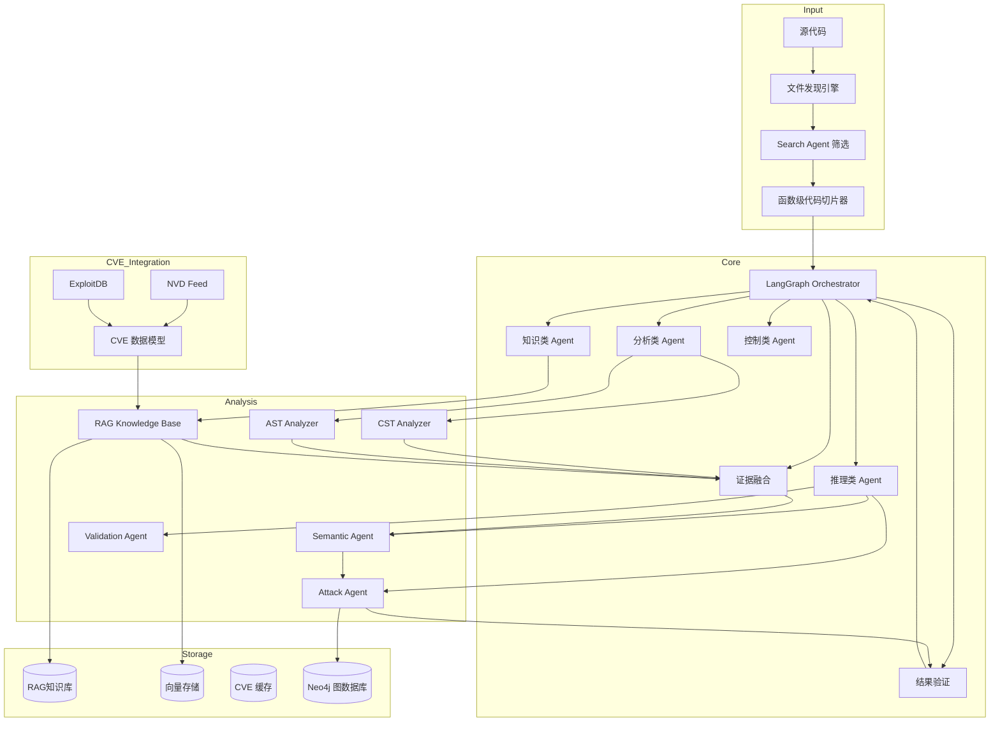
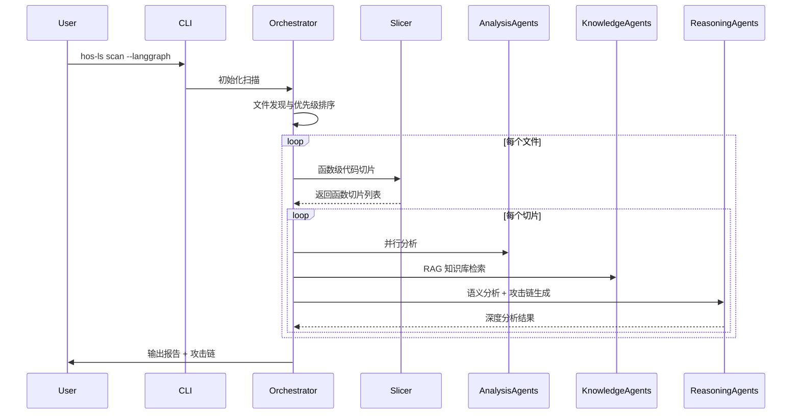

<div align="center">


# 🔒 HOS-LS v0.3.3.0

## AI 生成代码安全扫描工具

[](https://opensource.org/licenses/MIT)
[](https://github.com/psf/black)

**English** | [中文](README_CN.md)

</div>

---

## 📋 快速导航

- [核心特性](#-核心特性) - Search Agent、多维度分析、多语言支持
- [系统架构](#-系统架构) - LangGraph 流程控制、Multi-Agent 协作
- [工具对比](#-工具对比) - vs Semgrep/CodeQL/SonarQube
- [快速开始](#-快速开始) - 30秒上手
- [详细配置](#-详细配置) - 配置文件参考
- [FAQ](#-faq) - 常见问题
- [路线图](#-路线图) - 版本规划

---

## 🎯 核心特性

### Search Agent 智能筛选 (v0.3.3 新增)

| 特性 | 说明 |
|------|------|
| 语义搜索 | 基于向量嵌入的代码检索，只分析 Top-K 相关文件 |
| 评分算法 | keyword_match×0.3 + call_chain×0.25 + historical×0.2 + file_type×0.15 + diff×0.1 |
| Merkle Tree | 增量索引，只更新变化文件 |

### 分层扫描架构 (v0.3.3 新增)

```
Stage 1: 静态规则（快） → 候选漏洞点
Stage 2: Search Agent 筛选 Top-K
Stage 3: AI 深度分析
Stage 4: Exploit 生成 + 验证
```

### 多 Agent 并行执行 (v0.3.3 新增)

| Agent | 名称 | 职责 |
|-------|------|------|
| 0 | 上下文分析 | 构建代码上下文 |
| 1 | 代码理解 | 深度理解代码逻辑 |
| 2 | 风险枚举 | 枚举潜在风险点 |
| 3-5 | 验证/攻击/对抗 | 并行执行，提升效率 |
| 6 | 最终裁决 | 综合判断 |

### 多维度安全分析

| 维度 | 核心能力 |
|------|----------|
| **静态分析** | AST/CST 深度分析、函数级代码切片、多阶段扫描（轻量定位→精准扫描） |
| **AI 能力** | 多模型支持（Claude/GPT-4/DeepSeek）、规则驱动 Prompt、语义理解、DSPy 自动优化 |
| **知识库** | RAG 检索、混合 RAG 架构（PostgreSQL+向量存储）、CVE 数据集成（NVD+ExploitDB）、BM25 混合检索 |
| **攻击分析** | 攻击图引擎（Neo4j）、漏洞验证、攻击链可视化、exploit 知识注入 |
| **性能优化** | GPU 加速（FAISS/Embedding）、增量扫描、多进程架构、内存管理优化 |

### 大型项目优化

- **智能文件筛选**: 基于文件名语义分析，优先扫描重要文件
- **函数级切片**: 每个函数独立分析，保留完整上下文
- **多阶段 AI 分析**: 仅对可疑点深度分析，节省 50-80% Token
- **并发扫描**: async 并发、自动重试、速率限制

### 多语言支持

| 语言 | AST 分析 | AI 分析 | 函数级切片 | 漏洞检测 |
|------|:--------:|:-------:|:----------:|:--------:|
| Python | ✅ | ✅ | ✅ | ✅ |
| JavaScript | ✅ | ✅ | ✅ | ✅ |
| TypeScript | ✅ | ✅ | ✅ | ✅ |
| Java | ✅ | ✅ | 🚧 | ✅ |
| C/C++ | ✅ | ✅ | 🚧 | ✅ |
| Go | 🚧 | ✅ | ❌ | ✅ |
| Rust | 🚧 | ✅ | ❌ | ✅ |

### 攻击链分析

- **漏洞关系识别**: 因果、依赖、互补、同源关系分析
- **攻击路径构建**: DFS 图遍历，构建完整攻击链
- **风险评分**: 综合严重性、置信度、类型优先级
- **关键路径**: Top 5 最危险攻击路径可视化

### NVD + ExploitDB 集成

```bash
# 完整导入
hos-ls nvd update

# 测试模式
hos-ls nvd update --limit 20 --no-rag

# 指定压缩包
hos-ls nvd update --zip /path/to/nvd-json-data-feeds-main.zip
```

---

## ❓ 为什么选择 HOS-LS？

| 特性 | HOS-LS | 传统 SAST 工具 |
|------|:------:|:--------------:|
| AI 代码理解 | ✅ 深度语义分析 | ❌ 仅语法分析 |
| 函数级切片 | ✅ AST 精准切片 | ❌ 全文扫描 |
| 多阶段扫描 | ✅ 轻量定位+精扫 | ❌ 单阶段全量 |
| 误报率 | 🎯 低 | ⚠️ 高 |
| AI 模型支持 | ✅ 多模型支持 | ❌ 无 |
| CVE 集成 | ✅ NVD+ExploitDB | ❌ 无 |
| 攻击路径分析 | ✅ 可视化攻击图 | ❌ 无 |
| 增量扫描 | ✅ 支持 | ⚠️ 部分支持 |
| CI/CD 集成 | ✅ 开箱即用 | ⚠️ 需配置 |

---

## ⚡ 两种模式

| 特性 | Pure-AI 模式 | 完整版 |
|------|-------------|--------|
| **硬件要求** | 普通配置 | 高性能配置 |
| **依赖** | 仅需 AI API | Neo4j、FAISS、PostgreSQL |
| **启动速度** | ⚡ 快速 | 🐢 初始化慢 |
| **RAG 知识库** | ❌ | ✅ |
| **攻击链分析** | ✅ | ✅ |
| **CVE 集成** | ❌ | ✅ |
| **适用场景** | 日常开发、快速扫描 | 深度审计、大型项目 |

---

## 🚀 快速开始

### 1. 配置 API 密钥

```bash
# Windows
set DEEPSEEK_API_KEY=sk-your-api-key-here

# Linux/Mac
export DEEPSEEK_API_KEY=sk-your-api-key-here
```

### 2. 运行扫描

```bash
# Pure-AI 模式（推荐）
python -m src.cli.main scan . --pure-ai

# 完整版模式
python -m src.cli.main scan . --mode full

# 生成报告
python -m src.cli.main scan . --format html --output report.html
```

### 3. 常用命令

```bash
# 断点续扫
python -m src.cli.main scan . --resume

# 增量扫描
python -m src.cli.main scan . --incremental

# 测试模式（扫描前10个文件）
python -m src.cli.main scan . --test 10

# Git 差异扫描
python -m src.cli.main scan . --diff

# 两阶段扫描 + 函数级切片
python -m src.cli.main scan . --multi-phase --use-slicer

# 查看索引状态
python -m src.cli.main index status ./project

# 攻击链分析
python -m src.cli.main analyze --attack-chain
```

---

## 🏗️ 系统架构

### LangGraph 强 Multi-Agent 架构



### 多阶段扫描工作流程



### 核心模块

| 模块 | 路径 | 功能 |
|------|------|------|
| **核心引擎** | `src/core/` | 扫描调度、多阶段扫描、结果聚合、攻击链分析 |
| **LangGraph** | `src/core/langgraph_*` | 流程控制、状态管理、条件分支逻辑 |
| **分析器** | `src/analyzers/` | AST/CST 分析、函数级代码切片 |
| **AI 模块** | `src/ai/` | 多模型集成、规则驱动 Prompt、DSPy 自动优化 |
| **Search Agent** | `src/ai/search_agent/` | 语义搜索、评分计算、文件索引 |
| **推理 Agent** | `src/ai/reasoning/` | 语义分析、攻击链生成、结果验证 |
| **存储系统** | `src/storage/` | RAG 知识库、FAISS 向量存储、PostgreSQL |
| **攻击模拟** | `src/attack/` | 攻击图构建、漏洞验证、ExploitDB 映射 |
| **报告模块** | `src/reporting/` | 多格式报告生成 |

---

## ⚖️ 工具对比

| 特性 | HOS-LS | Semgrep | SonarQube | CodeQL |
|------|:------:|:-------:|:---------:|:------:|
| 函数级切片 | ✅ | ❌ | ❌ | ❌ |
| 多阶段扫描 | ✅ | ❌ | ❌ | ❌ |
| 规则驱动 Prompt | ✅ | ❌ | ❌ | ❌ |
| AI 分析 | ✅ | ❌ | ⚠️ | ❌ |
| RAG 知识库 | ✅ | ❌ | ❌ | ❌ |
| NVD CVE 集成 | ✅ | ❌ | ❌ | ❌ |
| ExploitDB 映射 | ✅ | ❌ | ❌ | ❌ |
| 攻击链分析 | ✅ | ❌ | ❌ | ⚠️ |
| 文件优先级评估 | ✅ | ❌ | ❌ | ❌ |
| LangGraph 流程控制 | ✅ | ❌ | ❌ | ❌ |

---

## ⚙️ 详细配置

### 配置文件示例

创建 `hos-ls.yaml`:

```yaml
# AI 配置
ai:
  provider: deepseek
  model: deepseek-reasoner
  api_key: ${DEEPSEEK_API_KEY}
  base_url: https://api.deepseek.com
  temperature: 0.0
  max_tokens: 4096

# 扫描配置
scan:
  max_workers: 4
  cache_enabled: true
  incremental: true
  exclude_patterns:
    - "*.min.js"
    - "node_modules/**"
    - ".git/**"
  include_patterns:
    - "*.py"
    - "*.js"
    - "*.ts"
    - "*.java"

# 函数级切片器配置
code_slicer:
  enabled: true
  max_slice_lines: 200
  include_context_lines: 10

# 多阶段扫描配置
multi_phase_scan:
  enabled: true
  phase1_max_tokens: 1024
  phase2_context_lines: 50

# 数据库配置
database:
  url: sqlite:///hos-ls.db
  neo4j:
    uri: bolt://localhost:7687
    username: neo4j
    password: password
  postgres:
    host: localhost
    port: 5432
    database: hos_ls

# Search Agent 配置
search_agent:
  top_k: 20
  enable_semantic_search: true
  enable_incremental_index: true

# 报告配置
report:
  format: html
  output: ./security-report
  include_code_snippets: true
  include_fix_suggestions: true
```

### 环境变量

```bash
export DEEPSEEK_API_KEY="your-key"
export HOS_LS_CONFIG_PATH="/path/to/config.yaml"
export HTTP_PROXY="http://127.0.0.1:7897"
export HTTPS_PROXY="http://127.0.0.1:7897"
```

### 配置文件优先级

1. 命令行参数
2. 环境变量
3. 配置文件
4. 默认配置

---

## ❓ FAQ

<details>
<summary><b>Pure-AI 模式与完整版有什么区别？</b></summary>

Pure-AI 模式是轻量级纯 AI 深度语义解析模式，无需依赖 Neo4j、FAISS 等重型组件。完整版提供全功能，包括 RAG 知识库、CVE 集成、攻击链分析等。

| 功能 | Pure-AI | 完整版 |
|------|---------|--------|
| AI 分析 | ✅ 7 Agent | ✅ 强 Multi-Agent |
| RAG 知识库 | ❌ | ✅ |
| CVE 集成 | ❌ | ✅ |
| 攻击链分析 | ✅ | ✅ |

</details>

<details>
<summary><b>Search Agent 是如何工作的？</b></summary>

Search Agent 使用语义搜索和评分算法来筛选最可能有漏洞的文件：

1. **语义搜索**: 基于向量嵌入检索相关代码
2. **评分计算**: keyword×0.3 + call_chain×0.25 + historical×0.2 + file_type×0.15 + diff×0.1
3. **Top-K 筛选**: 只分析评分最高的文件

这大幅减少了需要分析的代码量，提升扫描效率。

</details>

<details>
<summary><b>如何使用两阶段扫描？</b></summary>

两阶段扫描是核心特性，默认启用：

```bash
# 默认启用两阶段扫描
hos-ls scan

# 显式启用
hos-ls scan --multi-phase

# 配合函数级切片
hos-ls scan --multi-phase --use-slicer
```

**工作原理**：
- **Phase 1**: 使用低 Token Prompt 快速定位可疑点
- **Phase 2**: 仅对可疑点使用专项规则进行深度分析
- **Token 节省**: 通常可节省 50-80% 的 Token 消耗

</details>

<details>
<summary><b>如何同步 CVE 数据？</b></summary>

```bash
# 首次使用：全量同步
hos-ls cve-sync --full

# 日常使用：增量同步
hos-ls cve-sync

# 仅同步 NVD
hos-ls cve-sync --only-nvd
```

</details>

<details>
<summary><b>如何配置 Neo4j？</b></summary>

```yaml
database:
  neo4j:
    uri: bolt://localhost:7687
    username: neo4j
    password: your-password
```

或使用 Docker：
```bash
docker run --name neo4j -p 7474:7474 -p 7687:7687 \
  -e NEO4J_AUTH=neo4j/password neo4j:latest
```

</details>

<details>
<summary><b>如何启用 GPU 加速？</b></summary>

```bash
# 安装 PyTorch GPU 版本
pip install torch torchvision torchaudio --index-url https://download.pytorch.org/whl/cu118

# 配置文件
vector_store:
  faiss:
    use_gpu: true
```

</details>

---

## 📋 系统兼容性

| 组件 | 最低版本 | 推荐版本 |
|------|----------|----------|
| Python | 3.8 | 3.11+ |
| 操作系统 | Windows 10 / Linux / macOS | Windows 11 / Ubuntu 22.04 |
| PostgreSQL | 12 | 15+ |
| Neo4j | 4.4 | 5.x |
| RAM | 8GB | 16GB+ |
| GPU | 可选 | CUDA 兼容显卡 |

---

## 🗺️ 路线图

### v0.3.3 (当前版本)
- [x] Search Agent 智能筛选
- [x] 分层扫描架构
- [x] 多 Agent 并行执行
- [x] 函数级 Chunking
- [ ] 自动数据库初始化
- [ ] 更多 AI 提供商支持

### v0.4.0 (规划中)
- [ ] 实时协作扫描
- [ ] 企业级 RBAC 权限系统
- [ ] 自定义规则引擎
- [ ] 云原生部署支持

---

## 📞 联系方式

- **GitHub**: https://github.com/hos-ls/hos-ls
- **Email**: aqfxz_zh@qq.com

---

## 🤝 贡献指南

1. Fork 仓库
2. 创建分支 (`git checkout -b feature/amazing-feature`)
3. 提交更改 (`git commit -m 'Add amazing feature'`)
4. Push 分支 (`git push origin feature/amazing-feature`)
5. 创建 Pull Request

---

## 📝 升级指南

```bash
# 更新依赖
pip install --upgrade hos-ls

# 验证安装
python -m src.cli.main --version

# 测试 Pure AI 模式
python -m src.cli.main scan ./test-code --pure-ai --test 1
```

---

<div align="center">
  <p>⭐️ 如果您觉得 HOS-LS 有用，请给我们一个 Star！</p>
</div>
