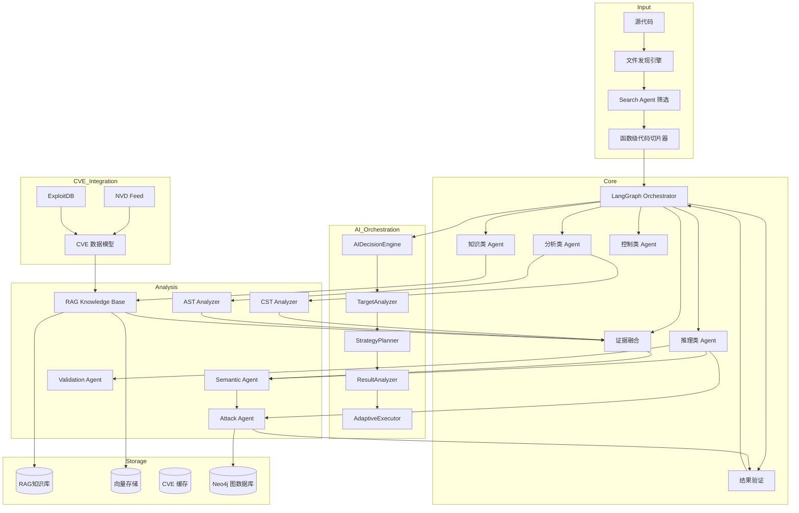
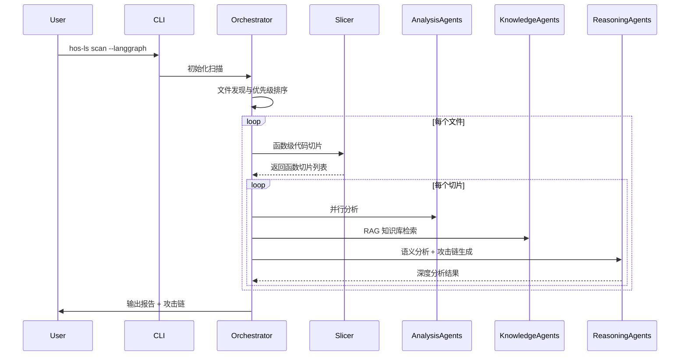

<div align="center">


# 🔒 HOS-LS v0.3.3.12

## AI 生成代码安全扫描工具


**English** | [中文](README_CN.md)

</div>

---

## 🎯 核心特性

### Search Agent 智能筛选

基于向量嵌入的代码检索，只分析 Top-K 相关文件。评分算法：keyword_match×0.3 + call_chain×0.25 + historical×0.2 + file_type×0.15 + diff×0.1。支持 Merkle Tree 增量索引，只更新变化文件。

### 分层扫描架构

```
Stage 1: 静态规则（快） → 候选漏洞点
Stage 2: Search Agent 筛选 Top-K
Stage 3: AI 深度分析
Stage 4: Exploit 生成 + 验证
```

### 多 Agent 并行执行

| Agent | 名称 | 职责 |
|-------|------|------|
| 0 | 上下文分析 | 构建代码上下文 |
| 1 | 代码理解 | 深度理解代码逻辑 |
| 2 | 风险枚举 | 枚举潜在风险点 |
| 3-5 | 验证/攻击/对抗 | 并行执行，提升效率 |
| 6 | 最终裁决 | 综合判断 |

**Agent 验证稳定性**：Agent-3 验证覆盖率 ≥50%，覆盖率不足时自动切换串行处理。Agent-3 CONFIRMED 结果优先于 Agent-6 REJECTED 决策。

### AI 自适应工具编排

| 组件 | 功能 |
|------|------|
| **AIDecisionEngine** | AI决策引擎，负责任务分析、策略规划和结果优化 |
| **TargetAnalyzer** | 目标分析器，识别目标类型、指纹和可测试性 |
| **StrategyPlanner** | 策略规划器，选择最优工具组合和扫描优先级 |
| **ResultAnalyzer** | 结果分析器，验证工具输出、识别高置信度发现 |
| **AdaptiveExecutor** | 自适应执行器，动态调整工具参数、智能重试 |

**工具联动AI决策点**：扫描前目标类型识别、扫描中结果判断、扫描后可信度评估、验证时漏洞真实性判断、降级时替代选择。

### 统一AI控制器

HOS-LS 支持多种AI提供商，可自由切换：

| 提供商 | 默认模型 | 特点 |
|-------|---------|------|
| DeepSeek | deepseek-reasoner | 高性价比推理 |
| 阿里云百炼 | qwen3-coder-next | 代码能力强 |
| OpenAI | gpt-4o | 通用能力强 |
| Anthropic | claude-3.5-sonnet | 长上下文优秀 |

**支持的模型**：Qwen3、Qwen3-Coder、Qwen-Max、Qwen-Plus、DeepSeek-R1 等。

**DeepSeek 统一管控**：
当 `ai.provider = "deepseek"` 时：
- 禁用回退链机制，只使用 DeepSeek
- 其他 provider 不会被初始化
- DeepSeek 失败时直接抛出异常，不尝试其他 provider

配置示例：
```yaml
ai:
  provider: deepseek
  model: deepseek-reasoner
  disable_fallback: true  # 禁用回退链
```

### 多维度安全分析

| 维度 | 核心能力 |
|------|----------|
| **静态分析** | AST/CST 深度分析、函数级代码切片、多阶段扫描（轻量定位→精准扫描） |
| **AI 能力** | 多模型支持、规则驱动 Prompt、语义理解、DSPy 自动优化、模型自动切换与降级 |
| **知识库** | RAG 检索、混合 RAG 架构（PostgreSQL+向量存储）、CVE 数据集成（NVD+ExploitDB） |
| **攻击分析** | 攻击图引擎（Neo4j）、漏洞验证、攻击链可视化、exploit 知识注入 |
| **性能优化** | GPU 加速（FAISS/Embedding）、增量扫描、多进程架构、批量并行处理 |
| **报告模块** | 多格式导出（HTML/PDF/JSON/CSV/Markdown）、可视化图表、交互式仪表盘 |

### Schema 验证与 Fallback 机制

**Schema 验证**：智能默认值填充，支持 AI 模型输出不完整时的自动恢复。signal_tracking 等必填字段缺失时自动填充默认值。

**Fallback 机制**：当主流程验证失败时，Fallback 机制确保漏洞不被丢失。confidence ≥ 0.3 且 signal_state ≠ REJECTED 的风险会被保留。

### 行号解析与换行格式处理

**范围行号解析**：支持 "27-29" 格式范围行号，自动取起始行进行验证。

**换行格式规范化**：自动将 CRLF/CR 统一转换为 LF，解决因换行符不统一导致的行号匹配失败问题。

### 大型项目优化

- **智能文件筛选**: 基于文件名语义分析，优先扫描重要文件
- **函数级切片**: 每个函数独立分析，保留完整上下文
- **多阶段 AI 分析**: 仅对可疑点深度分析，节省 50-80% Token
- **并发扫描**: async 并发、自动重试、速率限制
- **深度检测模式**: 更全面的漏洞模式库，覆盖更多 CWE
- **自定义规则引擎**: 用户可编写自己的检测规则
- **扫描进度实时显示**: 实时查看扫描进度和当前处理文件
- **详细日志与调试模式**: `--verbose` 参数启用详细日志输出
- **扫描结果差异对比**: 与历史扫描结果对比，追踪变化

### 多语言支持

| 语言 | AST 分析 | AI 分析 | 函数级切片 | 漏洞检测 |
|------|:--------:|:-------:|:----------:|:--------:|
| Python | ✅ | ✅ | ✅ | ✅ |
| JavaScript | ✅ | ✅ | ✅ | ✅ |
| TypeScript | ✅ | ✅ | ✅ | ✅ |
| Java | ✅ | ✅ | 🚧 | ✅ |
| C/C++ | ✅ | ✅ | 🚧 | ✅ |
| Go | ✅ | ✅ | ✅ | ✅ |
| Rust | ✅ | ✅ | ✅ | ✅ |

### 攻击链分析

- **漏洞关系识别**: 因果、依赖、互补、同源关系分析
- **攻击路径构建**: DFS 图遍历，构建完整攻击链
- **风险评分**: 综合严重性、置信度、类型优先级
- **关键路径**: Top 5 最危险攻击路径可视化

### NVD + ExploitDB 集成

HOS-LS 支持两种独立的漏洞数据导入路径：

**ETL批量导入（SQLite）**：直接将JSON数据解析入库，用于漏洞查询和依赖匹配扫描。目标数据库：`All Vulnerabilities/sql_data/nvd_vulnerability.db`

**RAG导入（向量知识库）**：将漏洞数据转换为Knowledge对象并生成向量嵌入，用于AI增强分析和RAG对话。目标：RAG知识库（PostgreSQL + 向量存储）

### 动态验证架构

HOS-LS 提供动态验证架构，支持验证器可插拔、可配置：

| 组件 | 功能 |
|------|------|
| **DynamicLoader** | 动态加载器，扫描 `dynamic_code/validators/` 目录加载验证器 |
| **AIPOCGenerator** | AI POC生成器，自动生成泛化 POC 验证脚本 |
| **MethodStorage** | 方法存储管理器，验证方法以 YAML 格式存储 |
| **Validator Registry** | 验证器注册表，支持热更新和自定义验证器 |

**动态验证流程**：
```
扫描报告生成 → 选择验证策略 → 加载验证器 → 执行验证 → 标记误报/有效/需复核
```

**验证器类型**：
| 类型 | 说明 |
|------|------|
| SQL注入 | mybatis_dollar_brace, entity_wrapper_safe, string_concat |
| 认证绕过 | csrf_disabled, permit_all_wildcard, wildcard_bypass |
| SSRF | resttemplate, url_controllable |
| 凭证泄露 | code_hardcoded, config_database, database_stored |
| 反序列化 | objectinputstream, jackson_config |

**使用示例**：
```bash
# 对报告进行复核验证
hos-ls verify report.html

# 使用指定验证器
hos-ls verify report.html --validators sql_injection,auth_bypass

# 列出可用验证器
hos-ls validator list

# 生成新验证器
hos-ls generate-validator --vuln-type sql_injection --output ./dynamic_code/validators/
```

---

## ⚡ 两种模式

| 特性 | Pure-AI 模式 | 完整版 |
|------|-------------|--------|
| **硬件要求** | 普通配置 | 高性能配置 |
| **依赖** | 仅需 AI API | Neo4j、FAISS、PostgreSQL |
| **启动速度** | ⚡ 快速 | 🐢 初始化慢 |
| **RAG 知识库** | ❌ | ✅ |
| **攻击链分析** | ✅ | ✅ |
| **CVE 集成** | ❌ | ✅ |
| **适用场景** | 日常开发、快速扫描 | 深度审计、大型项目 |

---

## 🚀 快速开始

### 1. 配置 API 密钥

```bash
# Windows
set DEEPSEEK_API_KEY=sk-your-api-key-here

# Linux/Mac
export DEEPSEEK_API_KEY=sk-your-api-key-here
```

### 2. 运行扫描

```bash
# Pure-AI 模式（推荐）
python -m src.cli.main scan . --pure-ai

# 完整版模式
python -m src.cli.main scan . --mode full

# 生成报告
python -m src.cli.main scan . --format html --output report.html
```

### 3. 常用命令

```bash
# 断点续扫
python -m src.cli.main scan . --resume

# 增量扫描
python -m src.cli.main scan . --incremental

# 测试模式（扫描前10个文件）
python -m src.cli.main scan . --test 10

# Git 差异扫描
python -m src.cli.main scan . --diff

# 两阶段扫描 + 函数级切片
python -m src.cli.main scan . --multi-phase --use-slicer

# 深度检测模式
python -m src.cli.main scan . --deep-scan

# 详细日志模式
python -m src.cli.main scan . --verbose

# 指定 AI 模型
python -m src.cli.main scan . --model claude-3.5-sonnet

# 生成指定格式报告
python -m src.cli.main scan . --report-format html --output report.html
python -m src.cli.main scan . --report-format json --output report.json

# 与历史扫描对比
python -m src.cli.main scan . --compare

# 截断模式（1小时后截断并输出报告）
python -m src.cli.main scan . --truncate-output --max-duration 3600

# 截断模式（扫描100个文件后截断）
python -m src.cli.main scan . --truncate-output --max-files 100

# 工具链扫描
python -m src.cli.main scan . --tool-chain semgrep,trivy,gitleaks

# 强制全量扫描
python -m src.cli.main scan . --full-scan

# 验证扫描报告
hos-ls verify report.html

# 使用指定验证器验证
hos-ls verify report.html --validators sql_injection,auth_bypass

# 列出所有可用验证器
hos-ls validator list

# 生成自定义验证器
hos-ls generate-validator --vuln-type sql_injection --output ./dynamic_code/validators/
```

---

## 🔧 截断与断点续传

长时间扫描任务可能因网络超时、API 限制或系统中断而失败。截断与断点续传系统提供完整保护。

| 参数 | 说明 |
|------|------|
| `--truncate-output` | 启用截断模式，达到条件后停止但输出报告 |
| `--max-duration SECONDS` | 最大扫描时长（秒），0 表示不限制 |
| `--max-files N` | 最大扫描文件数，0 表示不限制 |
| `--resume` | 从上次截断点继续扫描 |

**核心特性**：
- **截断模式**: 达到指定时间/文件数后停止，但仍输出已完成部分的报告
- **断点续传**: 跳过已完成的文件，继续扫描剩余文件
- **状态持久化**: ScanState 保存扫描进度到磁盘，支持中断恢复
- **互斥检查**: 截断模式和续传模式不能同时启用

---

## 🛡️ 误报控制机制

HOS-LS 实现多层次误报控制，显著降低误报率：

### 核心优化策略

| 优化项 | 当前问题 | 优化方案 |
|--------|----------|----------|
| **SQL注入检测增强** | `${}单独出现即报漏洞` | 增加服务层调用链追踪 |
| **方法注释检测** | 被注释方法仍报漏洞 | 增加方法可访问性分析 |
| **框架安全模型** | 未理解MyBatis-Plus封装 | 增加ORM框架安全模型 |
| **类型安全检测** | 未考虑Integer类型保护 | 增加参数类型上下文感知 |
| **硬编码区分检测** | 配置存储也报警 | 区分代码硬编码vs配置中心vs数据库 |
| **输入可控性分析** | 所有发现同一级别 | 增加利用前提条件验证 |

### 误报控制组件

| 组件 | 职责 |
|------|------|
| **ContextAnalyzer** | 上下文分析器，追踪服务层调用链，判断参数是否硬编码 |
| **TypeChecker** | 类型安全检查器，分析参数类型保护（如 Integer 在 LIMIT 中安全） |
| **InputTracer** | 输入追踪器，追踪用户输入传播路径 |
| **FrameworkSecurityModel** | 框架安全模型，理解 MyBatis-Plus、Spring 等框架安全封装 |

### 误报修复清单（部分）

| 误报ID | 原报告描述 | 修复方案 |
|--------|------------|----------|
| H04 | ${}拼接字段名SQL注入 | 服务层调用链追踪 |
| H05 | 参数直接传递数据访问层 | EntityWrapper安全模型 |
| H11 | 手机验证码登录接口未实现 | 方法注释可访问性检测 |
| H20 | Java原生反序列化漏洞 | 入口点存在性验证 |

### 优化指标

| 指标 | 目标 |
|------|------|
| 误报率 | <5% |
| 准确率 | >95% |
| 召回率 | >90% |

---

## ⚡ 扫描性能优化

### 批量并行 AI 分析

将逐文件串行 AI 分析改为批量并行处理，显著提升扫描速度。asyncio.Semaphore 控制并发数，批量处理减少 API 往返开销。

### 快速预扫描层

在 AI 分析前执行快速预扫描，优先检测高风险漏洞：

| 扫描器 | 职责 | 速度 |
|--------|------|------|
| ConfigScanner | 配置文件敏感信息检测 | < 1s |
| CodeVulnScanner | 代码层漏洞模式检测 | < 5s |
| NVD Adapter | CVE 相似度匹配 | < 2s |

### 外部工具融合

集成业界领先的安全工具，构建完整工具链：

| 工具 | 职责 | 安装命令 |
|------|------|---------|
| **Semgrep** | SAST 快速规则扫描 | `pip install semgrep` |
| **CodeAudit** | AST 语义分析 | `pip install codeaudit` |
| **pip-audit** | 依赖漏洞扫描 | `pip install pip-audit` |
| **Trivy** | 综合漏洞扫描 | `pip install trivy` |
| **Syft** | SBOM 生成 | `pip install syft` |
| **Gitleaks** | Secrets 专用扫描 | `pip install gitleaks` |

---

## 🔒 安全编排架构

### 攻击验证闭环

发现漏洞后自动验证是否真实可利用：发现漏洞 → 自动生成 exploit → 验证可利用性 → 计算真实风险 → 决策

### 优先级决策系统

综合多维度因素计算真实风险评分：`真实风险 = CVSS_Base × Exploitability × Reachability × Asset_Value`

| 因子 | 说明 | 取值范围 |
|------|------|----------|
| CVSS_Base | NVD 官方评分 | 0-10 |
| Exploitability | 可利用性 | 0-1 |
| Reachability | 可达性 | 0-1 |
| Asset_Value | 资产价值 | 0-1 |

### 跨 Agent 验证

- **共识决策**: >50% Agent 同意 → ACCEPT
- **escalate**: >30% 同意 → ESCALATE（人工复核）
- **拒绝**: <30% 同意 → REJECT

---

## 📋 全量漏洞验证体系

HOS-LS 支持对扫描发现的每个漏洞进行代码级验证：

### 验证原则

1. **上下文推理**：禁止仅关键词匹配，必须分析输入来源、过滤逻辑、执行路径
2. **证据链完整**：每个漏洞必须包含文件路径、行号、代码片段
3. **攻击路径可行**：必须说明攻击者如何利用
4. **置信度评估**：高/中/低/误报
5. **误报控制**：如果证据不足，标记为"可疑"而非直接定性

### 验证清单

| 严重级别 | 数量 | 验证方式 |
|----------|------|----------|
| CRITICAL | 待验证 | 全部代码级验证 |
| HIGH | 26个 | 全部代码级验证 |
| MEDIUM | 32个 | 全部验证 |
| LOW | 11个 | 抽样30%验证 |
| INFO | 3个 | 确认即可 |

### 验证输出

| 分类 | 说明 |
|------|------|
| 真实漏洞 | 确认存在，有完整证据链 |
| 条件性风险 | 存在但需特定条件触发 |
| 误报 | 代码存在但无安全风险 |
| 可疑需复核 | 证据不足需人工确认 |

---

## 📊 报告模块

### 多格式报告导出

| 格式 | 适用场景 | 特点 |
|------|----------|------|
| HTML | 日常审计、分享 | 交互式图表、可点击跳转 |
| PDF | 正式报告、归档 | 格式固定、适合打印 |
| JSON | 二次开发、API 集成 | 结构化数据、便于程序处理 |
| CSV | 数据分析、Excel 查看 | 表格数据、便于导入 |
| Markdown | 快速预览、Git 文档 | 纯文本、版本控制友好 |

### 可视化图表

- **漏洞分布图**: 按类型、严重性、语言分布可视化
- **风险趋势图**: 历史扫描风险趋势对比
- **攻击路径图**: 关键攻击路径可视化展示
- **资产重要性图**: 按资产价值分类展示

### 交互式报告仪表盘

- 扫描进度实时监控
- 点击查看详细漏洞信息
- 过滤和搜索功能
- 自定义列展示

---

## 🔌 插件系统

### 插件类型

| 类型 | 说明 | 示例 |
|------|------|------|
| **MCP工具插件** | 集成外部安全工具 | sqlmap, nuclei, ZAP |
| **SKILL插件** | 扩展AI技能，提供提示词模板 | code-analysis |
| **功能插件** | 自定义扫描功能 | custom-scanner |

### 配置示例

```yaml
plugins:
  enabled: true
  plugin_dirs:
    - "./plugins"
    - "./skills"

  mcp:
    - name: "sqlmap"
      enabled: true
      path: "./plugins/mcp/sqlmap_plugin.py"
      config:
        auto_install: true
        risk_level: 2
```

### 使用示例

```bash
# 列出可用插件
hos-ls plugin list

# 启用插件
hos-ls plugin enable sqlmap

# 禁用插件
hos-ls plugin disable nuclei
```

---

## 🏗️ 系统架构

### LangGraph 强 Multi-Agent 架构



### 多阶段扫描工作流程



### 核心模块

| 模块 | 路径 | 功能 |
|------|------|------|
| **核心引擎** | `src/core/` | 扫描调度、多阶段扫描、结果聚合、攻击链分析 |
| **LangGraph** | `src/core/langgraph_*` | 流程控制、状态管理、条件分支逻辑 |
| **分析器** | `src/analyzers/` | AST/CST 分析、函数级代码切片 |
| **AI 模块** | `src/ai/` | 多模型集成、规则驱动 Prompt、DSPy 自动优化 |
| **统一AI控制器** | `src/ai/unified_controller.py` | 多provider切换、阿里云百炼支持 |
| **Search Agent** | `src/ai/search_agent/` | 语义搜索、评分计算、文件索引 |
| **AI工具编排** | `src/tools/` | AIDecisionEngine、TargetAnalyzer、StrategyPlanner |
| **推理 Agent** | `src/ai/reasoning/` | 语义分析、攻击链生成、结果验证 |
| **存储系统** | `src/storage/` | RAG 知识库、FAISS 向量存储、PostgreSQL |
| **攻击模拟** | `src/attack/` | 攻击图构建、漏洞验证、ExploitDB 映射 |
| **报告模块** | `src/reporting/` | 多格式报告生成 |
| **插件系统** | `src/plugins/` | MCP工具、SKILL技能、功能插件 |

---

## ⚖️ 工具对比

| 特性 | HOS-LS | Semgrep | SonarQube | CodeQL |
|------|:------:|:-------:|:---------:|:------:|
| 函数级切片 | ✅ | ❌ | ❌ | ❌ |
| 多阶段扫描 | ✅ | ❌ | ❌ | ❌ |
| 规则驱动 Prompt | ✅ | ❌ | ❌ | ❌ |
| AI 分析 | ✅ | ❌ | ⚠️ | ❌ |
| RAG 知识库 | ✅ | ❌ | ❌ | ❌ |
| NVD CVE 集成 | ✅ | ❌ | ❌ | ❌ |
| 攻击链分析 | ✅ | ❌ | ❌ | ⚠️ |
| 截断与断点续传 | ✅ | ❌ | ❌ | ❌ |
| 工具链编排 | ✅ | ❌ | ❌ | ❌ |
| 多格式报告导出 | ✅ | ❌ | ✅ | ❌ |

---

## ❓ 为什么选择 HOS-LS？

| 特性 | HOS-LS | 传统 SAST 工具 |
|------|:------:|:--------------:|
| AI 代码理解 | ✅ 深度语义分析 | ❌ 仅语法分析 |
| 函数级切片 | ✅ AST 精准切片 | ❌ 全文扫描 |
| 多阶段扫描 | ✅ 轻量定位+精扫 | ❌ 单阶段全量 |
| 误报率 | 🎯 低 | ⚠️ 高 |
| AI 模型支持 | ✅ 多模型支持 | ❌ 无 |
| CVE 集成 | ✅ NVD+ExploitDB | ❌ 无 |
| 攻击路径分析 | ✅ 可视化攻击图 | ❌ 无 |
| 增量扫描 | ✅ 支持 | ⚠️ 部分支持 |

---

## ⚙️ 详细配置

### 配置文件示例

创建 `hos-ls.yaml`:

```yaml
# AI 配置
ai:
  provider: deepseek
  model: deepseek-reasoner
  api_key: ${DEEPSEEK_API_KEY}
  base_url: https://api.deepseek.com
  temperature: 0.0
  max_tokens: 4096
  model_fallback:
    - claude-3.5-sonnet
    - gpt-4o
  ollama:
    enabled: true
    base_url: http://localhost:11434

# 扫描配置
scan:
  max_workers: 4
  cache_enabled: true
  incremental: true
  deep_scan: false
  verbose: false
  exclude_patterns:
    - "*.min.js"
    - "node_modules/**"
    - ".git/**"
  include_patterns:
    - "*.py"
    - "*.js"
    - "*.ts"
    - "*.java"

# 函数级切片器配置
code_slicer:
  enabled: true
  max_slice_lines: 200
  include_context_lines: 10

# 多阶段扫描配置
multi_phase_scan:
  enabled: true
  phase1_max_tokens: 1024
  phase2_context_lines: 50

# 数据库配置
database:
  url: sqlite:///hos-ls.db
  neo4j:
    uri: bolt://localhost:7687
    username: neo4j
    password: password
  postgres:
    host: localhost
    port: 5432
    database: hos_ls

# Search Agent 配置
search_agent:
  top_k: 20
  enable_semantic_search: true
  enable_incremental_index: true

# 报告配置
report:
  format: html
  output: ./security-report
  include_code_snippets: true
  include_fix_suggestions: true
  template: default
  export_formats:
    - html
    - pdf
    - json
    - csv

# 截断与断点续传配置
scan_truncate:
  enabled: true
  max_duration: 0
  max_files: 0
  truncate_output: false
  state_file: .scan_state.json

# 工具链配置
tool_chain:
  enabled: true
  tools:
    - semgrep
    - trivy
    - gitleaks
  default_chain: semgrep,trivy,gitleaks

# 优先级决策系统配置
priority_engine:
  enabled: true
  cvss_weight: 1.0
  exploitability_weight: 1.0
  reachability_weight: 1.0
  asset_value_weight: 1.0

# 攻击验证闭环配置
attack_validation:
  enabled: true
  auto_exploit: true
  confidence_threshold: 0.8

# 自定义规则引擎配置
rule_engine:
  enabled: true
  custom_rules_dir: ./rules
  validate_on_load: true
```

### 环境变量

```bash
export DEEPSEEK_API_KEY="your-key"
export HOS_LS_CONFIG_PATH="/path/to/config.yaml"
export HTTP_PROXY="http://127.0.0.1:7897"
export HTTPS_PROXY="http://127.0.0.1:7897"
```

### 配置文件优先级

1. 命令行参数
2. 环境变量
3. 配置文件
4. 默认配置

---

## ❓ FAQ

<details>
<summary><b>Pure-AI 模式与完整版有什么区别？</b></summary>

Pure-AI 模式是轻量级纯 AI 深度语义解析模式，无需依赖 Neo4j、FAISS 等重型组件。完整版提供全功能，包括 RAG 知识库、CVE 集成、攻击链分析等。

| 功能 | Pure-AI | 完整版 |
|------|---------|--------|
| AI 分析 | ✅ 7 Agent | ✅ 强 Multi-Agent |
| RAG 知识库 | ❌ | ✅ |
| CVE 集成 | ❌ | ✅ |
| 攻击链分析 | ✅ | ✅ |

</details>

<details>
<summary><b>Search Agent 是如何工作的？</b></summary>

Search Agent 使用语义搜索和评分算法来筛选最可能有漏洞的文件：

1. **语义搜索**: 基于向量嵌入检索相关代码
2. **评分计算**: keyword×0.3 + call_chain×0.25 + historical×0.2 + file_type×0.15 + diff×0.1
3. **Top-K 筛选**: 只分析评分最高的文件

这大幅减少了需要分析的代码量，提升扫描效率。

</details>

<details>
<summary><b>如何使用两阶段扫描？</b></summary>

两阶段扫描是核心特性，默认启用：

```bash
# 默认启用两阶段扫描
hos-ls scan

# 显式启用
hos-ls scan --multi-phase

# 配合函数级切片
hos-ls scan --multi-phase --use-slicer
```

**工作原理**：
- **Phase 1**: 使用低 Token Prompt 快速定位可疑点
- **Phase 2**: 仅对可疑点使用专项规则进行深度分析
- **Token 节省**: 通常可节省 50-80% 的 Token 消耗

</details>

<details>
<summary><b>如何同步 CVE 数据？</b></summary>

HOS-LS 支持两种独立的漏洞数据导入路径：

**ETL批量导入（SQLite）**：
```bash
python -m src.nvd.etl_batch_import --base-path "c:\1AAA_PROJECT\HOS\HOS-LS\HOS-LS\All Vulnerabilities\temp_zip"
python -m src.nvd.etl_batch_import --etl nvd --base-path "path/to/nvd"
python -m src.nvd.etl_batch_import --continue
```

**RAG导入（向量知识库）**：
```bash
hos-ls nvd update
hos-ls nvd update --limit 20 --no-rag
hos-ls nvd update --zip /path/to/nvd-json-data-feeds-main.zip
```

</details>

<details>
<summary><b>如何配置 Neo4j？</b></summary>

```yaml
database:
  neo4j:
    uri: bolt://localhost:7687
    username: neo4j
    password: your-password
```

或使用 Docker：
```bash
docker run --name neo4j -p 7474:7474 -p 7687:7687 \
  -e NEO4J_AUTH=neo4j/password neo4j:latest
```

</details>

<details>
<summary><b>如何使用截断与断点续传？</b></summary>

```bash
# 超时截断（1小时后截断并输出报告）
hos-ls scan . --truncate-output --max-duration 3600

# 文件数截断（扫描100个文件后截断）
hos-ls scan . --truncate-output --max-files 100

# 断点续扫（从上次截断点继续）
hos-ls scan . --resume
```

**注意**：截断模式和续传模式不能同时启用。

</details>

<details>
<summary><b>如何生成不同格式的报告？</b></summary>

```bash
# 生成 HTML 报告（交互式）
hos-ls scan . --report-format html --output report.html

# 生成 JSON 报告（便于程序处理）
hos-ls scan . --report-format json --output report.json

# 生成 PDF 报告（适合打印）
hos-ls scan . --report-format pdf --output report.pdf

# 生成 CSV 报告（数据分析）
hos-ls scan . --report-format csv --output report.csv
```

</details>

<details>
<summary><b>如何切换不同的 AI 模型？</b></summary>

```bash
# 指定模型
hos-ls scan . --model claude-3.5-sonnet

# 支持的模型
# - deepseek-reasoner（默认）
# - claude-3.5-sonnet
# - gpt-4o
# - ollama（本地模型）
```

**模型配置**：

```yaml
ai:
  provider: deepseek
  model: deepseek-reasoner
  model_fallback:
    - claude-3.5-sonnet
    - gpt-4o
  ollama:
    enabled: true
    base_url: http://localhost:11434
```

</details>

<details>
<summary><b>如何使用自定义规则？</b></summary>

HOS-LS 支持用户编写自定义检测规则：

```bash
# 列出内置规则
hos-ls rule list

# 验证自定义规则
hos-ls rule validate ./my-rule.yaml
```

**规则文件示例 (my-rule.yaml)**：

```yaml
name: custom-sql-injection
description: 检测自定义 SQL 注入模式
severity: high
pattern: |
  SELECT.*FROM.*WHERE.*{user_input}
```

</details>

<details>
<summary><b>如何启用 GPU 加速？</b></summary>

```bash
# 安装 PyTorch GPU 版本
pip install torch torchvision torchaudio --index-url https://download.pytorch.org/whl/cu118

# 配置文件
vector_store:
  faiss:
    use_gpu: true
```

</details>

<details>
<summary><b>如何使用动态验证功能？</b></summary>

动态验证是可选功能，用于复核扫描报告：

```bash
# 1. 生成扫描报告
hos-ls scan . --output report.html

# 2. 复核报告
hos-ls verify report.html

# 3. 使用指定验证器
hos-ls verify report.html --validators sql_injection,ssrf

# 4. 列出可用验证器
hos-ls validator list
```

验证结果会标记：有效漏洞、误报、需要复核的发现。

</details>

<details>
<summary><b>如何降低误报率？</b></summary>

HOS-LS 通过以下机制降低误报：

1. **上下文分析**：追踪服务层调用链，判断参数是否硬编码
2. **类型安全检查**：Integer 类型在 LIMIT 上下文中是安全的
3. **框架安全模型**：理解 MyBatis-Plus EntityWrapper 是安全封装
4. **输入可控性分析**：验证攻击前置条件是否满足

误报率目标：<5%

</details>

<details>
<summary><b>如何配置 DeepSeek 为唯一 provider？</b></summary>

```yaml
ai:
  provider: deepseek
  model: deepseek-reasoner
  disable_fallback: true  # 禁用回退链
```

启用后，HOS-LS 只使用 DeepSeek，不会自动切换到其他 provider。

</details>

---

## 📋 系统兼容性

| 组件 | 最低版本 | 推荐版本 |
|------|----------|----------|
| Python | 3.8 | 3.11+ |
| 操作系统 | Windows 10 / Linux / macOS | Windows 11 / Ubuntu 22.04 |
| PostgreSQL | 12 | 15+ |
| Neo4j | 4.4 | 5.x |
| RAM | 8GB | 16GB+ |
| GPU | 可选 | CUDA 兼容显卡 |

---

## 📞 联系方式

- **GitHub**: https://github.com/hos-ls/hos-ls
- **Email**: aqfxz_zh@qq.com

---

## 🤝 贡献指南

1. Fork 仓库
2. 创建分支 (`git checkout -b feature/amazing-feature`)
3. 提交更改 (`git commit -m 'Add amazing feature'`)
4. Push 分支 (`git push origin feature/amazing-feature`)
5. 创建 Pull Request

---

## 📝 升级指南

```bash
# 更新依赖
pip install --upgrade hos-ls

# 验证安装
python -m src.cli.main --version

# 测试 Pure AI 模式
python -m src.cli.main scan ./test-code --pure-ai --test 1
```

---

<div align="center">
  <p>⭐️ 如果您觉得 HOS-LS 有用，请给我们一个 Star！</p>
</div>
