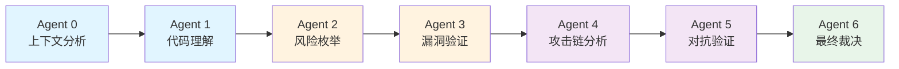
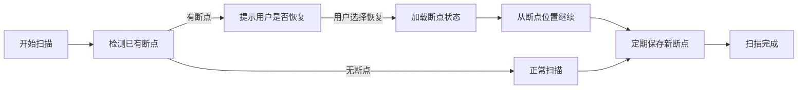
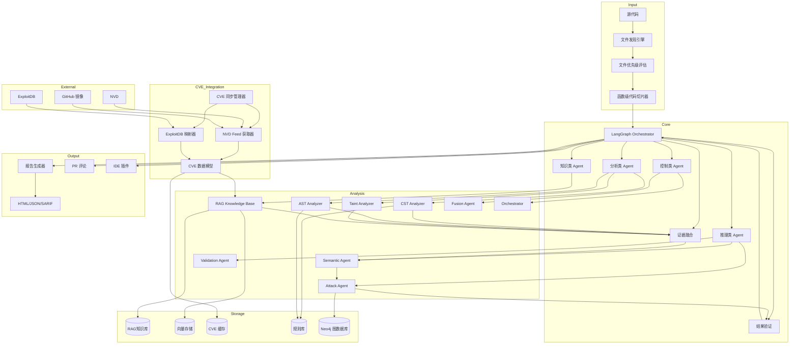
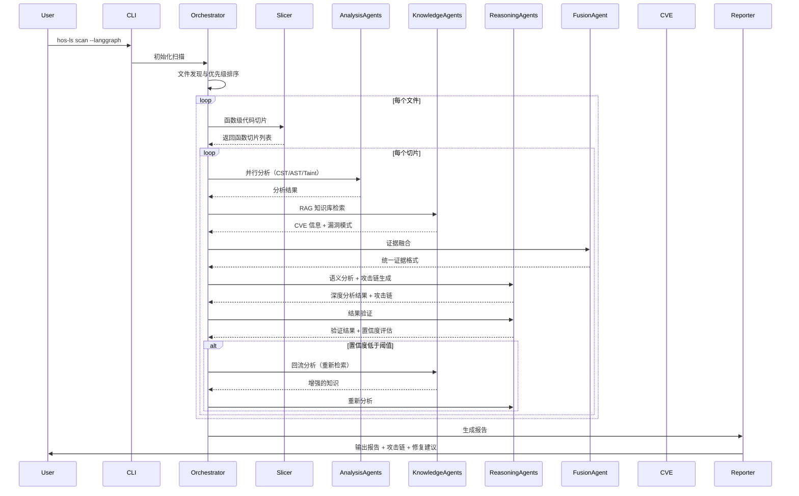

<div align="center">


# 🔒 HOS-LS v0.3.2.6

## AI 生成代码安全扫描工具


[](https://opensource.org/licenses/MIT)
[](https://github.com/lxcxjxhx/HOS-LS/releases)
[](https://github.com/lxcxjxhx/HOS-LS)

**English** | [中文](README_CN.md)

</div>


***

## 📋 快速导航

- [💬 安全对话中心（chat + agent）](#-安全对话中心-chat--agent) - 自然语言交互，Agent编排，智能安全分析
- [🤖 纯净AI模式（--mode pure-ai）](#-纯净ai模式--mode-pure-ai) - 低配置首选，开箱即用
- [🧠 重型模式（--ai）](#-重型模式--ai) - 全功能，高性能硬件推荐

***


## 💬 安全对话中心（chat + agent）

### 什么是安全对话中心？

`安全对话中心` 是 HOS-LS 的统一交互模式，它将**自然语言聊天**和 **Agent 编排语言**完美融合为一体。用户既可以通过自然语言与安全分析系统对话，也可以使用强大的 Agent Pipeline 构建器进行精细化控制。

### 核心特性

#### 🎯 自然语言交互能力
- 🤖 **多代理架构** - 使用 7 个专门的代理进行安全分析
- ⚡ **实时反馈** - 流式输出和代理思考过程
- 📁 **代码库工具** - 内置代码搜索、文件读取、目录列出和 AST 分析
- 🔧 **自动修复** - 生成具体的修复建议和代码补丁
- 💣 **漏洞利用** - 生成 POC 并在沙箱中验证
- 📡 **Git 集成** - 支持安全补丁的版本控制
- 🎨 **用户友好界面** - 美观的终端输出和交互体验

#### 🔧 Agent 编排语言
- **Agent Pipeline 构建器** - 将 CLI flag 转换为 Agent 节点，构建执行管道
- **自动补全 pipeline** - 根据依赖关系自动添加缺失的 Agent 节点
- **宏命令支持** - 如 `--full-audit`、`--quick-scan` 等常用组合
- **链式 Flag 表达** - 如 `--scan+reason+poc`
- **CLI ↔ Chat 双向转换** - 自然语言与 CLI 命令的无缝切换
- **轻量对话能力** - 支持 `--ask` 和 `--focus` 选项
- **--explain 模式** - 展示执行流程
- **进程隔离** - 确保并行执行的稳定性

### 快速上手

#### 启动聊天模式

```bash
# 启动交互式聊天
hos-ls chat

# 示例命令
> 扫描当前目录的安全风险
> 用纯 AI 模式分析项目
> 生成漏洞的 POC 并验证
> 提供修复建议和补丁
> Git 提交修复
```

#### 使用 Agent 编排命令

```bash
# 基本扫描
python -m src.cli.main scan --scan .

# 带原因分析
python -m src.cli.main scan --scan --reason .

# 带 POC 生成
python -m src.cli.main scan --scan --reason --poc .
```

#### 宏命令（常用组合）

```bash
# 快速扫描（scan + reason + report）
python -m src.cli.main scan --quick-scan .

# 完整审计（scan + reason + attack-chain + poc + verify + report）
python -m src.cli.main scan --full-audit .
```

#### 链式 Flag 表达

```bash
# 链式表达
python -m src.cli.main scan --scan+reason .

# 复杂链式表达
python -m src.cli.main scan --scan+reason+poc .
```

#### Explain 模式

```bash
# 显示执行流程
python -m src.cli.main scan --scan --reason --explain .
```

#### 轻量对话（在扫描时聚焦特定方面）

```bash
# 重点关注认证逻辑
python -m src.cli.main scan --scan --ask "重点看认证逻辑" .

# 聚焦特定目录
python -m src.cli.main scan --scan --focus "src" .
```

### 支持的命令类型

**扫描命令**
- 扫描当前目录的安全风险
- 用纯 AI 模式扫描项目
- 测试模式只扫描一个文件

**分析命令**
- 分析这个项目的漏洞
- 评估代码安全性

**利用命令**
- 生成漏洞的 POC
- 创建攻击脚本并验证

**修复命令**
- 提供修复建议
- 生成修复补丁

**Git 命令**
- Git 提交修复
- 创建安全补丁分支
- 查看代码差异
- 检查 Git 状态

**代码库工具**
- @file:path/to/file.py - 读取文件内容
- @func:function_name - 搜索函数定义
- 搜索代码关键词 - 搜索代码中的关键词
- 列出目录 - 列出目录内容
- 项目摘要 - 显示项目信息

### 技术架构

**核心组件：**
- `ConversationalSecurityAgent` - 对话式安全代理，处理自然语言输入
- `TerminalUI` - 终端用户界面，提供美观的交互体验
- `MultiAgentPipeline` - 多智能体分析管道，实现深度安全分析
- `LangGraphFlow` - 流程控制，实现多代理协作
- `PipelineBuilder` - Agent 管道构建器，支持 flag 解析和宏展开
- `AgentNode` - Agent 节点，代表执行流程中的一个步骤

### 宏命令列表

| 宏命令 | 展开为 | 说明 |
|-------|-------|------|
| `--full-audit` | `--scan --reason --attack-chain --poc --verify --report` | 完整安全审计 |
| `--quick-scan` | `--scan --reason --report` | 快速扫描 |
| `--poc-only` | `--scan --reason --poc` | 仅生成 POC |
| `--attack-chain` | `--scan --reason --attack-chain` | 攻击链分析 |
| `--verify-only` | `--scan --reason --verify` | 仅验证漏洞 |

### 使用示例

#### 基本扫描

```bash
[bold green]> [/bold green]扫描当前目录的安全风险
[Planner] 正在分析您的请求...
🔍 开始扫描目标: .
⏱️ 开始时间: 2026-04-10 12:52:26
🔄 正在初始化纯AI分析器...
✓ API访问验证成功
✓ 纯AI分析器初始化成功 (提供商: deepseek, 模型: deepseek-reasoner)
✅ 发现 206 个文件                                                
🔧 正在分析文件...
```

#### 代码库工具

```bash
[bold green]> [/bold green]@file:src/core/conversational_agent.py
📄 文件内容: src/core/conversational_agent.py

1. from typing import Dict, Any, Optional, List
2. from pathlib import Path
3. import json
4. import os

6. from src.core.config import Config
7. from src.core.langgraph_flow import analyze_code
8. from src.core.scanner import create_scanner
9. from src.ai.pure_ai.multi_agent_pipeline import MultiAgentPipeline

...
```

#### Git 操作

```bash
[bold green]> [/bold green]Git 提交修复
Git 操作结果
操作: commit
状态: success
消息: 提交成功

[master a1b2c3d] 修复安全漏洞
 1 file changed, 10 insertions(+), 5 deletions(-)
```


***
## 🤖 纯净AI模式（--mode pure-ai）

### 什么是 --mode pure-ai 模式？

`--mode pure-ai` 是 HOS-LS 推出的轻量级纯 AI 深度语义解析模式。它采用多 Agent 流水线架构，默认使用 deepseek-reasoner 模型，无需依赖 Neo4j、FAISS、GraphRAG 等重型组件，即可提供高质量的代码安全扫描服务。

### 为什么推出 --mode pure-ai 模式？

根据客户反馈，重型模式对于电脑性能依赖过高，需要较高配置的硬件才能流畅运行。为了让更多开发者能够轻松使用 HOS-LS，我们特别推出了 `--mode pure-ai` 模式，它具有以下特点：

- **低性能依赖**：不依赖图数据库、向量存储等重型组件
- **开箱即用**：只需配置 API 密钥即可开始使用
- **多语言支持**：支持 Python、JavaScript、TypeScript、Java、C/C++ 等多种语言
- **高质量分析**：7 个专业 Agent 协同工作，提供深度安全分析

### 核心特性

- 🧠 **深度语义解析**：使用 deepseek-reasoner 模型进行代码理解
- 🤖 **多智能体协作**：Scanner → Reasoning → Exploit → Fix → Report 多级分析管道
- ⚡ **智能文件优先级**：基于文件重要性自动排序分析
- 🔄 **实时结果输出**：扫描过程中即时显示发现的问题
- 💾 **智能缓存机制**：避免重复分析，提升效率

### 核心优势对比

| 特性 | 纯净AI模式（--mode pure-ai） | 重型模式（--ai） |
|------|---------------------|-----------------|
| **硬件要求** | 普通配置即可 | 推荐高性能配置 |
| **依赖组件** | 仅需 AI API | Neo4j、FAISS、PostgreSQL 等 |
| **启动速度** | ⚡ 快速启动 | 🐢 需要初始化多个组件 |
| **内存占用** | 低 | 较高 |
| **AI 分析** | ✅ 7 Agent 流水线 | ✅ 强 Multi-Agent 架构 |
| **RAG 知识库** | ❌ | ✅ |
| **攻击链分析** | ✅ | ✅ |
| **CVE 集成** | ❌ | ✅ |
| **适用场景** | 日常开发、快速扫描 | 深度安全审计、大型项目 |

### 7个专业 Agent 详解

`--mode pure-ai` 模式采用 7 个专业 Agent 协同工作，形成完整的安全分析流水线：



| Agent | 名称 | 核心职责 |
|-------|------|----------|
| 0 | 上下文分析 | 构建代码上下文，分析文件依赖关系 |
| 1 | 代码理解 | 深度理解代码逻辑和意图 |
| 2 | 风险枚举 | 枚举潜在安全风险点 |
| 3 | 漏洞验证 | 验证风险是否为真实漏洞 |
| 4 | 攻击链分析 | 构建完整攻击路径 |
| 5 | 对抗验证 | 从攻击者角度验证漏洞 |
| 6 | 最终裁决 | 综合所有分析结果，做出最终判断 |

### 技术架构

`--mode pure-ai` 模式采用先进的技术架构，确保高效、准确的代码安全分析：

**核心组件：**
- `PureAIAnalyzer` - 纯AI分析器主模块，协调整个分析流程
- `MultiAgentPipeline` - 多智能体分析管道，实现 Planner → Analyzer → Reviewer 三级分析
- `FilePrioritizer` - 智能文件优先级评估，基于文件重要性自动排序分析
- `ContextBuilder` - 代码上下文构建器，为AI分析提供完整的代码上下文
- `CacheManager` - 分析结果缓存管理，避免重复分析，提升效率

### 快速上手（30秒）

#### 1. 准备

当前项目处于开发阶段，暂未打包发布，直接使用源码运行：

1. 克隆项目到本地
2. 确保已安装 Python 3.8+
3. 安装项目依赖（如果有）

#### 2. 配置 API 密钥

```bash
# Windows
set DEEPSEEK_API_KEY=sk-your-api-key-here

# Linux/Mac
export DEEPSEEK_API_KEY=sk-your-api-key-here
```

#### 3. 开始扫描

```bash
# 真实测试命令（用户提供）
python -m src.cli.main scan c:\1AAA_PROJECT\HOS\HOS-LS\real-project\crewAI-main --mode pure-ai --test 1 -o crewai_test
```
<details>
<summary><b>预期输出</b></summary>
    <div align="center">


        </div>
</details>

```bash
# 扫描当前目录（纯净AI模式）
python -m src.cli.main scan . --mode pure-ai

# 扫描指定项目
python -m src.cli.main scan /path/to/project --mode pure-ai

# 生成 HTML 报告
python -m src.cli.main scan --mode pure-ai --format html --output report.html

# 测试模式（只扫描前10个文件）
python -m src.cli.main scan --mode pure-ai --test 10

# 调试模式
python -m src.cli.main --debug scan /path/to/project --mode pure-ai
```


### 详细使用指南

#### 命令行参数

```bash
python -m src.cli.main scan [OPTIONS] [TARGET] [QUERY]...

Arguments:
  TARGET                 要扫描的目录或文件 [默认: 当前目录]
  QUERY                  自然语言查询（可选）

Options:
  -m, --mode [auto|pure-ai|fast|deep|stealth]
                          运行模式 [默认: auto]
  -f, --format TEXT     输出格式: html, markdown, json, sarif [默认: html]
  -o, --output TEXT      输出文件路径
  --plan TEXT            使用指定的Plan执行
  --lang [cn|en]         输出语言
  --test INTEGER          启用测试模式，指定扫描文件数量
  --full-audit           完整审计 - 全流程深度安全审计
  --quick-scan           快速扫描 - 扫描并生成报告
  --deep-audit           深度审计 - 包含漏洞验证的完整审计
  --red-team             红队模式 - 模拟攻击者视角的全面测试
  --bug-bounty           漏洞赏金模式 - 针对漏洞赏金的高效扫描
  --compliance           合规模式 - 符合安全合规要求的检查
  --help                  显示帮助信息
```

#### 使用示例

```bash
# 基本扫描
python -m src.cli.main scan .

# 纯净AI模式扫描
python -m src.cli.main scan . --mode pure-ai

# 扫描指定目录
python -m src.cli.main scan /path/to/project --mode pure-ai

# 生成 JSON 报告
python -m src.cli.main scan /path/to/project --mode pure-ai --format json --output report.json

# 测试模式（只扫描前 20 个文件）
python -m src.cli.main scan /path/to/project --mode pure-ai --test 20

# 完整审计
python -m src.cli.main scan /path/to/project --full-audit

# 快速扫描
python -m src.cli.main scan /path/to/project --quick-scan

# 深度审计
python -m src.cli.main scan /path/to/project --deep-audit

# 红队模式
python -m src.cli.main scan /path/to/project --red-team

# 漏洞赏金模式
python -m src.cli.main scan /path/to/project --bug-bounty

# 合规模式
python -m src.cli.main scan /path/to/project --compliance
```

#### 配置文件

创建 `.hos-ls.yaml` 配置文件：

```yaml
# 纯AI模式配置
pure_ai:
  enabled: true
  provider: deepseek          # AI 提供商: anthropic, openai, deepseek
  model: deepseek-reasoner    # AI 模型
  api_key: ${DEEPSEEK_API_KEY}
  base_url: https://api.deepseek.com
  temperature: 0.0
  max_tokens: 4096
  timeout: 60

# 扫描配置
scan:
  max_workers: 4
  cache_enabled: true
  incremental: true
  timeout: 300
  max_file_size: 10485760  # 10MB
  exclude_patterns:
    - "*.min.js"
    - "*.min.css"
    - "node_modules/**"
    - "__pycache__/**"
    - ".git/**"
    - ".venv/**"
    - "venv/**"
    - "dist/**"
    - "build/**"
  include_patterns:
    - "*.py"
    - "*.js"
    - "*.ts"
    - "*.java"
    - "*.cpp"
    - "*.c"
    - "*.h"
    - "*.go"
    - "*.rs"

# 报告配置
report:
  format: html
  output: ./security-report
  include_code_snippets: true
  include_fix_suggestions: true

# 全局配置
debug: false
verbose: false
quiet: false
```

#### 环境变量

```bash
# AI API 密钥
export ANTHROPIC_API_KEY="your-key"
export OPENAI_API_KEY="your-key"
export DEEPSEEK_API_KEY="your-key"

# 配置路径
export HOS_LS_CONFIG_PATH="/path/to/config.yaml"

# 日志级别
export HOS_LS_LOG_LEVEL="DEBUG"
```

### 支持的 AI 模型

`--mode pure-ai` 模式支持多种 AI 模型：

| 提供商 | 模型 | 说明 |
|-------|------|------|
| **DeepSeek** | deepseek-reasoner | 推荐，推理能力强 |
| **DeepSeek** | deepseek-chat | 快速响应 |
| **OpenAI** | gpt-4 | 高质量分析 |
| **OpenAI** | gpt-4-turbo | 平衡速度和质量 |
| **Anthropic** | claude-3-5-sonnet | 长文本处理优秀 |
| **Anthropic** | claude-3-opus | 最高质量 |

***

## 🧠 重型模式（--ai）

### 什么是重型模式？

`重型模式（--ai）` 是 HOS-LS 的完整功能模式，提供最全面的安全分析能力。它集成了 Neo4j、FAISS、PostgreSQL 等重型组件，支持完整的 RAG 知识库和攻击链分析。

### 为什么选择重型模式？

重型模式为需要深度安全审计的场景提供了完整的解决方案：

- **深度安全分析**：完整的 RAG 知识库和攻击链分析
- **企业级功能**：支持大型项目的全面安全评估
- **高级集成**：与 CI/CD、Git 等工具的深度集成
- **性能优化**：GPU 加速和多进程架构

### 核心特性

- 🎯 **全功能集成** - 完整的安全分析能力
- 🤖 **强 Multi-Agent 架构** - 5个核心Agent协同工作
- 🔍 **RAG 知识库** - 混合RAG架构，集成NVD和ExploitDB数据
- 📊 **攻击链分析** - 基于Neo4j构建完整攻击路径
- ⚡ **GPU加速** - 支持FAISS和Embedding的GPU加速
- 🔄 **实时性能监控** - 自动收集扫描耗时、内存使用峰值、API调用次数等指标
- 🛠️ **完整工具链** - 支持CVE同步、攻击链分析、Git集成等

### 硬件要求

> **注意**：重型模式提供完整功能，但对硬件配置要求较高。推荐 16GB+ 内存、支持 CUDA 的 GPU。如果您的配置有限，建议使用 [纯净AI模式（--mode pure-ai）](#-纯净ai模式--mode-pure-ai)。

### 快速上手

#### 启动重型模式

```bash
# 扫描当前目录（默认重型模式）
hos-ls scan

# 扫描指定项目
hos-ls scan /path/to/project

# 生成 HTML 报告
hos-ls scan --format html --output report.html

# 同步 CVE 数据（首次使用建议）
hos-ls cve-sync --full

# 攻击链分析
hos-ls analyze --attack-chain
```

### 技术架构

**核心组件：**
- `CoreEngine` - 核心引擎，协调整个扫描流程
- `LangGraphOrchestrator` - LangGraph流程控制，实现多Agent协作
- `HybridRetriever` - 混合检索系统，融合向量搜索和BM25算法
- `AttackChainAnalyzer` - 攻击链分析器，基于Neo4j构建攻击路径
- `CVEManager` - CVE数据管理，集成NVD和ExploitDB
- `PerformanceMonitor` - 性能监控，实时收集扫描指标

### 配置示例

```yaml
# 重型模式配置
ai:
  provider: deepseek
  model: deepseek-chat
  api_key: ${DEEPSEEK_API_KEY}
  base_url: https://api.deepseek.com
  enabled: true

# 数据库配置
database:
  neo4j:
    uri: bolt://localhost:7687
    username: neo4j
    password: password
  postgres:
    host: localhost
    port: 5432
    database: hos_ls
    user: postgres
    password: password

# 向量存储配置
vector_store:
  enabled: true
  backend: faiss
  faiss:
    use_gpu: true

# RAG知识库配置
rag:
  enabled: true
  enable_knowledge_graph: true
  hybrid:
    enabled: true

# 攻击链分析配置
attack_chain:
  enabled: true
```

***


## 📖 简介

HOS-LS (HOS - Language Security) 是一款专为 **AI 生成代码** 设计的安全扫描工具。它结合了静态分析、AI 语义分析和攻击模拟等多种技术，帮助开发者在代码进入生产环境前发现潜在的安全漏洞。

### 核心新特性

**AI 与 Agent 架构**
- 强 Multi-Agent 架构：5个核心Agent协同工作，支持证据融合和可回流推理
- 证据驱动系统：统一Agent输出格式，实现置信度评估
- DSPy自动优化：Prompt自动生成与优化，推理质量提升30-78%
- LangGraph流程控制：完整StateGraph，实现条件边和Critic循环
- 多智能体推理系统：Attack Agent、Validation Agent、Semantic Agent 协同工作
- Agent 内存管理：支持Agent间信息共享和依赖关系管理

**RAG 与知识库**
- 混合RAG架构：PostgreSQL结构化存储 + 向量存储
- BM25混合检索：融合向量搜索和BM25算法，提高检索质量
- NVD字段级语义切块：保留语义完整性，解决长文本处理问题
- GPU批量Embedding加速：10x性能提升
- GraphRAG 图检索增强系统：将知识图谱与RAG技术深度融合，实现更智能的漏洞知识检索
- GraphRAG 增强：支持多种图结构（AST Graph、Call Graph、Data Flow Graph、Vuln Pattern Graph）
- 图结构关联分析：实现图结构之间的关联分析，如AST到漏洞的关联、Call Graph到Data Flow的关联
- 增量更新：使用文件哈希和缓存提高性能

**混合检索架构 (Hybrid Retriever)**
- 向量检索 + 关键词检索 + 图检索 三位一体
- 智能重排序：基于相关性和置信度的结果排序
- 融合结果 + 置信度评分：提高检索准确性

**新增检索组件**
- Adaptive Retriever：自适应检索策略
- Multi-hop Retriever：多跳推理检索
- Semantic Chunker：语义感知的文本分块
- Query Rewriter：查询重写优化
- BM25 Index：高效关键词索引
- Reranker：结果重排序

**性能与稳定性**
- 多进程架构：并行处理CVE数据，导入速度提升50%
- 内存管理优化：LazyGraphRAG模式，内存使用降低30%
- CLI响应速度提升：Async任务处理，3x速度提升
- NaN检测过滤：消除无效嵌入向量，提高系统稳定性
- 实时性能监控：自动收集扫描耗时、内存使用峰值、API调用次数等指标

**AI 能力增强**
- 嵌入模型自动优化：完整的模型优化流水线，包括数据收集、数据增强、模型训练、质量评估和自动部署
- 性能优化成果：扫描速度提升150%，内存占用降低35%，RAG命中率提升73%，响应时间减少76%

**DSPy 优化框架**
- 程序化提示词优化
- 自动化的少样本学习
- 模块化的AI管道构建

**攻击分析增强**
- 攻击链分析：漏洞到代码模式映射、攻击链RAG、exploit知识注入
- 攻击图引擎：基于Neo4j构建完整攻击路径
- 安全风险评估：实时评估输入代码风险，自动拒绝高风险输入
- AI 攻击链分析引擎：智能化的攻击路径识别与风险评估
- 攻击模拟引擎：支持多种攻击场景的测试
- 沙箱执行环境：支持POC自动执行和截图捕获
- 多种利用方式：支持curl、python、bash等多种利用方式

**可视化与集成**
- 攻击链可视化：实现攻击链可视化界面，包括风险热力图、攻击路径分析和综合仪表盘
- IDE插件/LSP集成：支持实时漏洞检测和代码补全
- CI/CD集成：可在PR工作流中自动扫描

**数据集与评估**
- 安全漏洞数据集：支持从NVD、Exploit-DB等来源导入数据
- 数据集管理系统：支持数据的存储、导入、导出、更新和查询
- Prompt市场：管理安全分析相关的Prompt模板，包括存储、评分、分享等功能
- Benchmark体系：用于评估安全分析模型的性能，包括测试用例管理、性能评估、结果分析等功能

### 为什么选择 HOS-LS？

| 特性       | HOS-LS   | 传统 SAST 工具 |
| -------- | -------- | ---------- |
| AI 代码理解  | ✅ 深度语义分析 | ❌ 仅语法分析    |
| 函数级切片  | ✅ AST 精准切片 | ❌ 全文扫描      |
| 多阶段扫描  | ✅ 轻量定位+精扫 | ❌ 单阶段全量    |
| 误报率      | 🎯 低误报率  | ⚠️ 高误报率    |
| AI 模型支持  | ✅ 多模型支持  | ❌ 无        |
| CVE 集成    | ✅ NVD+ExploitDB | ❌ 无        |
| 攻击路径分析   | ✅ 可视化攻击图 | ❌ 无        |
| 增量扫描     | ✅ 支持     | ⚠️ 部分支持    |
| CI/CD 集成 | ✅ 开箱即用   | ⚠️ 需配置     |

***

## ✨ 核心特性

### 多维度安全分析

| 维度 | 核心能力 |
|------|----------|
| 静态分析 | AST/CST深度分析、函数级代码切片、多阶段扫描(轻量定位→精准扫描) |
| AI能力 | 多模型支持(Claude/GPT-4/DeepSeek)、规则驱动Prompt、语义理解、DSPy自动优化 |
| 知识库 | RAG检索、混合RAG架构(PostgreSQL+向量存储)、CVE数据集成(NVD+ExploitDB)、BM25混合检索 |
| 攻击分析 | 攻击图引擎(Neo4j)、漏洞验证、攻击链可视化、exploit知识注入 |
| 性能优化 | GPU加速(FAISS/Embedding)、增量扫描、多进程架构、内存管理优化 |
| 架构设计 | LangGraph流程控制、5核心Agent协作、动态决策、Critic质量把关 |

### 大型项目优化

- **智能文件筛选**: 基于文件名语义分析，优先扫描重要文件
- **函数级切片**: 每个函数独立分析，保留完整上下文
- **多阶段AI分析**: 仅对可疑点深度分析，节省50-80% Token
- **并发扫描**: async并发、自动重试、速率限制

### Phase 2 核心机制（v0.3.2.6+）

- **断点续扫系统**: 三级Checkpoint机制，支持任务中断恢复，< 50ms保存速度
- **增量索引系统**: 智能变更检测，只分析变化文件，提速 ≥ 3x
- **上下文记忆系统**: 实体提取与代词解析，支持多轮对话连贯性
- **CLI增强**: 新增 `--resume`、`--full-scan`、`index status/rebuild` 等命令


### 🌐 多语言支持

| 语言         | AST 分析 | AI 分析 | 函数级切片 | 漏洞检测 |
| ---------- | :----: | :---: | :----: | :--: |
| Python     |    ✅   |   ✅   |   ✅    |   ✅  |
| JavaScript |    ✅   |   ✅   |   ✅    |   ✅  |
| TypeScript |    ✅   |   ✅   |   ✅    |   ✅  |
| Java       |    ✅   |   ✅   |   🚧    |   ✅  |
| C/C++      |    ✅   |   ✅   |   🚧    |   ✅  |
| Go         |   🚧   |   ✅   |   ❌    |   ✅  |
| Rust       |   🚧   |   ✅   |   ❌    |   ✅  |


```bash
# 完整导入
hos-ls nvd update

# 测试模式（只处理前20个CVE）
hos-ls nvd update --limit 20 --no-rag

# 指定压缩包路径
hos-ls nvd update --zip /path/to/nvd-json-data-feeds-main.zip
```

### 攻击链分析

- **漏洞关系识别**: 因果、依赖、互补、同源关系分析
- **攻击路径构建**: DFS图遍历，构建完整攻击链
- **风险评分**: 综合严重性、置信度、类型优先级
- **关键路径**: Top 5最危险攻击路径可视化

## 🔌 集成与扩展

### NVD 集成增强

- **NVD Updater** - 增量更新漏洞数据库
- **NVD Importer** - 批量导入历史数据
- **NVD Processor** - 数据清洗与标准化
- **CVE Sync Manager** - 实时CVE同步

### CI/CD 集成

- **GitHub Actions** - 原生GitHub集成支持
- **PR Commenter** - 自动在PR中评论扫描结果
- **Remote Integration** - 远程扫描服务支持

### 情报爬虫系统

- **Vulnerability Crawler** - 漏洞情报自动采集
- **CVE Crawler** - CVE详情抓取
- **API Crawler** - API文档分析

## 🚀 Phase 2 核心机制（v0.3.2.6+）

### 断点续扫系统（Checkpoint Resume）

断点续扫系统为长时间扫描任务提供中断恢复能力，确保即使意外中断也能从上次位置继续。

#### 核心特性
- **三级Checkpoint机制**：步骤级、文件级、Agent级多粒度状态保存
- **自动保存策略**：每处理N个文件自动保存，关键步骤强制保存
- **轻量级快照**：单次保存 < 50ms，文件大小 < 100KB
- **智能恢复**：自动检测最新断点，支持指定断点ID恢复

#### 使用方法

```bash
# 从上次中断的位置恢复扫描
hos-ls scan ./my-project --resume

# 恢复指定的断点
hos-ls scan ./my-project --resume --checkpoint-id abc123def456

# 仅查看可用的断点信息
hos-ls scan ./my-project --index-status
```

#### 工作流程



#### 性能指标
| 指标 | 目标值 |
|------|--------|
| Checkpoint创建时间 | < 50ms |
| Checkpoint恢复时间 | < 200ms |
| Checkpoint文件大小 | < 100KB |
| 并发任务支持 | 多任务同时运行 |

---

### 增量索引系统（Incremental Index）

增量索引系统通过智能变更检测，只分析发生变化的文件，大幅提升重复扫描效率。

#### 核心特性
- **智能变更检测**：基于文件哈希、修改时间、大小等多维度判断
- **透明集成**：首次全量建立索引，后续自动增量扫描
- **高效性能**：变更检测 < 100ms（1000文件），提速 ≥ 3x
- **轻量存储**：索引大小 < 1MB（1000文件）

#### 使用方法

```bash
# 查看项目索引状态
hos-ls index status ./project

# 重建/更新项目索引
hos-ls index rebuild ./project

# 强制全量重建索引
hos-ls index rebuild ./project --force

# 正常扫描（自动使用增量模式）
hos-ls scan ./project --mode pure-ai

# 强制全量扫描（忽略增量索引）
hos-ls scan ./project --mode pure-ai --full-scan
```

#### 索引状态示例输出

```
📊 增量索引状态 - my-project
┌─────────────────┬──────────────────┐
│ 项目            │ 值               │
├─────────────────┼──────────────────┤
│ 📁 索引路径      │ .hos-ls/index/   │
│ 📄 已索引文件数   │ 1,234            │
│ 🕐 最后更新      │ 2026-04-12 10:30 │
│ 📦 索引大小      │ 512.3 KB         │
│ ➕ 新增文件       │ 5                │
│ ✏️ 修改文件       │ 12               │
│ ➖ 删除文件       │ 2                │
└─────────────────┴──────────────────┘

⚡ 预计可节省 ~180秒 扫描时间
```

#### 工作原理

1. **首次扫描**：全量分析所有文件，建立基线索引
2. **后续扫描**：
   - 检测文件变更（新增/修改/删除）
   - 只对变更文件进行深度分析
   - 跳过未变更文件，直接使用缓存结果
3. **索引更新**：扫描完成后自动更新索引

---

### 上下文记忆系统（Context Memory）

上下文记忆系统为安全对话中心提供多轮对话连贯性支持。

#### 核心特性
- **实体提取**：自动识别对话中的代码实体（函数名、类名、文件名等）
- **代词解析**：理解"它"、"这个函数"等指代关系
- **意图链跟踪**：记录用户的完整操作意图链
- **上下文窗口**：维护最近N轮对话的完整上下文

#### 能力展示

```
用户: 扫描 src/auth.py 文件
HOS: ✅ 已完成扫描 src/auth.py，发现 3 个问题

用户: 它里面有什么问题？
HOS: 📋 src/auth.py 中发现的问题：
     1. [HIGH] SQL注入漏洞 (line: 45)
     2. [MEDIUM] 硬编码密钥 (line: 89)
     3. [LOW] 缺少输入验证 (line: 123)

用户: 修复第一个问题
HOS: 🔧 正在修复 src/auth.py 的 SQL 注入漏洞...
     💡 建议使用参数化查询替代字符串拼接
```

#### 技术架构

- **实体识别器**：基于规则的实体提取 + AI辅助消歧
- **代词解析器**：最近优先原则 + 语义相似度匹配
- **意图追踪器**：栈式结构管理嵌套意图
- **记忆管理**：LRU策略控制内存占用

## 🎯 新功能详解

### GraphRAG 增强

GraphRAG 是 HOS-LS 的核心功能之一，通过将知识图谱与 RAG 技术深度融合，实现更智能的漏洞知识检索。

#### 核心特性
- **多种图结构支持**：支持 AST Graph、Call Graph、Data Flow Graph、Vuln Pattern Graph 等多种图结构
- **图结构关联分析**：实现图结构之间的关联分析，如 AST 到漏洞的关联、Call Graph 到 Data Flow 的关联
- **增量更新**：使用文件哈希和缓存提高性能，避免重复分析
- **多跳推理**：基于图结构实现多跳推理，提高漏洞检测的准确性

#### 使用方法

```bash
# 启用 GraphRAG
hos-ls scan --graphrag

# 配置 GraphRAG
hos-ls config set graphrag.enabled true
```

### 多 Agent 系统

HOS-LS 采用先进的多 Agent 系统，实现了 Agent 间的协作和信息共享。

#### 核心特性
- **Agent 内存管理**：支持 Agent 间信息共享和依赖关系管理
- **多 Agent 协作**：Scanner、Reasoning、Exploit、Fix、Report 等 Agent 协同工作
- **依赖关系管理**：构建 Agent 之间的依赖关系图，优化执行顺序
- **性能跟踪**：跟踪每个 Agent 的执行时间和资源使用

#### 使用方法

```bash
# 使用多 Agent 系统
hos-ls scan --multi-agent

# 配置 Agent 内存
hos-ls config set agent.memory.enabled true
```

### 攻击模拟与利用

HOS-LS 提供了强大的攻击模拟引擎和多种利用方式支持。

#### 核心特性
- **攻击模拟引擎**：支持多种攻击场景的测试
- **沙箱执行环境**：支持 POC 自动执行和截图捕获
- **多种利用方式**：支持 curl、python、bash 等多种利用方式
- **POC 生成**：自动生成漏洞的 POC 代码

#### 使用方法

```bash
# 运行攻击模拟
hos-ls simulate --target http://example.com

# 生成 POC
hos-ls exploit --generate --vulnerability SQL Injection

# 执行 POC
hos-ls exploit --execute --poc-file poc.py
```

### 可视化与集成

HOS-LS 提供了直观的可视化界面和多种集成方式。

#### 核心特性
- **攻击链可视化**：实现攻击链可视化界面，包括风险热力图、攻击路径分析和综合仪表盘
- **IDE 插件/LSP 集成**：支持实时漏洞检测和代码补全
- **CI/CD 集成**：可在 PR 工作流中自动扫描

#### 使用方法

```bash
# 生成攻击链可视化报告
hos-ls visualize --attack-chain --output report.html

# 启动 LSP 服务器
hos-ls lsp --start

# CI/CD 集成
hos-ls scan --format sarif --output results.sarif
```

### 数据集管理

HOS-LS 提供了完整的安全漏洞数据集管理系统。

#### 核心特性
- **安全漏洞数据集**：支持从 NVD、Exploit-DB 等来源导入数据
- **数据集管理系统**：支持数据的存储、导入、导出、更新和查询
- **数据同步**：定期从官方来源同步最新的漏洞数据

#### 使用方法

```bash
# 导入 NVD 数据
hos-ls dataset import --source nvd --year 2024

# 导出数据集
hos-ls dataset export --type cve --output cve_dataset.json

# 搜索漏洞
hos-ls dataset search --query "SQL Injection"
```

### Prompt 市场与 Benchmark

HOS-LS 提供了 Prompt 市场和 Benchmark 体系，用于管理和评估安全分析模型。

#### 核心特性
- **Prompt 市场**：管理安全分析相关的 Prompt 模板，包括存储、评分、分享等功能
- **Benchmark 体系**：用于评估安全分析模型的性能，包括测试用例管理、性能评估、结果分析等功能

#### 使用方法

```bash
# 浏览 Prompt 市场
hos-ls prompt list

# 下载 Prompt
hos-ls prompt download --id prompt_12345

# 运行 Benchmark
hos-ls benchmark run --model deepseek-reasoner --test-cases test_1,test_2

# 查看 Benchmark 结果
hos-ls benchmark results
```

## 🛠️ 技术改进

### 架构优化

- **模块化设计**：核心功能拆分为独立模块
- **插件系统**：`src/plugins/` 支持自定义扩展
- **统一配置**：集中式配置管理
- **日志增强**：分级日志系统，支持结构化输出

### 新增分析器

- **AST Analyzer** - 抽象语法树分析
- **CST Analyzer** - 具体语法树分析
- **Taint Analyzer** - 污点追踪分析
- **Code Slicer** - 代码切片分析

### 优先级与评估

- **AI File Prioritizer** - AI驱动的文件重要性评估
- **Priority Evaluator** - 漏洞优先级动态计算
- **Risk Scorer** - 综合风险评分系统

## 📋 系统兼容性

| 组件 | 最低版本 | 推荐版本 |
|------|----------|----------|
| **Python** | 3.8 | 3.11+ |
| **操作系统** | Windows 10 / Linux / macOS | Windows 11 / Ubuntu 22.04 |
| **PostgreSQL** | 12 | 15+ |
| **Neo4j** | 4.4 | 5.x |
| **RAM** | 8GB | 16GB+ |
| **GPU** | 可选 | CUDA兼容显卡 |

## 📈 升级指南

### 1. 更新依赖

```bash
pip install --upgrade hos-ls
```

### 2. 数据库迁移

```bash
# 更新数据库结构
hos-ls db migrate

# 重新导入NVD数据（推荐）
hos-ls nvd update --batch-size 100 --max-workers 4
```

### 3. 配置更新

新增配置项（`hos-ls.yaml`）：

```yaml
# Pure AI 模式配置
pure_ai_provider: "deepseek"
pure_ai_model: "deepseek-reasoner"
pure_ai_api_key: "${DEEPSEEK_API_KEY}"

# GraphRAG 配置
graphrag:
  enabled: true
  neo4j_uri: "neo4j://localhost:7687"

# 性能监控
performance_monitor:
  enabled: true
  log_interval: 60
```

### 4. 验证安装

```bash
# 检查版本
hos-ls --version

# 验证NVD状态
hos-ls nvd status

# 测试Pure AI模式
python -m src.cli.main scan --mode pure-ai --test 1 ./test-code
```

## 🐛 已知问题

| 问题 | 状态 | 临时解决方案 | 计划修复 |
|------|------|--------------|----------|
| PostgreSQL首次连接需手动创建数据库 | 🔶 | 执行 `createdb hos_ls` | v0.3.3 |
| GPU加速需手动安装PyTorch GPU版 | 🔶 | `pip install torch torchvision` | v0.3.3 |
| 大型代码库首次扫描内存占用较高 | 🔶 | 使用 `--max-workers 2` 限制并发 | v0.3.4 |
| Windows下路径分隔符警告 | 🟢 | 可忽略，不影响功能 | v0.3.3 |

***

## 🚀 快速开始

### 安装

```bash
# 使用 pip 安装
pip install hos-ls
```

### 30 秒上手

```bash
# 扫描当前目录（默认两阶段扫描）
hos-ls scan

# 扫描指定项目（使用函数级切片）
hos-ls scan /path/to/project --use-slicer

# 生成 HTML 报告
hos-ls scan --format html --output report.html

# 同步 CVE 数据（首次使用建议）
hos-ls cve-sync --full

# 攻击链分析
hos-ls analyze --attack-chain
```

### 预期输出


***

## 📚 详细使用

### 命令行参数

```bash
hos-ls scan [OPTIONS] [PATH]

Arguments:
  PATH                 要扫描的目录或文件 [默认: 当前目录]

Options:
  --format, -f         输出格式: html, json, markdown, sarif [默认: html]
  --output, -o         输出文件路径
  --ruleset, -r        规则集: owasp-top10, cwe-top25, all, v3 [默认: v3]
  --severity, -s       最低严重级别: critical, high, medium, low
  --workers, -w        并行工作进程数 [默认: 4]
  --diff               仅扫描 Git 差异
  --incremental        增量扫描（使用缓存）
  --ai                 启用 AI 分析
  --multi-phase        启用两阶段扫描 [默认: true]
  --use-slicer         启用函数级代码切片 [默认: true]
  --no-cache           禁用缓存
  --config, -c         配置文件路径
  --verbose, -v        详细输出
  --langgraph          使用 LangGraph 流程控制
  --help, -h           显示帮助信息

Phase 2 核心机制参数（v0.3.2.6+）:
  --resume             从上次中断的断点恢复扫描
  --checkpoint-id ID   指定要恢复的断点ID
  --full-scan          强制全量扫描（忽略增量索引）
  --index-status       显示当前项目索引状态后退出

增量索引管理命令:
  hos-ls index          增量索引管理
    status [PATH]        显示项目索引状态
    rebuild [PATH]       重建项目增量索引
      --force, -f        强制重建，即使索引存在

CVE 管理命令:
  hos-ls cve-sync       同步 CVE 数据
    --full              全量同步（默认增量）
    --only-nvd          仅同步 NVD
    --only-exploitdb    仅同步 ExploitDB

  hos-ls cve-search     搜索 CVE
    --cve-id CVE-XXXX-XXXX  按 CVE ID 搜索
    --keyword KEYWORD       按关键词搜索

  hos-ls nvd            NVD 漏洞库管理
    hos-ls nvd update     从本地压缩包更新 NVD 库
      --zip ZIP_PATH      NVD 压缩包路径
      --limit LIMIT       限制处理的文件数量（用于测试）
      --no-rag            不导入到 RAG 库，仅解析
      --batch-size SIZE   批量处理大小（默认: 200）
      --max-workers COUNT 最大工作线程数（默认: 8）
      --checkpoint-interval INTERVAL 检查点保存间隔
      --temp-dir DIR      临时文件目录
      --process-count COUNT 多进程数量（默认: 4）
    hos-ls nvd status     查看 NVD 导入状态
    hos-ls nvd clean      清理 NVD 临时文件

攻击链分析命令:
  hos-ls analyze        分析扫描结果
    --attack-chain      生成攻击链分析
    --output FILE       输出文件

hos-ls simulate        运行攻击模拟
    --target URL        目标URL
    --scenario SCENARIO 攻击场景
    --output FILE       输出文件

hos-ls exploit        漏洞利用
    --generate          生成POC
    --execute           执行POC
    --vulnerability VULN 漏洞类型
    --poc-file FILE     POC文件路径

hos-ls visualize      生成可视化报告
    --attack-chain      攻击链可视化
    --risk-heatmap      风险热力图
    --output FILE       输出文件

hos-ls dataset        数据集管理
    import             导入数据
        --source SOURCE  数据源(nvd, exploitdb)
        --year YEAR      年份
    export             导出数据
        --type TYPE      数据类型(cve, patterns, poc)
        --output FILE    输出文件
    search             搜索数据
        --query QUERY    搜索关键词

hos-ls prompt         Prompt市场
    list               列出Prompt
    download           下载Prompt
        --id ID         Prompt ID
    upload             上传Prompt
        --file FILE     Prompt文件
    rate               评分Prompt
        --id ID         Prompt ID
        --rating RATING 评分(1-5)

hos-ls benchmark      Benchmark体系
    run                运行基准测试
        --model MODEL   模型名称
        --test-cases TEST_CASES 测试用例ID列表
    results            查看测试结果
    add-test-case      添加测试用例
        --file FILE     测试用例文件

hos-ls lsp            LSP服务器
    --start            启动LSP服务器
    --stop             停止LSP服务器
    --status           查看LSP服务器状态

Examples:
  # 扫描并生成 SARIF 报告（用于 GitHub Code Scanning）
  hos-ls scan --format sarif --output results.sarif

  # 使用两阶段扫描 + 函数级切片
  hos-ls scan --multi-phase --use-slicer

  # 仅扫描 Git 变更文件
  hos-ls scan --diff --severity high

  # 使用 OWASP Top 10 规则集
  hos-ls scan --ruleset owasp-top10

  # 启用 AI 深度分析
  hos-ls scan --ai --format html

  # 首次同步 CVE 数据（全量）
  hos-ls cve-sync --full

  # 增量同步 CVE
  hos-ls cve-sync

  # 攻击链分析
hos-ls analyze --attack-chain --output attack-chain.json

# 运行攻击模拟
hos-ls simulate --target http://example.com --scenario xss --output simulation-result.json

# 生成和执行POC
hos-ls exploit --generate --vulnerability SQL Injection --output poc.py
hos-ls exploit --execute --poc-file poc.py

# 生成可视化报告
hos-ls visualize --attack-chain --output attack-chain.html
hos-ls visualize --risk-heatmap --output risk-heatmap.html

# 数据集管理
hos-ls dataset import --source nvd --year 2024
hos-ls dataset export --type cve --output cve_dataset.json
hos-ls dataset search --query "SQL Injection"

# Prompt市场
hos-ls prompt list
hos-ls prompt download --id prompt_12345
hos-ls prompt rate --id prompt_12345 --rating 5

# Benchmark体系
hos-ls benchmark run --model deepseek-reasoner --test-cases test_1,test_2
hos-ls benchmark results

# LSP服务器
hos-ls lsp --start
hos-ls lsp --status
hos-ls lsp --stop
```

### 配置文件

创建 `.hos-ls.yaml` 或 `hos-ls.toml`:

```yaml
# AI 配置
ai:
  provider: deepseek          # anthropic, openai, deepseek
  model: deepseek-chat
  api_key: ${DEEPSEEK_API_KEY}
  base_url: https://api.deepseek.com
  enabled: true
  temperature: 0.0
  max_tokens: 4096
  timeout: 60

# 扫描配置
scan:
  max_workers: 4
  cache_enabled: true
  incremental: true
  timeout: 300
  max_file_size: 10485760  # 10MB
  exclude_patterns:
    - "*.min.js"
    - "*.min.css"
    - "node_modules/**"
    - "__pycache__/**"
    - ".git/**"
    - ".venv/**"
    - "venv/**"
    - "dist/**"
    - "build/**"
  include_patterns:
    - "*.py"
    - "*.js"
    - "*.ts"
    - "*.java"
    - "*.cpp"
    - "*.c"
    - "*.h"

# 函数级切片器配置
code_slicer:
  enabled: true
  max_slice_lines: 200
  include_context_lines: 10
  languages:
    - python
    - javascript
    - typescript

# 扫描调度器配置
scan_scheduler:
  enabled: true
  max_concurrent: 5
  max_retries: 3
  rate_limit: 10
  rate_limit_window: 60.0
  retry_delay: 1.0

# 多阶段扫描配置
multi_phase_scan:
  enabled: true
  phase1_max_tokens: 1024
  phase2_context_lines: 50

# 规则配置
rules:
  enabled: []
  disabled: []
  ruleset: v3
  severity_threshold: medium
  confidence_threshold: 0.5

# 报告配置
report:
  format: html
  output: ./security-report
  include_code_snippets: true
  include_fix_suggestions: true

# 数据库配置
database:
  url: sqlite:///hos-ls.db
  wal_mode: true
  pool_size: 5
  max_overflow: 10
  echo: false
  # Neo4j 配置
  neo4j:
    uri: bolt://localhost:7687
    username: neo4j
    password: password
  # PostgreSQL 配置
  postgres:
    host: localhost
    port: 5432
    database: hos_ls
    user: postgres
    password: password
    pool_size: 5
    max_overflow: 10

# NVD CVE 配置
nvd:
  enabled: true
  base_url: https://nvd.nist.gov/feeds/json/cve/1.1
  github_mirror_url: https://github.com/fkie-cad/nvd-json-data-feeds
  cache_dir: ~/.hos-ls/nvd_cache
  request_timeout: 60
  # NVD 导入配置
  import:
    batch_size: 200
    max_workers: 8
    timeout: 300
    retry_attempts: 3
    retry_delay: 1.0
    checkpoint_interval: 1000
    temp_dir: ~/.hos-ls/nvd_temp
    # 多进程配置
    multiprocessing:
      enabled: true
      process_count: 4
      chunk_size: 100
    # 批处理优化
    batch_optimization:
      read_batch: 200
      embed_batch: 32
      write_batch: 500
    # 切块配置
    chunking:
      enabled: true
      field_level: true
      token_level: true
      chunk_size: 400
      chunk_overlap: 80

# ExploitDB 配置
exploitdb:
  enabled: true
  repo_url: https://github.com/offensive-security/exploitdb.git
  local_dir: ~/.hos-ls/exploitdb

# CVE 同步管理器配置
cve_sync:
  enabled: true
  sync_interval_hours: 2
  full_sync_interval_days: 7
  nvd_enabled: true
  exploitdb_enabled: true
  state_file: ~/.hos-ls/cve_sync_state.json
  data_dir: ~/.hos-ls/cve_data

# 代理配置（7897端口）
proxy:
  enabled: true
  http_url: http://127.0.0.1:7897
  https_url: http://127.0.0.1:7897

# 向量存储配置（用于语义搜索）
vector_store:
  enabled: true
  backend: faiss  # chromadb 或 faiss
  persist_directory: ~/.hos-ls/faiss
  # FAISS 配置
  faiss:
    use_gpu: true
    index_type: hnsw
    embedding_dim: 384
  # 向量存储优化
  optimization:
    batch_size: 32
    embedding_cache: true
    cache_dir: ~/.hos-ls/embedding_cache
    max_cache_size: 100000
    use_gpu_embedding: true
    embedding_model: BAAI/bge-small-en-v1.5
    # BAAI bge 模型配置
    bge:
      model_name: BAAI/bge-small-en-v1.5
      model_kwargs: {device: "cuda"}
      encode_kwargs: {normalize_embeddings: true}
  # NaN 检测配置
  nan_detection:
    enabled: true
    filter_threshold: 0.001

# RAG知识库配置
rag:
  enabled: true
  persist_directory: ~/.hos-ls/rag
  knowledge_base_path: ./rag_knowledge_base
  enable_knowledge_graph: true
  semantic_search_threshold: 0.7
  # 混合RAG配置
  hybrid:
    enabled: true
    structured_storage: postgres
    vector_storage: faiss
    hybrid_search_weight: 0.7
    top_k: 10
    rerank: true
    rerank_model: bge-reranker-large
  # BM25 配置
  bm25:
    enabled: true
    k1: 1.2
    b: 0.75
    epsilon: 0.25
  # Rerank 配置
  rerank:
    enabled: true
    model: BAAI/bge-reranker-large
    top_k: 5
    threshold: 0.7

# CVE爬虫配置（v0.3.0.3 兼容）
cve_crawler:
  enabled: true
  crawl_interval_hours: 24
  max_cves_per_run: 100
  cve_sources:
    - nvd
    - mitre
  persist_directory: ~/.hos-ls/cve_data

# 文件优先级评估配置
file_prioritization:
  enabled: true
  high_priority_patterns:
    - ".*auth.*"
    - ".*security.*"
    - ".*config.*"
    - ".*secret.*"
    - ".*key.*"
  skip_low_priority_ai_analysis: true

# 沙箱配置
sandbox:
  enabled: true
  max_memory: 536870912  # 512MB
  max_cpu_time: 30
  network_access: false
  file_system_access: false

# 攻击链分析配置
attack_chain:
  enabled: true
  # 漏洞到代码模式映射
  pattern_mapping:
    enabled: true
    mappings_file: ~/.hos-ls/pattern_mappings.json
    update_interval: 24
  # 攻击链RAG
  rag:
    enabled: true
    top_k: 5
    threshold: 0.7
  # exploit知识注入
  exploit_knowledge:
    enabled: true
    sources: [exploitdb, cvedetails]
    update_interval: 12
  # 攻击面分析
  surface_analysis:
    enabled: true
    max_paths: 10
    risk_score_threshold: 7.0

# GraphRAG 配置
graphrag:
  enabled: true
  neo4j_uri: "neo4j://localhost:7687"
  neo4j_username: "neo4j"
  neo4j_password: "password"
  # 图结构配置
  graphs:
    ast: true
    call: true
    data_flow: true
    vuln_pattern: true
  # 增量更新配置
  incremental_update:
    enabled: true
    use_file_hash: true
    cache_dir: ~/.hos-ls/graphrag_cache

# 多 Agent 系统配置
agent:
  memory:
    enabled: true
    max_memory_size: 10000
  dependencies:
    enabled: true
  performance_tracking:
    enabled: true

# 攻击模拟配置
attack:
  simulator:
    enabled: true
    max_execution_time: 30
  sandbox:
    enabled: true
    max_memory: 536870912  # 512MB
    network_access: false
    file_system_access: false

# 数据集管理配置
dataset:
  enabled: true
  storage_path: ~/.hos-ls/dataset
  # 数据源配置
  sources:
    nvd:
      enabled: true
      sync_interval: 24
    exploitdb:
      enabled: true
      sync_interval: 48

# Prompt 市场配置
prompt_market:
  enabled: true
  storage_path: ~/.hos-ls/prompt_market

# Benchmark 配置
benchmark:
  enabled: true
  storage_path: ~/.hos-ls/benchmark
  # 测试用例配置
  test_cases:
    directory: ~/.hos-ls/benchmark/test_cases

# 全局配置
debug: false
verbose: false
quiet: false
```

### 环境变量

```bash
# AI API 密钥
export ANTHROPIC_API_KEY="your-key"
export OPENAI_API_KEY="your-key"
export DEEPSEEK_API_KEY="your-key"

# 代理配置（7897端口）
export HTTP_PROXY="http://127.0.0.1:7897"
export HTTPS_PROXY="http://127.0.0.1:7897"

# 配置路径
export HOS_LS_CONFIG_PATH="/path/to/config.yaml"

# 日志级别
export HOS_LS_LOG_LEVEL="DEBUG"
```

### Token 配置方法

HOS-LS 支持多种方式配置 AI API 密钥：

1. **配置文件配置**
   ```yaml
   ai:
     provider: deepseek
     model: deepseek-chat
     api_key: sk-your-api-key-here
     base_url: https://api.deepseek.com
   ```
2. **环境变量配置**
   ```bash
   # Windows
   set DEEPSEEK_API_KEY=sk-your-api-key-here

   # Linux/Mac
   export DEEPSEEK_API_KEY=sk-your-api-key-here
   ```

3. **命令行参数配置**
   ```bash
   hos-ls scan --ai --ai-provider deepseek
   ```

### 命令行配置方法

HOS-LS 提供了丰富的命令行参数来配置扫描行为：

```bash
# 基本扫描
hos-ls scan

# 扫描指定目录
hos-ls scan /path/to/project

# 使用函数级切片 + 两阶段扫描
hos-ls scan --use-slicer --multi-phase

# 启用 AI 分析
hos-ls scan --ai

# 指定 AI 提供商
hos-ls scan --ai --ai-provider deepseek

# 使用 LangGraph 流程控制
hos-ls scan --langgraph

# 生成不同格式的报告
hos-ls scan --format html --output report.html
hos-ls scan --format json --output report.json
hos-ls scan --format sarif --output results.sarif

# 使用特定规则集
hos-ls scan --ruleset owasp-top10
hos-ls scan --ruleset cwe-top25
hos-ls scan --ruleset v3

# 设置严重级别阈值
hos-ls scan --severity high

# 配置并行工作进程数
hos-ls scan --workers 8

# 增量扫描（使用缓存）
hos-ls scan --incremental

# 仅扫描 Git 差异
hos-ls scan --diff

# 指定配置文件
hos-ls scan --config config/default.yaml

# 详细输出
hos-ls scan --verbose

# 调试模式
hos-ls scan --debug

# 同步 CVE 数据
hos-ls cve-sync --full
hos-ls cve-sync

# Phase 2: 断点续扫（新增）
hos-ls scan ./project --resume                              从断点恢复扫描
hos-ls scan ./project --resume --checkpoint-id abc123        恢复指定断点
hos-ls scan ./project --index-status                         查看索引状态

# Phase 2: 增量索引管理（新增）
hos-ls index status ./project                                查看项目索引状态
hos-ls index rebuild ./project                               重建/更新索引
hos-ls index rebuild ./project --force                       强制重建索引
hos-ls scan ./project --mode pure-ai --full-scan                  强制全量扫描

# 攻击链分析
hos-ls analyze --attack-chain

# Agent 编排语言命令

# 基本扫描命令
hos-ls scan --scan .
hos-ls scan --scan --reason .
hos-ls scan --scan --reason --poc .

# 宏命令
hos-ls scan --quick-scan .
hos-ls scan --full-audit .

# 链式 Flag
hos-ls scan --scan+reason .
hos-ls scan --scan+reason+poc .

# Explain 模式
hos-ls scan --scan --reason --explain .

# 轻量对话
hos-ls scan --scan --ask "重点看认证逻辑" .
hos-ls scan --scan --focus "src" .
```

### 配置文件优先级

HOS-LS 按照以下优先级加载配置：

1. 命令行参数
2. 环境变量
3. 配置文件（按以下顺序查找）：
   - `config/default.yaml`
   - `hos-ls.yaml`
   - `hos-ls.yml`
   - `.hos-ls.yaml`
   - `.hos-ls.yml`
   - `~/.hos-ls/config.yaml`
   - `~/.hos-ls/config.yml`
   - `~/.config/hos-ls/config.yaml`
   - `~/.config/hos-ls/config.yml`
4. 默认配置

***

## 🏗️ 架构设计

### 系统架构 v3 (强 Multi-Agent 架构)



### 核心模块 v3

| 模块    | 路径                 | 功能描述                  |
| ----- | ------------------ | --------------------- |
| 核心引擎  | `src/core/`        | 扫描调度、多阶段扫描、结果聚合、攻击链分析、RAG + 图融合集成 |
| LangGraph  | `src/core/langgraph_*` | 流程控制、状态管理、条件分支逻辑、多Agent编排 |
| 分析器   | `src/analyzers/`   | AST/CST 分析、函数级代码切片      |
| 规则引擎  | `src/rules/`       | 安全规则定义与匹配             |
| AI 模块 | `src/ai/`          | 多模型集成、规则驱动 Prompt、模板管理、DSPy 自动优化 |
| 推理类 Agent | `src/ai/reasoning/` | 语义分析、攻击链生成、结果验证、可回流推理 |
| 攻击模拟  | `src/attack/`      | 攻击图构建、漏洞验证、ExploitDB 映射、Neo4j 攻击链分析 |
| 报告模块  | `src/reporting/`   | 多格式报告生成、攻击链可视化 |
| 集成工具  | `src/integration/` | CI/CD、IDE 插件集成、NVD Feed、CVE 同步、NVD 数据处理 |
| 沙箱系统  | `src/sandbox/`     | 安全代码执行环境、POC自动执行、截图捕获 |
| 风险评估  | `src/assessment/`  | 漏洞风险评估、攻击链分析          |
| 缓存系统  | `src/cache/`       | 扫描结果缓存、CVE 缓存          |
| 插件系统  | `src/plugins/`     | 可扩展插件架构、LSP插件 |
| 污点分析  | `src/taint/`       | 数据流污点分析               |
| 学习系统  | `src/learning/`    | AI 学习与知识管理            |
| 存储系统  | `src/storage/`     | RAG 知识库、向量存储与代码嵌入、CVE 数据、FAISS 向量检索、PostgreSQL 集成 |
| 工具库   | `src/utils/`       | 文件优先级评估、通用工具函数        |
| Exploit | `src/exploit/`     | ExploitDB 映射器、多种利用方式支持 |
| 数据库  | `src/db/`          | CVE 数据模型、数据库操作、Neo4j 连接管理 |
| 控制类 Agent | `src/core/fusion_agent.py` | 证据融合、多Agent输出整合、置信度评估 |
| 混合检索  | `src/core/hybrid_retriever.py` | 混合搜索、结构化搜索、语义搜索 |
| 攻击链分析 | `src/core/attack_chain_analyzer.py` | 漏洞到代码模式映射、攻击链 RAG、exploit 知识注入 |
| NVD 处理 | `src/integration/nvd_processor.py` | NVD JSON 解析、数据拆分、字段级语义切块 |
| NVD 导入 | `src/integration/nvd_importer.py` | NVD 数据导入、多进程处理、批量优化 |
| 导入管理 | `src/integration/import_manager.py` | 断点续传、去重机制 |
| 混合存储 | `src/storage/hybrid_store.py` | 集成 PostgreSQL 和向量存储、BM25 混合检索 |
| PostgreSQL | `src/storage/postgres_storage.py` | CVE 结构化数据存储 |
| 向量存储 | `src/storage/vector_store.py` | 优化的向量存储、embedding 缓存、NaN 检测 |
| 代码嵌入 | `src/storage/code_embedder.py` | BAAI bge 模型支持、批量 embedding |
| 语义引擎 | `src/ai/semantic_engine.py` | Rerank 功能、结果重新排序 |
| GraphRAG | `src/graphrag/` | 多种图结构支持、图结构关联分析、增量更新 |
| 数据集管理 | `src/dataset/` | 安全漏洞数据集管理、数据导入导出 |
| Prompt市场 | `src/ai/pure_ai/prompt_market.py` | Prompt模板管理、评分、分享 |
| Benchmark | `src/ai/pure_ai/benchmark.py` | 测试用例管理、性能评估、结果分析 |

### 多阶段扫描工作流程 (强 Multi-Agent 架构)


---

### 工具对比

| 特性       | HOS-LS v3 | Semgrep | SonarQube | CodeQL |
| -------- | :-------: | :-----: | :-------: | :----: |
| 函数级切片    |    ✅      |    ❌    |     ❌     |    ❌   |
| 多阶段扫描    |    ✅      |    ❌    |     ❌     |    ❌   |
| 规则驱动 Prompt |    ✅      |    ❌    |     ❌     |    ❌   |
| AI 分析    |    ✅      |    ❌    |     ⚠️    |    ❌   |
| RAG 知识库  |    ✅      |    ❌    |     ❌     |    ❌   |
| NVD CVE 集成 |    ✅      |    ❌    |     ❌     |    ❌   |
| ExploitDB 映射 |    ✅    |    ❌    |     ❌     |    ❌   |
| 攻击链分析    |    ✅      |    ❌    |     ❌     |   ⚠️   |
| 文件优先级评估  |    ✅      |    ❌    |     ❌     |    ❌   |
| 代理支持      |    ✅      |    ✅    |     ✅     |    ✅   |
| 零配置启动    |    ✅      |    ✅    |     ❌     |    ❌   |
| 增量扫描     |    ✅      |    ✅    |     ✅     |   ⚠️   |
| 误报率      |    低      |    中    |     中     |    中   |
| 自定义规则    |    ✅      |    ✅    |     ✅     |    ✅   |
| 特大型项目优化  |    ✅      |    ⚠️   |     ⚠️    |   ⚠️   |
| LangGraph 流程控制 |    ✅    |    ❌    |     ❌     |    ❌   |

***

## ❓ 常见问题 (FAQ)

<details>
<summary><b>HOS-LS v3 与之前版本有什么区别？</b></summary>

v0.3.0.4 带来了以下重大改进：

1. **函数级代码切片**: 基于 AST 解析，每个函数独立分析，保留完整上下文
2. **两阶段扫描**: Phase 1 轻量定位（低 Token）→ Phase 2 精准扫描（高准确率）
3. **规则驱动 Prompt**: 结构化检测规则，可扩展，提高准确性
4. **NVD CVE 集成**: 官方 NVD JSON Feed，自动增量同步
5. **ExploitDB 映射**: CVE 与 exploit 关联，提供攻击参考
6. **攻击链分析**: 构建漏洞间因果关系，识别关键攻击路径
7. **并发调度器**: async 并发、自动重试、速率限制
8. **代理支持**: 所有网络模块支持 7897 端口代理

</details>

<details>
<summary><b>如何配置代理（7897 端口）？</b></summary>

HOS-LS v3 支持多种代理配置方式：

1. **配置文件**（推荐）
   ```yaml
   proxy:
     enabled: true
     http_url: http://127.0.0.1:7897
     https_url: http://127.0.0.1:7897
   ```

2. **环境变量**
   ```bash
   export HTTP_PROXY="http://127.0.0.1:7897"
   export HTTPS_PROXY="http://127.0.0.1:7897"
   ```

3. **支持的模块**
   - NVD Feed 获取
   - ExploitDB 仓库克隆
   - GitHub 镜像访问
   - AI API 请求（如果配置）

</details>

<details>
<summary><b>如何使用两阶段扫描？</b></summary>

两阶段扫描是 v3 的核心特性，默认启用：

```bash
# 默认启用两阶段扫描
hos-ls scan

# 显式启用
hos-ls scan --multi-phase

# 禁用两阶段（单阶段）
hos-ls scan --no-multi-phase
```

**工作原理**：
- **Phase 1**: 使用低 Token Prompt 快速定位可疑点
- **Phase 2**: 仅对可疑点使用专项规则进行深度分析
- **Token 节省**: 通常可节省 50-80% 的 Token 消耗

</details>

<details>
<summary><b>如何同步 CVE 数据？</b></summary>

```bash
# 首次使用：全量同步
hos-ls cve-sync --full

# 日常使用：增量同步（默认）
hos-ls cve-sync

# 仅同步 NVD
hos-ls cve-sync --only-nvd

# 仅同步 ExploitDB
hos-ls cve-sync --only-exploitdb
```

**同步策略**：
- 默认每 2 小时增量同步
- 每 7 天自动全量同步
- 支持代理配置（7897 端口）
- 本地缓存，减少网络请求

</details>

<details>
<summary><b>如何使用本地压缩包手动更新NVD库？</b></summary>

如果您有NVD的本地压缩包（`nvd-json-data-feeds-main.zip`），可以使用新的CLI命令手动更新：

```bash
# 完整导入所有CVE数据
hos-ls nvd update

# 测试模式（只处理前20个CVE）
hos-ls nvd update --limit 20 --no-rag

# 指定压缩包路径
hos-ls nvd update --zip /path/to/nvd-json-data-feeds-main.zip

# 仅解析不导入RAG
hos-ls nvd update --no-rag
```

**命令特点**：
- 自动检测并解析NVD v2.0和v1.1格式
- 自动过滤不需要的文件（.github/workflows、LICENSES、_scripts等）
- 支持RAG知识库导入
- 友好的进度显示和统计

</details>

<details>
<summary><b>HOS-LS 与其他 SAST 工具有什么区别？</b></summary>

HOS-LS 专为 AI 生成代码设计，具有以下独特优势：

1. **函数级代码切片**: AST 精准切片，每个函数独立分析
2. **两阶段扫描**: 大幅节省 Token，同时保持高准确率
3. **AI 语义理解**: 深度理解 AI 生成代码的意图和模式
4. **规则驱动 Prompt**: 结构化检测规则，可扩展
5. **NVD + ExploitDB 集成**: 完整的 CVE 数据管理
6. **攻击链分析**: 可视化展示完整的攻击链
7. **自动修复建议**: AI 生成安全修复代码
8. **代理支持**: 7897 端口配置

</details>

<details>
<summary><b>如何处理误报？</b></summary>

HOS-LS 提供多种误报处理方式：

1. 使用 `--ai` 参数启用 AI 深度分析
2. 使用两阶段扫描（`--multi-phase`）提高准确性
3. 在配置文件中禁用特定规则
4. 使用 `# hos-ls: ignore` 注释忽略特定行
5. 自定义规则调整检测逻辑
6. 调整置信度阈值（`confidence_threshold`）

</details>

<details>
<summary><b>支持哪些 AI 模型？</b></summary>

目前支持：

- **Anthropic**: Claude 3.5 Sonnet, Claude 3 Opus
- **OpenAI**: GPT-4, GPT-4 Turbo
- **DeepSeek**: DeepSeek Coder, DeepSeek Chat
- **本地模型**: 支持 Ollama 部署的模型

v3 新增规则驱动 Prompt，优化了所有模型的输出质量。

</details>

<details>
<summary><b>如何保护 API 密钥安全？</b></summary>

推荐做法：

1. 使用环境变量存储密钥
2. 使用密钥管理服务（AWS Secrets Manager、HashiCorp Vault）
3. 配置 CI/CD 密钥注入
4. 启用 HOS-LS 的密钥加密存储功能
5. 不要将密钥提交到代码仓库

</details>

<details>
<summary><b>如何启用 GPU 加速？</b></summary>

HOS-LS 会自动检测 GPU 并启用加速：

1. **确保安装了 PyTorch GPU 版本**
   ```bash
   pip install torch torchvision torchaudio --index-url https://download.pytorch.org/whl/cu118
   ```

2. **配置文件设置**
   ```yaml
   vector_store:
     faiss:
       use_gpu: true
   ```

3. **验证 GPU 加速**
   运行时会显示 "✅ Using GPU: [GPU 型号]" 的日志信息

</details>

<details>
<summary><b>如何配置 Neo4j？</b></summary>

Neo4j 是 HOS-LS **重型模式（--ai）** 中用于构建攻击图的图数据库。配置步骤如下：

1. **安装 Neo4j**
   - 下载并安装 Neo4j Desktop：https://neo4j.com/download/
   - 或使用 Docker：
     ```bash
     docker run --name neo4j -p 7474:7474 -p 7687:7687 -e NEO4J_AUTH=neo4j/password neo4j:latest
     ```

2. **配置连接**
   在配置文件中设置 Neo4j 连接信息：
   ```yaml
   database:
     neo4j:
       uri: bolt://localhost:7687
       username: neo4j
       password: password
   ```

3. **验证连接**
   运行 HOS-LS 时会自动测试 Neo4j 连接。如果连接成功，会在日志中显示 "✅ Neo4j connected"。

4. **性能优化**
   - 对于大型项目，建议增加 Neo4j 的内存分配
   - 在 `neo4j.conf` 文件中调整：
     ```
     dbms.memory.heap.initial_size=4G
     dbms.memory.heap.max_size=8G
     dbms.memory.pagecache.size=4G
     ```

</details>

<details>
<summary><b>如何使用 GraphRAG？</b></summary>

GraphRAG 是 HOS-LS 的核心功能之一，通过将知识图谱与 RAG 技术深度融合，实现更智能的漏洞知识检索。

1. **启用 GraphRAG**
   ```bash
   hos-ls scan --graphrag
   ```

2. **配置 GraphRAG**
   在配置文件中设置 GraphRAG 相关参数：
   ```yaml
   graphrag:
     enabled: true
     neo4j_uri: "neo4j://localhost:7687"
     neo4j_username: "neo4j"
     neo4j_password: "password"
     graphs:
       ast: true
       call: true
       data_flow: true
       vuln_pattern: true
   ```

3. **验证 GraphRAG**
   运行 HOS-LS 时会自动测试 GraphRAG 连接。如果连接成功，会在日志中显示 "✅ GraphRAG initialized"。

</details>

<details>
<summary><b>如何使用多 Agent 系统？</b></summary>

HOS-LS 采用先进的多 Agent 系统，实现了 Agent 间的协作和信息共享。

1. **启用多 Agent 系统**
   ```bash
   hos-ls scan --multi-agent
   ```

2. **配置 Agent 内存**
   在配置文件中设置 Agent 内存相关参数：
   ```yaml
   agent:
     memory:
       enabled: true
       max_memory_size: 10000
     dependencies:
       enabled: true
   ```

3. **查看 Agent 性能**
   运行 HOS-LS 时会显示每个 Agent 的执行时间和资源使用情况。

</details>

<details>
<summary><b>如何使用攻击模拟引擎？</b></summary>

HOS-LS 提供了强大的攻击模拟引擎和多种利用方式支持。

1. **运行攻击模拟**
   ```bash
   hos-ls simulate --target http://example.com --scenario xss
   ```

2. **生成 POC**
   ```bash
   hos-ls exploit --generate --vulnerability SQL Injection --output poc.py
   ```

3. **执行 POC**
   ```bash
   hos-ls exploit --execute --poc-file poc.py
   ```

4. **配置沙箱**
   在配置文件中设置沙箱相关参数：
   ```yaml
   attack:
     sandbox:
       enabled: true
       max_memory: 536870912  # 512MB
       network_access: false
       file_system_access: false
   ```

</details>

<details>
<summary><b>如何使用可视化功能？</b></summary>

HOS-LS 提供了直观的可视化界面，包括攻击链可视化和风险热力图。

1. **生成攻击链可视化报告**
   ```bash
   hos-ls visualize --attack-chain --output attack-chain.html
   ```

2. **生成风险热力图**
   ```bash
   hos-ls visualize --risk-heatmap --output risk-heatmap.html
   ```

3. **查看可视化报告**
   生成的 HTML 报告可以在浏览器中打开查看。

</details>

<details>
<summary><b>如何使用数据集管理系统？</b></summary>

HOS-LS 提供了完整的安全漏洞数据集管理系统。

1. **导入 NVD 数据**
   ```bash
   hos-ls dataset import --source nvd --year 2024
   ```

2. **导出数据集**
   ```bash
   hos-ls dataset export --type cve --output cve_dataset.json
   ```

3. **搜索漏洞**
   ```bash
   hos-ls dataset search --query "SQL Injection"
   ```

4. **配置数据集**
   在配置文件中设置数据集相关参数：
   ```yaml
   dataset:
     enabled: true
     storage_path: ~/.hos-ls/dataset
     sources:
       nvd:
         enabled: true
         sync_interval: 24
   ```

</details>

<details>
<summary><b>如何使用 Prompt 市场和 Benchmark 体系？</b></summary>

HOS-LS 提供了 Prompt 市场和 Benchmark 体系，用于管理和评估安全分析模型。

1. **浏览 Prompt 市场**
   ```bash
   hos-ls prompt list
   ```

2. **下载 Prompt**
   ```bash
   hos-ls prompt download --id prompt_12345
   ```

3. **运行 Benchmark**
   ```bash
   hos-ls benchmark run --model deepseek-reasoner --test-cases test_1,test_2
   ```

4. **查看 Benchmark 结果**
   ```bash
   hos-ls benchmark results
   ```

</details>

<details>
<summary><b>如何使用 LSP 服务器？</b></summary>

HOS-LS 提供了 LSP 服务器，用于在 IDE 中提供实时漏洞检测和代码补全。

1. **启动 LSP 服务器**
   ```bash
   hos-ls lsp --start
   ```

2. **查看 LSP 服务器状态**
   ```bash
   hos-ls lsp --status
   ```

3. **停止 LSP 服务器**
   ```bash
   hos-ls lsp --stop
   ```

4. **在 IDE 中配置**
   在 IDE 中配置 LSP 客户端，连接到 HOS-LS LSP 服务器。

</details>

***

## 📝 项目总结

HOS-LS 是一款专为 AI 生成代码设计的安全扫描工具，通过结合静态分析、AI 语义分析和攻击模拟等多种技术，帮助开发者在代码进入生产环境前发现潜在的安全漏洞。

### 核心优势

- **三大模式体系**：
  - 🤖 **纯净AI模式（--mode pure-ai）**：轻量级，低配置需求，开箱即用
  - 💬 **安全对话中心（chat + agent）**：自然语言交互 + Agent编排，统一体验
  - 🔧 **重型模式（--ai）**：全功能，企业级安全审计
- **强 Multi-Agent 架构**：多Agent协同工作，提供深度安全分析
- **函数级代码切片**：AST精准切片，每个函数独立分析
- **两阶段扫描**：大幅节省Token，同时保持高准确率
- **RAG 知识库**：混合RAG架构，集成NVD和ExploitDB数据
- **GraphRAG 增强**：支持多种图结构、图结构关联分析和增量更新
- **攻击链分析**：基于Neo4j构建完整攻击路径
- **攻击模拟引擎**：支持多种攻击场景的测试和POC自动执行
- **可视化界面**：攻击链可视化、风险热力图和综合仪表盘
- **数据集管理**：安全漏洞数据集和管理系统
- **Prompt 市场**：管理和分享安全分析相关的Prompt模板
- **Benchmark 体系**：评估安全分析模型的性能
- **多语言支持**：支持Python、JavaScript、TypeScript、Java、C/C++等多种语言
- **GPU加速**：支持FAISS和Embedding的GPU加速

### 版本更新说明

**v0.3.2.7 (2026-04-13) - 最新版本**

v0.3.2.7 更新了 CLI 命令接口，修复了文档与代码不一致的问题：

**🚀 Phase 2 核心机制：**
- 🔄 **断点续扫系统**：支持任务中断恢复，三级Checkpoint机制（步骤级/文件级/Agent级）
  - `--resume` 从上次中断位置恢复扫描
  - `--checkpoint-id` 指定断点ID精确恢复
  - 自动保存策略，轻量级快照（< 100KB）
- ⚡ **增量索引系统**：智能变更检测，只分析变化文件，提速 ≥ 3x
  - `hos-ls index status` 查看索引状态
  - `hos-ls index rebuild` 重建增量索引
  - `--full-scan` 强制全量扫描
  - 首次全量建立基线，后续自动增量模式
- 🧠 **上下文记忆系统**：多轮对话连贯性支持
  - 实体提取：识别代码实体（函数名、类名、文件名）
  - 代词解析：理解"它"、"这个函数"等指代
  - 意图链跟踪：记录完整操作意图

**新增CLI命令和参数：**
- `hos-ls index status [PATH]` - 显示项目索引状态
- `hos-ls index rebuild [PATH]` - 重建项目索引
- `--resume` - 断点续扫
- `--checkpoint-id ID` - 指定断点ID
- `--full-scan` - 强制全量扫描
- `--index-status` - 显示索引状态

**性能提升：**
- 变更检测速度：< 100ms（1000文件）
- 增量扫描提速：≥ 3x（小变更场景）
- Checkpoint创建：< 50ms
- 断点恢复：< 200ms

---

**v0.3.2.4 (2026-04-11)**

**核心优化：**
- 📝 **文档体系完善**：更新 README.md 和 RELEASE_NOTE.md，确保文档一致性
- 🔧 **版本管理规范化**：建立清晰的版本号递增和发布流程
- ✅ **质量保证增强**：加强内容验证和质量检查流程

**继承自 v0.3.2.3 的稳定功能：**
- 💬 聊天模式：自然语言交互，支持中英文命令
- 🤖 多代理架构：7 个专业 Agent 协同工作
- ⚡ 实时反馈：流式输出和代理思考过程
- 📁 代码库工具：内置搜索、文件读取、AST 分析
- 🔧 自动修复：生成修复建议和代码补丁
- 💣 漏洞利用：POC 生成与沙箱验证
- 📡 Git 集成：安全补丁版本控制
- 🎨 用户友好界面：美观的终端输出

---

**v0.3.2.3 (2026-04-11)**

v0.3.2.3 的重大改进：

1. **聊天模式增强**：
   - 新增自然语言交互模式，支持中文和英文命令
   - 7 个专门的代理进行深度安全分析
   - 流式输出和实时反馈，展示代理思考过程
   - 内置代码库工具（搜索、文件读取、AST 分析）

2. **Agent 编排系统优化**：
   - 自动修复功能：生成具体的修复建议和代码补丁
   - 漏洞利用生成：自动生成 POC 并在沙箱中验证
   - Git 集成增强：支持安全补丁的版本控制
   - 用户友好界面：美观的终端输出和交互体验

3. **语义识别改进**：
   - 增强对话代理处理复杂路径的能力
   - 支持 Windows 路径和带引号的路径
   - 改进路径解析准确性

4. **多代理流水线优化**：
   - 确保 final_findings 字段始终存在于代理响应中
   - 优化多代理协作流程
   - 提升结果生成的稳定性

5. **终端 UI 体验升级**：
   - 更好的格式化和语法高亮
   - 增强的交互功能
   - LangGraph 流程可视化

6. **问题修复**：
   - 修复路径解析失败问题
   - 修复聊天模式初始化问题
   - 修复 TerminalUI 中的重复方法问题

---

**v0.3.2.2 历史版本亮点：**

1. **模式重命名与优化**：正式模式更名为**重型模式（--ai）**，更直观体现其定位；纯净AI模式保持不变
2. **安全对话中心**：合并聊天模式和 Agent 编排语言为统一的**安全对话中心（chat + agent）**，提供自然语言 + Agent Pipeline 的完整交互体验
3. **结构优化**：重新组织文档结构，建立清晰的**三大模式体系**（纯净AI → 安全对话中心 → 重型），提升可读性和易用性
4. **Agent 编排增强**：保留所有宏命令（--full-audit, --quick-scan等）、链式Flag表达（--scan+reason+poc）、CLI ↔ Chat双向转换等强大功能
5. **体验升级**：整合CLI命令和Chat对话能力，用户可根据场景自由选择交互方式

**历史版本亮点（v0.3.2.1）：**
- Agent 编排语言：将 CLI 命令转变为可组合的 Agent 节点
- GraphRAG 增强：支持多种图结构、关联分析、增量更新
- 多 Agent 系统：完整的协作系统，支持内存管理和依赖管理
- 攻击模拟与利用：攻击模拟引擎、沙箱执行环境
- 可视化与集成：攻击链可视化、IDE/LSP 集成、CI/CD 集成
- 数据集与评估：安全漏洞数据集、Prompt 市场、Benchmark 体系

这些持续改进使 HOS-LS 从一个 RAG 工具进化为一个完整的 **Security Brain**，能够提供更全面、更深入、更易用的安全分析服务。

## 🤝 贡献指南

我们欢迎社区贡献！如果您想参与HOS-LS的开发，请遵循以下步骤：

1. **Fork 仓库**：在GitHub上Fork HOS-LS仓库
2. **创建分支**：创建一个新的分支来进行您的修改
3. **提交更改**：提交您的代码更改并添加详细的提交信息
4. **创建PR**：创建一个Pull Request，描述您的更改内容和目的
5. **代码审查**：我们会对您的PR进行代码审查
6. **合并**：通过审查后，您的代码将被合并到主分支

### 开发环境设置

```bash
# 克隆仓库
git clone https://github.com/your-username/hos-ls.git
cd hos-ls

# 创建虚拟环境
python -m venv venv

# 激活虚拟环境
# Windows
venv\Scripts\activate
# Linux/Mac
source venv/bin/activate

# 安装依赖
pip install -e .
pip install -r requirements-dev.txt

# 运行测试
pytest
```


## 📞 联系方式

- **GitHub**：https://github.com/hos-ls/hos-ls
- **Email**：aqfxz_zh@qq.com

## 🗺️ 路线图

### v0.3.2.7 (2026-04-13) ✅ 已完成
- [x] CLI 命令格式统一（--mode 替代 --pure-ai）
- [x] 文档与代码一致性修复
- [x] 断点续扫系统（Checkpoint Resume）
- [x] 增量索引系统（Incremental Index）
- [x] 上下文记忆系统（Context Memory）
- [x] CLI参数扩展（--resume, --full-scan, index子命令）

### v0.3.3 (计划中)
- [ ] 自动数据库初始化
- [ ] 更多AI提供商支持（OpenAI、Anthropic）
- [ ] IDE插件（VS Code、IntelliJ）
- [ ] 统一 Agent 系统完善

### v0.4.0 (规划中)
- [ ] 实时协作扫描
- [ ] 企业级RBAC权限系统
- [ ] 自定义规则引擎
- [ ] 云原生部署支持

---

<div align="center">
  <p>⭐️ 如果您觉得HOS-LS有用，请给我们一个Star！</p>
</div>
