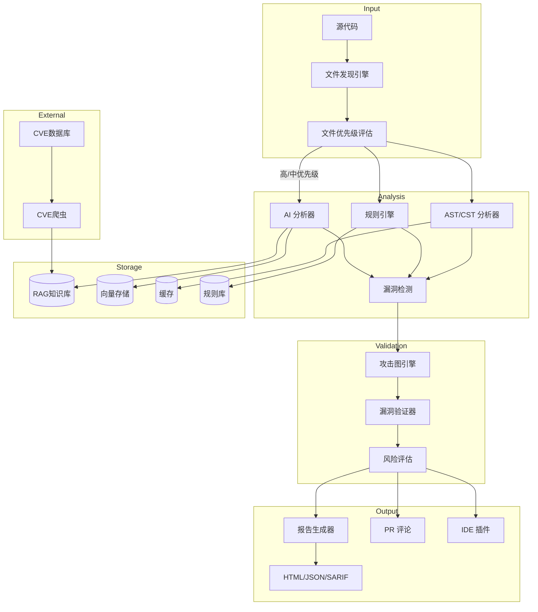
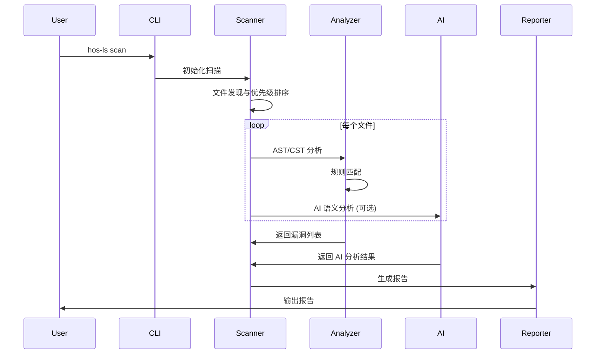

<div align="center">
# 🔒 HOS-LS v0.3.0.3

## AI 生成代码安全扫描工具

[](https://opensource.org/licenses/MIT)
[](https://github.com/psf/black)

**English** | [中文](README_CN.md)

</div>

***

## 📖 简介

HOS-LS (HOS - Language Security) 是一款专为 **AI 生成代码** 设计的安全扫描工具。它结合了静态分析、AI 语义分析和攻击模拟等多种技术，帮助开发者在代码进入生产环境前发现潜在的安全漏洞。

### 为什么选择 HOS-LS？

| 特性       | HOS-LS   | 传统 SAST 工具 |
| -------- | -------- | ---------- |
| AI 代码理解  | ✅ 深度语义分析 | ❌ 仅语法分析    |
| 误报率      | 🎯 低误报率  | ⚠️ 高误报率    |
| AI 模型支持  | ✅ 多模型支持  | ❌ 无        |
| 攻击路径分析   | ✅ 可视化攻击图 | ❌ 无        |
| 增量扫描     | ✅ 支持     | ⚠️ 部分支持    |
| CI/CD 集成 | ✅ 开箱即用   | ⚠️ 需配置     |

***

## ✨ 核心特性

### 🔍 多维度安全分析

- **静态分析 (SAST)**: 基于 AST/CST 的深度代码分析
- **AI 语义分析**: 集成 Claude、OpenAI、DeepSeek 等 AI 模型
- **攻击图引擎**: 构建完整的攻击路径图
- **漏洞验证**: 自动验证漏洞可利用性
- **RAG 知识库**: 基于向量存储的安全知识检索，支持语义搜索和知识图谱（已替代传统知识库）
- **CVE 爬虫集成**: 自动爬取最新漏洞信息，结合语义分析提高检测准确度
- **网络搜索集成**: 实时搜索相关安全信息，增强漏洞检测能力

### 🚀 大型项目优化

- **文件优先级评估**: 基于文件名语义分析，智能筛选重要文件
- **增量 AI 分析**: 仅对高/中优先级文件进行深度 AI 分析，大幅提升扫描速度
- **智能文件类型识别**: 扩展支持配置文件、脚本、文档等更多文件类型
- **增强问题识别**: 覆盖更多安全问题种类，提高检测全面性

### 🛡️ 全面的安全规则

| 规则类别   | 数量      | 覆盖范围                      |
| ------ | ------- | ------------------------- |
| 注入漏洞   | 15+     | SQL、命令、LDAP、XPath 等       |
| 认证授权   | 12+     | 弱密码、会话管理、权限绕过             |
| 数据保护   | 10+     | 敏感数据泄露、加密缺陷               |
| 配置安全   | 8+      | 不安全配置、默认凭证                |
| 代码质量   | 10+     | 硬编码、调试代码、异常处理             |
| **总计** | **70+** | OWASP Top 10 + CWE Top 25 |

### 🌐 多语言支持

| 语言         | AST 分析 | AI 分析 | 漏洞检测 |
| ---------- | :----: | :---: | :--: |
| Python     |    ✅   |   ✅   |   ✅  |
| JavaScript |    ✅   |   ✅   |   ✅  |
| TypeScript |    ✅   |   ✅   |   ✅  |
| Java       |    ✅   |   ✅   |   ✅  |
| C/C++      |    ✅   |   ✅   |   ✅  |
| Go         |   🚧   |   ✅   |   ✅  |
| Rust       |   🚧   |   ✅   |   ✅  |

### 🤖 AI 能力

- **多模型支持**: Claude 3.5、GPT-4、DeepSeek 等
- **智能误报过滤**: AI 辅助判断漏洞真实性
- **修复建议生成**: 自动生成安全修复代码
- **语义理解**: 理解 AI 生成代码的意图

***

## 🚀 快速开始

### 安装

```bash
# 使用 pip 安装
pip install hos-ls

# 或使用 Poetry
poetry add hos-ls

# 或使用 Docker
docker pull hosls/hos-ls:latest
```

### 30 秒上手

```bash
# 扫描当前目录
hos-ls scan

# 扫描指定项目
hos-ls scan /path/to/project

# 生成 HTML 报告
hos-ls scan --format html --output report.html
```

### 预期输出


***

## 📚 详细使用

### 命令行参数

```bash
hos-ls scan [OPTIONS] [PATH]

Arguments:
  PATH                 要扫描的目录或文件 [默认: 当前目录]

Options:
  --format, -f         输出格式: html, json, markdown, sarif [默认: html]
  --output, -o         输出文件路径
  --ruleset, -r        规则集: owasp-top10, cwe-top25, all [默认: all]
  --severity, -s       最低严重级别: critical, high, medium, low
  --workers, -w        并行工作进程数 [默认: 4]
  --diff               仅扫描 Git 差异
  --incremental        增量扫描（使用缓存）
  --ai                 启用 AI 分析
  --no-cache           禁用缓存
  --config, -c         配置文件路径
  --verbose, -v        详细输出
  --help, -h           显示帮助信息

Examples:
  # 扫描并生成 SARIF 报告（用于 GitHub Code Scanning）
  hos-ls scan --format sarif --output results.sarif

  # 仅扫描 Git 变更文件
  hos-ls scan --diff --severity high

  # 使用 OWASP Top 10 规则集
  hos-ls scan --ruleset owasp-top10

  # 启用 AI 深度分析
  hos-ls scan --ai --format html
```

### 配置文件

创建 `.hos-ls.yaml` 或 `hos-ls.toml`:

```yaml
# AI 配置
ai:
  provider: anthropic          # anthropic, openai, deepseek
  model: claude-3-5-sonnet-20241022
  api_key: ${ANTHROPIC_API_KEY}
  enabled: true
  max_tokens: 4096

# 扫描配置
scan:
  max_workers: 4
  cache_enabled: true
  incremental: true
  timeout: 300
  exclude:
    - "*/tests/*"
    - "*/migrations/*"
    - "*/.venv/*"

# 规则配置
rules:
  enabled:
    - sql-injection
    - command-injection
    - xss
    - hardcoded-secret
  disabled:
    - false-positive-rule
  severity_threshold: medium
  poc_severity_threshold: high  # POC生成的严重程度阈值，默认为high

# 报告配置
report:
  format: html
  output: ./security-report
  include_source: true
  include_fix_suggestions: true

# 向量存储配置（用于语义搜索）
vector_store:
  enabled: true
  backend: chromadb
  persist_directory: ~/.hos-ls/chroma

# RAG知识库配置
rag:
  enabled: true
  persist_directory: ~/.hos-ls/rag
  knowledge_base_path: ./rag_knowledge_base
  enable_knowledge_graph: true
  semantic_search_threshold: 0.7

# CVE爬虫配置
cve_crawler:
  enabled: true
  crawl_interval_hours: 24
  max_cves_per_run: 100
  cve_sources:
    - nvd
    - mitre
  persist_directory: ~/.hos-ls/cve_data

# 文件优先级评估配置
file_prioritization:
  enabled: true
  high_priority_patterns:
    - ".*auth.*"
    - ".*security.*"
    - ".*config.*"
    - ".*secret.*"
    - ".*key.*"
  skip_low_priority_ai_analysis: true

# 沙箱配置
sandbox:
  enabled: true
  memory_limit: 512MB
  timeout: 30s
```

### 环境变量

```bash
# AI API 密钥
export ANTHROPIC_API_KEY="your-key"
export OPENAI_API_KEY="your-key"
export DEEPSEEK_API_KEY="your-key"

# 配置路径
export HOS_LS_CONFIG_PATH="/path/to/config.yaml"

# 日志级别
export HOS_LS_LOG_LEVEL="DEBUG"
```

### Token 配置方法

HOS-LS 支持多种方式配置 AI API 密钥：

1. **配置文件配置**
   ```yaml
   ai:
     provider: deepseek
     model: deepseek-chat
     api_key: sk-your-api-key-here
     base_url: https://api.deepseek.com
   ```
2. **环境变量配置**
   ```bash
   # Windows
   ```

t set DEEPSEEK\_API\_KEY=sk-your-api-key-here

# Linux/Mac

export DEEPSEEK\_API\_KEY=sk-your-api-key-here

````

3. **命令行参数配置**
```bash
hos-ls scan --ai --ai-provider deepseek
````

### 命令行配置方法

HOS-LS 提供了丰富的命令行参数来配置扫描行为：

```bash
# 基本扫描
hos-ls scan

# 扫描指定目录
hos-ls scan /path/to/project

# 启用 AI 分析
hos-ls scan --ai

# 指定 AI 提供商
hos-ls scan --ai --ai-provider deepseek

# 生成不同格式的报告
hos-ls scan --format html --output report.html
hos-ls scan --format json --output report.json
hos-ls scan --format sarif --output results.sarif

# 使用特定规则集
hos-ls scan --ruleset owasp-top10
hos-ls scan --ruleset cwe-top25

# 设置严重级别阈值
hos-ls scan --severity high

# 配置并行工作进程数
hos-ls scan --workers 8

# 增量扫描（使用缓存）
hos-ls scan --incremental

# 仅扫描 Git 差异
hos-ls scan --diff

# 指定配置文件
hos-ls scan --config config/default.yaml

# 详细输出
hos-ls scan --verbose

# 调试模式
hos-ls scan --debug
```

### 配置文件优先级

HOS-LS 按照以下优先级加载配置：

1. 命令行参数
2. 环境变量
3. 配置文件（按以下顺序查找）：
   - `config/default.yaml`
   - `hos-ls.yaml`
   - `hos-ls.yml`
   - `.hos-ls.yaml`
   - `.hos-ls.yml`
   - `~/.hos-ls/config.yaml`
   - `~/.hos-ls/config.yml`
   - `~/.config/hos-ls/config.yaml`
   - `~/.config/hos-ls/config.yml`
4. 默认配置

***

## 🏗️ 架构设计

### 系统架构



### 核心模块

| 模块    | 路径                 | 功能描述                  |
| ----- | ------------------ | --------------------- |
| 核心引擎  | `src/core/`        | 扫描调度、依赖注入、配置管理        |
| 分析器   | `src/analyzers/`   | AST/CST 分析、数据流分析      |
| 规则引擎  | `src/rules/`       | 安全规则定义与匹配             |
| AI 模块 | `src/ai/`          | 多模型集成、语义分析            |
| 攻击模拟  | `src/attack/`      | 攻击图构建、漏洞验证            |
| 报告模块  | `src/reporting/`   | 多格式报告生成               |
| 集成工具  | `src/integration/` | CI/CD、IDE 插件集成、CVE 爬虫 |
| 沙箱系统  | `src/sandbox/`     | 安全代码执行环境              |
| 风险评估  | `src/assessment/`  | 漏洞风险评估                |
| 缓存系统  | `src/cache/`       | 扫描结果缓存                |
| 插件系统  | `src/plugins/`     | 可扩展插件架构               |
| 污点分析  | `src/taint/`       | 数据流污点分析               |
| 学习系统  | `src/learning/`    | AI 学习与知识管理            |
| 存储系统  | `src/storage/`     | RAG 知识库、向量存储与代码嵌入     |
| 工具库   | `src/utils/`       | 文件优先级评估、通用工具函数        |

### 工作流程



***

## 🛡️ 安全规则

### OWASP Top 10 覆盖

| OWASP 类别  | HOS-LS 规则                                        | 检测能力 |
| --------- | ------------------------------------------------ | ---- |
| A01 访问控制  | auth-bypass, insecure-permissions                | ✅    |
| A02 加密失败  | weak-crypto, hardcoded-secret                    | ✅    |
| A03 注入    | sql-injection, command-injection, ldap-injection | ✅    |
| A04 不安全设计 | design-flaw, missing-validation                  | ✅    |
| A05 配置错误  | insecure-config, debug-enabled                   | ✅    |
| A06 脆弱组件  | vulnerable-dependency                            | ✅    |
| A07 认证失败  | weak-password, session-fixation                  | ✅    |
| A08 完整性失败 | insecure-deserialization                         | ✅    |
| A09 日志失败  | sensitive-logging                                | ✅    |
| A10 SSRF  | ssrf, open-redirect                              | ✅    |

### CWE Top 25 覆盖

- ✅ CWE-79: XSS
- ✅ CWE-89: SQL Injection
- ✅ CWE-78: OS Command Injection
- ✅ CWE-20: Input Validation
- ✅ CWE-125: Buffer Overflow
- ✅ CWE-787: Out-of-bounds Write
- ✅ CWE-22: Path Traversal
- ✅ CWE-352: CSRF
- ✅ CWE-434: Unrestricted File Upload
- ... 更多

### 自定义规则

创建 `.hos-ls/rules/custom.yaml`:

```yaml
rules:
  - id: custom-sensitive-api
    name: Sensitive API Key Detection
    description: 检测自定义敏感 API 密钥
    severity: high
    languages: [python, javascript]
    pattern: |
      api_key\s*=\s*["'](?!(test_|mock_))[A-Za-z0-9]{32,}["']
    message: |
      发现疑似生产环境 API 密钥
      建议: 使用环境变量或密钥管理服务
    fix: |
      api_key = os.environ.get("API_KEY")
```

***

## 🔗 集成

### GitHub Actions

```yaml
name: Security Scan

on:
  push:
    branches: [main]
  pull_request:

jobs:
  security:
    runs-on: ubuntu-latest
    steps:
      - uses: actions/checkout@v4
      
      - name: Set up Python
        uses: actions/setup-python@v5
        with:
          python-version: '3.11'
      
      - name: Install HOS-LS
        run: pip install hos-ls
      
      - name: Run Security Scan
        run: |
          hos-ls scan \
            --format sarif \
            --output results.sarif \
            --ai \
            --severity high
        env:
          ANTHROPIC_API_KEY: ${{ secrets.ANTHROPIC_API_KEY }}
      
      - name: Upload SARIF
        uses: github/codeql-action/upload-sarif@v3
        with:
          sarif_file: results.sarif
```

### GitLab CI

```yaml
security-scan:
  image: python:3.11
  stage: test
  script:
    - pip install hos-ls
    - hos-ls scan --format json --output report.json --ai
  artifacts:
    reports:
      sast: report.json
  only:
    - merge_requests
    - main
```

### Jenkins Pipeline

```groovy
pipeline {
    agent any
    stages {
        stage('Security Scan') {
            steps {
                sh 'pip install hos-ls'
                sh 'hos-ls scan --format html --output report.html'
            }
            post {
                always {
                    publishHTML([
                        allowMissing: false,
                        alwaysLinkToLastBuild: true,
                        keepAll: true,
                        reportDir: '.',
                        reportFiles: 'report.html',
                        reportName: 'Security Report'
                    ])
                }
            }
        }
    }
}
```

### VS Code 插件

1. 安装扩展: `hos-ls.vscode-hos-ls`
2. 配置 API 密钥
3. 实时安全反馈

### Git Hooks

```bash
# pre-commit
#!/bin/bash
hos-ls scan --diff --severity high --format console
if [ $? -ne 0 ]; then
    echo "❌ Security issues found. Please fix before commit."
    exit 1
fi
```

***

## 📊 性能

### 性能基准

测试环境: MacBook Pro M2, 16GB RAM, 4 workers

| 项目规模      | 文件数       | 扫描时间     | 内存占用      | 说明                |
| --------- | --------- | -------- | --------- | ----------------- |
| 小型项目      | 50        | 2.5s     | 120MB     | 标准扫描              |
| 中型项目      | 500       | 15s      | 350MB     | 标准扫描              |
| 大型项目      | 5000      | 120s     | 800MB     | 标准扫描              |
| **特大型项目** | **50000** | **180s** | **1.2GB** | **RAG优化 + 优先级评估** |
| 增量扫描      | \~50      | 1.5s     | 100MB     | 使用缓存              |

#### 优化效果对比

| 扫描模式      | 50000文件扫描时间 | AI分析文件数 | 节省时间 |
| --------- | ----------- | ------- | ---- |
| 传统模式      | 1200s       | 50000   | -    |
| RAG+优先级模式 | 180s        | 8000    | 85%  |

### 工具对比

| 特性       | HOS-LS | Semgrep | SonarQube | CodeQL |
| -------- | :----: | :-----: | :-------: | :----: |
| AI 分析    |    ✅   |    ❌    |     ⚠️    |    ❌   |
| RAG 知识库  |    ✅   |    ❌    |     ❌     |    ❌   |
| CVE 爬虫集成 |    ✅   |    ❌    |     ❌     |    ❌   |
| 文件优先级评估  |    ✅   |    ❌    |     ❌     |    ❌   |
| 零配置启动    |    ✅   |    ✅    |     ❌     |    ❌   |
| 增量扫描     |    ✅   |    ✅    |     ✅     |   ⚠️   |
| 攻击路径     |    ✅   |    ❌    |     ❌     |   ⚠️   |
| 误报率      |    低   |    中    |     中     |    中   |
| 自定义规则    |    ✅   |    ✅    |     ✅     |    ✅   |
| 特大型项目优化  |    ✅   |    ⚠️   |     ⚠️    |   ⚠️   |

***

## ❓ 常见问题 (FAQ)

<details>
<summary><b>HOS-LS 与其他 SAST 工具有什么区别？</b></summary>

HOS-LS 专为 AI 生成代码设计，具有以下独特优势：

1. **AI 语义理解**: 深度理解 AI 生成代码的意图和模式
2. **低误报率**: AI 辅助判断漏洞真实性
3. **攻击路径分析**: 可视化展示完整的攻击链
4. **自动修复建议**: AI 生成安全修复代码

</details>

<details>
<summary><b>如何处理误报？</b></summary>

HOS-LS 提供多种误报处理方式：

1. 使用 `--ai` 参数启用 AI 深度分析
2. 在配置文件中禁用特定规则
3. 使用 `# hos-ls: ignore` 注释忽略特定行
4. 自定义规则调整检测逻辑

</details>

<details>
<summary><b>支持哪些 AI 模型？</b></summary>

目前支持：

- **Anthropic**: Claude 3.5 Sonnet, Claude 3 Opus
- **OpenAI**: GPT-4, GPT-4 Turbo
- **DeepSeek**: DeepSeek Coder
- **本地模型**: 支持 Ollama 部署的模型

</details>

<details>
<summary><b>如何保护 API 密钥安全？</b></summary>

推荐做法：

1. 使用环境变量存储密钥
2. 使用密钥管理服务（AWS Secrets Manager、HashiCorp Vault）
3. 配置 CI/CD 密钥注入
4. 启用 HOS-LS 的密钥加密存储功能

</details>

<details>
<summary><b>可以扫描 Docker 镜像中的代码吗？</b></summary>

可以。两种方式：

1. 使用 HOS-LS Docker 镜像挂载代码目录
2. 在 CI/CD 流程中扫描后再构建镜像

</details>

***

## 🗺️ 路线图

### v0.3.0.3 (已完成)

- [x] 修复 severity 枚举类型处理问题
- [x] 修复文件句柄占用导致的备份删除失败
- [x] 增强错误处理和日志记录
- [x] 优化 RAG 知识库历史清理机制

### v0.3.0.2 (已完成)

- [x] RAG 知识库专项存储系统（已替代传统知识库）
- [x] CVE 网站爬虫和数据集成
- [x] 特大型项目文件优先级评估
- [x] 扩展文件类型和安全问题识别
- [x] 网络搜索集成功能

### v0.3.1 (计划中)

- [ ] 支持更多语言（Go、Rust 完整支持）
- [ ] 云原生安全扫描
- [ ] SBOM 生成与漏洞关联
- [ ] VS Code 插件增强

### v0.3.2 (计划中)

- [ ] 实时协作扫描
- [ ] 安全知识图谱增强
- [ ] 自动化修复 PR 生成
- [ ] 移动端安全扫描

### v0.4.0 (远期)

- [ ] 多租户 SaaS 版本
- [ ] 自定义 AI 模型训练
- [ ] 安全态势感知平台
- [ ] 合规性自动化报告

***

## 🤝 贡献

我们欢迎所有形式的贡献！

### 贡献方式

- 🐛 [报告 Bug](https://github.com/hos-ls/hos-ls/issues)
- 💡 [提出新功能](https://github.com/hos-ls/hos-ls/issues)
- 📝 改进文档
- 🔧 提交代码

### 开发环境设置

```bash
# 克隆仓库
git clone https://github.com/hos-ls/hos-ls.git
cd hos-ls

# 安装开发依赖
poetry install --with dev

# 激活虚拟环境
poetry shell

# 运行测试
pytest

# 代码格式化
black src tests
isort src tests

# 类型检查
mypy src
```

请查看 [CONTRIBUTING.md](CONTRIBUTING.md) 了解详细信息。

***

## 📄 许可证

本项目采用 MIT 许可证 - 查看 [LICENSE](LICENSE) 文件了解详情。

感谢所有贡献者的付出！

***

## 📞 联系方式

- **项目主页**: <https://github.com/hos-ls/hos-ls>
- **问题反馈**: <https://github.com/hos-ls/hos-ls/issues>
- **邮箱**: <aqfxz_zh@qq.com>

***

<div align="center">

**如果 HOS-LS 对你有帮助，请给我们一个 ⭐ Star！**

[!\[Star History Chart\](https://api.star-history.com/svg?repos=hos-ls/hos-ls\&type=Date null)](https://star-history.com/#hos-ls/hos-ls\&Date)

Made with ❤️ by HOS-LS Team

</div>
