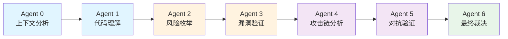
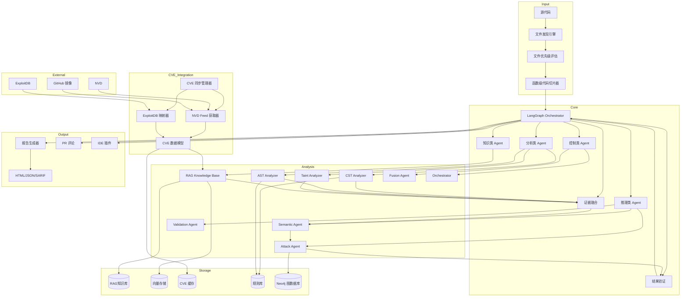
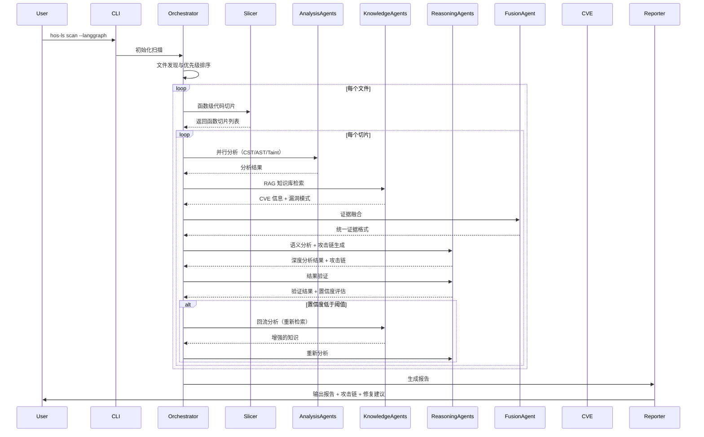

<div align="center">


# 🔒 HOS-LS v0.3.1.6

## AI 生成代码安全扫描工具

[](https://opensource.org/licenses/MIT)
[](https://github.com/psf/black)

**English** | [中文](README_CN.md)

</div>

***

## 📋 快速导航

- [🤖 纯净AI模式（--pure-ai）](#-纯净ai模式--pure-ai) - 低配置首选，开箱即用
- [🔒 正式模式（完整版）](#-正式模式完整版) - 全功能，高性能硬件推荐

***

## 🤖 纯净AI模式（--pure-ai）

### 什么是 --pure-ai 模式？

`--pure-ai` 是 HOS-LS 推出的轻量级纯 AI 深度语义解析模式。它采用多 Agent 流水线架构，默认使用 deepseek-reasoner 模型，无需依赖 Neo4j、FAISS、GraphRAG 等重型组件，即可提供高质量的代码安全扫描服务。

### 为什么推出 --pure-ai 模式？

根据客户反馈，正式模式对于电脑性能依赖过高，需要较高配置的硬件才能流畅运行。为了让更多开发者能够轻松使用 HOS-LS，我们特别推出了 `--pure-ai` 模式，它具有以下特点：

- **低性能依赖**：不依赖图数据库、向量存储等重型组件
- **开箱即用**：只需配置 API 密钥即可开始使用
- **多语言支持**：支持 Python、JavaScript、TypeScript、Java、C/C++ 等多种语言
- **高质量分析**：7 个专业 Agent 协同工作，提供深度安全分析

### 核心优势对比

| 特性 | 纯净AI模式（--pure-ai） | 正式模式（完整版） |
|------|---------------------|-----------------|
| **硬件要求** | 普通配置即可 | 推荐高性能配置 |
| **依赖组件** | 仅需 AI API | Neo4j、FAISS、PostgreSQL 等 |
| **启动速度** | ⚡ 快速启动 | 🐢 需要初始化多个组件 |
| **内存占用** | 低 | 较高 |
| **AI 分析** | ✅ 7 Agent 流水线 | ✅ 强 Multi-Agent 架构 |
| **RAG 知识库** | ❌ | ✅ |
| **攻击链分析** | ✅ | ✅ |
| **CVE 集成** | ❌ | ✅ |
| **适用场景** | 日常开发、快速扫描 | 深度安全审计、大型项目 |

### 7个专业 Agent 详解

`--pure-ai` 模式采用 7 个专业 Agent 协同工作，形成完整的安全分析流水线：



| Agent | 名称 | 核心职责 |
|-------|------|----------|
| 0 | 上下文分析 | 构建代码上下文，分析文件依赖关系 |
| 1 | 代码理解 | 深度理解代码逻辑和意图 |
| 2 | 风险枚举 | 枚举潜在安全风险点 |
| 3 | 漏洞验证 | 验证风险是否为真实漏洞 |
| 4 | 攻击链分析 | 构建完整攻击路径 |
| 5 | 对抗验证 | 从攻击者角度验证漏洞 |
| 6 | 最终裁决 | 综合所有分析结果，做出最终判断 |

### 快速上手（30秒）

#### 1. 准备

当前项目处于开发阶段，暂未打包发布，直接使用源码运行：

1. 克隆项目到本地
2. 确保已安装 Python 3.8+
3. 安装项目依赖（如果有）

#### 2. 配置 API 密钥

```bash
# Windows
set DEEPSEEK_API_KEY=sk-your-api-key-here

# Linux/Mac
export DEEPSEEK_API_KEY=sk-your-api-key-here
```

#### 3. 开始扫描

```bash
# 真实测试命令（用户提供）
python -m src.cli.main scan c:\1AAA_PROJECT\HOS\HOS-LS\real-project\crewAI-main --pure-ai --test 5 -o crewai_test

# 扫描当前目录（纯净AI模式）
python -m src.cli.main scan . --pure-ai

# 扫描指定项目
python -m src.cli.main scan /path/to/project --pure-ai

# 生成 HTML 报告
python -m src.cli.main scan --pure-ai --format html --output report.html

# 测试模式（只扫描前10个文件）
python -m src.cli.main scan --pure-ai --test 10

# 调试模式
python -m src.cli.main --debug scan /path/to/project --pure-ai
```

### 详细使用指南

#### 命令行参数

```bash
hos-ls scan --pure-ai [OPTIONS] [PATH]

Arguments:
  PATH                 要扫描的目录或文件 [默认: 当前目录]

Options:
  --format, -f         输出格式: html, json, markdown, sarif [默认: html]
  --output, -o         输出文件路径
  --ruleset, -r        规则集: owasp-top10, cwe-top25, all, v3 [默认: v3]
  --severity, -s       最低严重级别: critical, high, medium, low
  --workers, -w        并行工作进程数 [默认: 4]
  --incremental        增量扫描（使用缓存）
  --test, -t           测试模式，指定扫描文件数量
  --config, -c         配置文件路径
  --verbose, -v        详细输出
  --help, -h           显示帮助信息
```

#### 配置文件

创建 `.hos-ls.yaml` 配置文件：

```yaml
# 纯AI模式配置
pure_ai:
  enabled: true
  provider: deepseek          # AI 提供商: anthropic, openai, deepseek
  model: deepseek-reasoner    # AI 模型
  api_key: ${DEEPSEEK_API_KEY}
  base_url: https://api.deepseek.com
  temperature: 0.0
  max_tokens: 4096
  timeout: 60

# 扫描配置
scan:
  max_workers: 4
  cache_enabled: true
  incremental: true
  timeout: 300
  max_file_size: 10485760  # 10MB
  exclude_patterns:
    - "*.min.js"
    - "*.min.css"
    - "node_modules/**"
    - "__pycache__/**"
    - ".git/**"
    - ".venv/**"
    - "venv/**"
    - "dist/**"
    - "build/**"
  include_patterns:
    - "*.py"
    - "*.js"
    - "*.ts"
    - "*.java"
    - "*.cpp"
    - "*.c"
    - "*.h"
    - "*.go"
    - "*.rs"

# 报告配置
report:
  format: html
  output: ./security-report
  include_code_snippets: true
  include_fix_suggestions: true

# 全局配置
debug: false
verbose: false
quiet: false
```

#### 使用示例

```bash
# 基本扫描
hos-ls scan --pure-ai

# 扫描指定目录
hos-ls scan /path/to/project --pure-ai

# 生成 JSON 报告
hos-ls scan --pure-ai --format json --output report.json

# 只扫描高严重级别问题
hos-ls scan --pure-ai --severity high

# 使用 8 个工作进程
hos-ls scan --pure-ai --workers 8

# 增量扫描（使用缓存）
hos-ls scan --pure-ai --incremental

# 测试模式（只扫描前 20 个文件）
hos-ls scan --pure-ai --test 20

# 详细输出
hos-ls scan --pure-ai --verbose
```

#### 环境变量

```bash
# AI API 密钥
export ANTHROPIC_API_KEY="your-key"
export OPENAI_API_KEY="your-key"
export DEEPSEEK_API_KEY="your-key"

# 配置路径
export HOS_LS_CONFIG_PATH="/path/to/config.yaml"

# 日志级别
export HOS_LS_LOG_LEVEL="DEBUG"
```

### 支持的 AI 模型

`--pure-ai` 模式支持多种 AI 模型：

| 提供商 | 模型 | 说明 |
|-------|------|------|
| **DeepSeek** | deepseek-reasoner | 推荐，推理能力强 |
| **DeepSeek** | deepseek-chat | 快速响应 |
| **OpenAI** | gpt-4 | 高质量分析 |
| **OpenAI** | gpt-4-turbo | 平衡速度和质量 |
| **Anthropic** | claude-3-5-sonnet | 长文本处理优秀 |
| **Anthropic** | claude-3-opus | 最高质量 |

***

## 🔒 正式模式（完整版）

> **注意**：正式模式提供完整功能，但对硬件配置要求较高。推荐 16GB+ 内存、支持 CUDA 的 GPU。如果您的配置有限，建议使用 [纯净AI模式（--pure-ai）](#-纯净ai模式--pure-ai)。

## 📖 简介

HOS-LS (HOS - Language Security) 是一款专为 **AI 生成代码** 设计的安全扫描工具。它结合了静态分析、AI 语义分析和攻击模拟等多种技术，帮助开发者在代码进入生产环境前发现潜在的安全漏洞。

### 核心新特性

**AI 与 Agent 架构**
- 强 Multi-Agent 架构：5个核心Agent协同工作，支持证据融合和可回流推理
- 证据驱动系统：统一Agent输出格式，实现置信度评估
- DSPy自动优化：Prompt自动生成与优化，推理质量提升30-78%
- LangGraph流程控制：完整StateGraph，实现条件边和Critic循环

**RAG 与知识库**
- 混合RAG架构：PostgreSQL结构化存储 + 向量存储
- BM25混合检索：融合向量搜索和BM25算法，提高检索质量
- NVD字段级语义切块：保留语义完整性，解决长文本处理问题
- GPU批量Embedding加速：10x性能提升

**性能与稳定性**
- 多进程架构：并行处理CVE数据，导入速度提升50%
- 内存管理优化：LazyGraphRAG模式，内存使用降低30%
- CLI响应速度提升：Async任务处理，3x速度提升
- NaN检测过滤：消除无效嵌入向量，提高系统稳定性

**攻击分析增强**
- 攻击链分析：漏洞到代码模式映射、攻击链RAG、exploit知识注入
- 攻击图引擎：基于Neo4j构建完整攻击路径
- 安全风险评估：实时评估输入代码风险，自动拒绝高风险输入

### 为什么选择 HOS-LS？

| 特性       | HOS-LS   | 传统 SAST 工具 |
| -------- | -------- | ---------- |
| AI 代码理解  | ✅ 深度语义分析 | ❌ 仅语法分析    |
| 函数级切片  | ✅ AST 精准切片 | ❌ 全文扫描      |
| 多阶段扫描  | ✅ 轻量定位+精扫 | ❌ 单阶段全量    |
| 误报率      | 🎯 低误报率  | ⚠️ 高误报率    |
| AI 模型支持  | ✅ 多模型支持  | ❌ 无        |
| CVE 集成    | ✅ NVD+ExploitDB | ❌ 无        |
| 攻击路径分析   | ✅ 可视化攻击图 | ❌ 无        |
| 增量扫描     | ✅ 支持     | ⚠️ 部分支持    |
| CI/CD 集成 | ✅ 开箱即用   | ⚠️ 需配置     |

***

## ✨ 核心特性

### 多维度安全分析

| 维度 | 核心能力 |
|------|----------|
| 静态分析 | AST/CST深度分析、函数级代码切片、多阶段扫描(轻量定位→精准扫描) |
| AI能力 | 多模型支持(Claude/GPT-4/DeepSeek)、规则驱动Prompt、语义理解、DSPy自动优化 |
| 知识库 | RAG检索、混合RAG架构(PostgreSQL+向量存储)、CVE数据集成(NVD+ExploitDB)、BM25混合检索 |
| 攻击分析 | 攻击图引擎(Neo4j)、漏洞验证、攻击链可视化、exploit知识注入 |
| 性能优化 | GPU加速(FAISS/Embedding)、增量扫描、多进程架构、内存管理优化 |
| 架构设计 | LangGraph流程控制、5核心Agent协作、动态决策、Critic质量把关 |

### 大型项目优化

- **智能文件筛选**: 基于文件名语义分析，优先扫描重要文件
- **函数级切片**: 每个函数独立分析，保留完整上下文
- **多阶段AI分析**: 仅对可疑点深度分析，节省50-80% Token
- **并发扫描**: async并发、自动重试、速率限制


### 🌐 多语言支持

| 语言         | AST 分析 | AI 分析 | 函数级切片 | 漏洞检测 |
| ---------- | :----: | :---: | :----: | :--: |
| Python     |    ✅   |   ✅   |   ✅    |   ✅  |
| JavaScript |    ✅   |   ✅   |   ✅    |   ✅  |
| TypeScript |    ✅   |   ✅   |   ✅    |   ✅  |
| Java       |    ✅   |   ✅   |   🚧    |   ✅  |
| C/C++      |    ✅   |   ✅   |   🚧    |   ✅  |
| Go         |   🚧   |   ✅   |   ❌    |   ✅  |
| Rust       |   🚧   |   ✅   |   ❌    |   ✅  |


```bash
# 完整导入
hos-ls nvd update

# 测试模式（只处理前20个CVE）
hos-ls nvd update --limit 20 --no-rag

# 指定压缩包路径
hos-ls nvd update --zip /path/to/nvd-json-data-feeds-main.zip
```

### 攻击链分析

- **漏洞关系识别**: 因果、依赖、互补、同源关系分析
- **攻击路径构建**: DFS图遍历，构建完整攻击链
- **风险评分**: 综合严重性、置信度、类型优先级
- **关键路径**: Top 5最危险攻击路径可视化

***

## 🚀 快速开始

### 安装

```bash
# 使用 pip 安装
pip install hos-ls
```

### 30 秒上手

```bash
# 扫描当前目录（默认两阶段扫描）
hos-ls scan

# 扫描指定项目（使用函数级切片）
hos-ls scan /path/to/project --use-slicer

# 生成 HTML 报告
hos-ls scan --format html --output report.html

# 同步 CVE 数据（首次使用建议）
hos-ls cve-sync --full

# 攻击链分析
hos-ls analyze --attack-chain
```

### 预期输出


***

## 📚 详细使用

### 命令行参数

```bash
hos-ls scan [OPTIONS] [PATH]

Arguments:
  PATH                 要扫描的目录或文件 [默认: 当前目录]

Options:
  --format, -f         输出格式: html, json, markdown, sarif [默认: html]
  --output, -o         输出文件路径
  --ruleset, -r        规则集: owasp-top10, cwe-top25, all, v3 [默认: v3]
  --severity, -s       最低严重级别: critical, high, medium, low
  --workers, -w        并行工作进程数 [默认: 4]
  --diff               仅扫描 Git 差异
  --incremental        增量扫描（使用缓存）
  --ai                 启用 AI 分析
  --multi-phase        启用两阶段扫描 [默认: true]
  --use-slicer         启用函数级代码切片 [默认: true]
  --no-cache           禁用缓存
  --config, -c         配置文件路径
  --verbose, -v        详细输出
  --langgraph          使用 LangGraph 流程控制
  --help, -h           显示帮助信息

CVE 管理命令:
  hos-ls cve-sync       同步 CVE 数据
    --full              全量同步（默认增量）
    --only-nvd          仅同步 NVD
    --only-exploitdb    仅同步 ExploitDB

  hos-ls cve-search     搜索 CVE
    --cve-id CVE-XXXX-XXXX  按 CVE ID 搜索
    --keyword KEYWORD       按关键词搜索

  hos-ls nvd            NVD 漏洞库管理
    hos-ls nvd update     从本地压缩包更新 NVD 库
      --zip ZIP_PATH      NVD 压缩包路径
      --limit LIMIT       限制处理的文件数量（用于测试）
      --no-rag            不导入到 RAG 库，仅解析
      --batch-size SIZE   批量处理大小（默认: 200）
      --max-workers COUNT 最大工作线程数（默认: 8）
      --checkpoint-interval INTERVAL 检查点保存间隔
      --temp-dir DIR      临时文件目录
      --process-count COUNT 多进程数量（默认: 4）
    hos-ls nvd status     查看 NVD 导入状态
    hos-ls nvd clean      清理 NVD 临时文件

攻击链分析命令:
  hos-ls analyze        分析扫描结果
    --attack-chain      生成攻击链分析
    --output FILE       输出文件

Examples:
  # 扫描并生成 SARIF 报告（用于 GitHub Code Scanning）
  hos-ls scan --format sarif --output results.sarif

  # 使用两阶段扫描 + 函数级切片
  hos-ls scan --multi-phase --use-slicer

  # 仅扫描 Git 变更文件
  hos-ls scan --diff --severity high

  # 使用 OWASP Top 10 规则集
  hos-ls scan --ruleset owasp-top10

  # 启用 AI 深度分析
  hos-ls scan --ai --format html

  # 首次同步 CVE 数据（全量）
  hos-ls cve-sync --full

  # 增量同步 CVE
  hos-ls cve-sync

  # 攻击链分析
  hos-ls analyze --attack-chain --output attack-chain.json
```

### 配置文件

创建 `.hos-ls.yaml` 或 `hos-ls.toml`:

```yaml
# AI 配置
ai:
  provider: deepseek          # anthropic, openai, deepseek
  model: deepseek-chat
  api_key: ${DEEPSEEK_API_KEY}
  base_url: https://api.deepseek.com
  enabled: true
  temperature: 0.0
  max_tokens: 4096
  timeout: 60

# 扫描配置
scan:
  max_workers: 4
  cache_enabled: true
  incremental: true
  timeout: 300
  max_file_size: 10485760  # 10MB
  exclude_patterns:
    - "*.min.js"
    - "*.min.css"
    - "node_modules/**"
    - "__pycache__/**"
    - ".git/**"
    - ".venv/**"
    - "venv/**"
    - "dist/**"
    - "build/**"
  include_patterns:
    - "*.py"
    - "*.js"
    - "*.ts"
    - "*.java"
    - "*.cpp"
    - "*.c"
    - "*.h"

# 函数级切片器配置
code_slicer:
  enabled: true
  max_slice_lines: 200
  include_context_lines: 10
  languages:
    - python
    - javascript
    - typescript

# 扫描调度器配置
scan_scheduler:
  enabled: true
  max_concurrent: 5
  max_retries: 3
  rate_limit: 10
  rate_limit_window: 60.0
  retry_delay: 1.0

# 多阶段扫描配置
multi_phase_scan:
  enabled: true
  phase1_max_tokens: 1024
  phase2_context_lines: 50

# 规则配置
rules:
  enabled: []
  disabled: []
  ruleset: v3
  severity_threshold: medium
  confidence_threshold: 0.5

# 报告配置
report:
  format: html
  output: ./security-report
  include_code_snippets: true
  include_fix_suggestions: true

# 数据库配置
database:
  url: sqlite:///hos-ls.db
  wal_mode: true
  pool_size: 5
  max_overflow: 10
  echo: false
  # Neo4j 配置
  neo4j:
    uri: bolt://localhost:7687
    username: neo4j
    password: password
  # PostgreSQL 配置
  postgres:
    host: localhost
    port: 5432
    database: hos_ls
    user: postgres
    password: password
    pool_size: 5
    max_overflow: 10

# NVD CVE 配置
nvd:
  enabled: true
  base_url: https://nvd.nist.gov/feeds/json/cve/1.1
  github_mirror_url: https://github.com/fkie-cad/nvd-json-data-feeds
  cache_dir: ~/.hos-ls/nvd_cache
  request_timeout: 60
  # NVD 导入配置
  import:
    batch_size: 200
    max_workers: 8
    timeout: 300
    retry_attempts: 3
    retry_delay: 1.0
    checkpoint_interval: 1000
    temp_dir: ~/.hos-ls/nvd_temp
    # 多进程配置
    multiprocessing:
      enabled: true
      process_count: 4
      chunk_size: 100
    # 批处理优化
    batch_optimization:
      read_batch: 200
      embed_batch: 32
      write_batch: 500
    # 切块配置
    chunking:
      enabled: true
      field_level: true
      token_level: true
      chunk_size: 400
      chunk_overlap: 80

# ExploitDB 配置
exploitdb:
  enabled: true
  repo_url: https://github.com/offensive-security/exploitdb.git
  local_dir: ~/.hos-ls/exploitdb

# CVE 同步管理器配置
cve_sync:
  enabled: true
  sync_interval_hours: 2
  full_sync_interval_days: 7
  nvd_enabled: true
  exploitdb_enabled: true
  state_file: ~/.hos-ls/cve_sync_state.json
  data_dir: ~/.hos-ls/cve_data

# 代理配置（7897端口）
proxy:
  enabled: true
  http_url: http://127.0.0.1:7897
  https_url: http://127.0.0.1:7897

# 向量存储配置（用于语义搜索）
vector_store:
  enabled: true
  backend: faiss  # chromadb 或 faiss
  persist_directory: ~/.hos-ls/faiss
  # FAISS 配置
  faiss:
    use_gpu: true
    index_type: hnsw
    embedding_dim: 384
  # 向量存储优化
  optimization:
    batch_size: 32
    embedding_cache: true
    cache_dir: ~/.hos-ls/embedding_cache
    max_cache_size: 100000
    use_gpu_embedding: true
    embedding_model: BAAI/bge-small-en-v1.5
    # BAAI bge 模型配置
    bge:
      model_name: BAAI/bge-small-en-v1.5
      model_kwargs: {device: "cuda"}
      encode_kwargs: {normalize_embeddings: true}
  # NaN 检测配置
  nan_detection:
    enabled: true
    filter_threshold: 0.001

# RAG知识库配置
rag:
  enabled: true
  persist_directory: ~/.hos-ls/rag
  knowledge_base_path: ./rag_knowledge_base
  enable_knowledge_graph: true
  semantic_search_threshold: 0.7
  # 混合RAG配置
  hybrid:
    enabled: true
    structured_storage: postgres
    vector_storage: faiss
    hybrid_search_weight: 0.7
    top_k: 10
    rerank: true
    rerank_model: bge-reranker-large
  # BM25 配置
  bm25:
    enabled: true
    k1: 1.2
    b: 0.75
    epsilon: 0.25
  # Rerank 配置
  rerank:
    enabled: true
    model: BAAI/bge-reranker-large
    top_k: 5
    threshold: 0.7

# CVE爬虫配置（v0.3.0.3 兼容）
cve_crawler:
  enabled: true
  crawl_interval_hours: 24
  max_cves_per_run: 100
  cve_sources:
    - nvd
    - mitre
  persist_directory: ~/.hos-ls/cve_data

# 文件优先级评估配置
file_prioritization:
  enabled: true
  high_priority_patterns:
    - ".*auth.*"
    - ".*security.*"
    - ".*config.*"
    - ".*secret.*"
    - ".*key.*"
  skip_low_priority_ai_analysis: true

# 沙箱配置
sandbox:
  enabled: true
  max_memory: 536870912  # 512MB
  max_cpu_time: 30
  network_access: false
  file_system_access: false

# 攻击链分析配置
attack_chain:
  enabled: true
  # 漏洞到代码模式映射
  pattern_mapping:
    enabled: true
    mappings_file: ~/.hos-ls/pattern_mappings.json
    update_interval: 24
  # 攻击链RAG
  rag:
    enabled: true
    top_k: 5
    threshold: 0.7
  # exploit知识注入
  exploit_knowledge:
    enabled: true
    sources: [exploitdb, cvedetails]
    update_interval: 12
  # 攻击面分析
  surface_analysis:
    enabled: true
    max_paths: 10
    risk_score_threshold: 7.0

# 全局配置
debug: false
verbose: false
quiet: false
```

### 环境变量

```bash
# AI API 密钥
export ANTHROPIC_API_KEY="your-key"
export OPENAI_API_KEY="your-key"
export DEEPSEEK_API_KEY="your-key"

# 代理配置（7897端口）
export HTTP_PROXY="http://127.0.0.1:7897"
export HTTPS_PROXY="http://127.0.0.1:7897"

# 配置路径
export HOS_LS_CONFIG_PATH="/path/to/config.yaml"

# 日志级别
export HOS_LS_LOG_LEVEL="DEBUG"
```

### Token 配置方法

HOS-LS 支持多种方式配置 AI API 密钥：

1. **配置文件配置**
   ```yaml
   ai:
     provider: deepseek
     model: deepseek-chat
     api_key: sk-your-api-key-here
     base_url: https://api.deepseek.com
   ```
2. **环境变量配置**
   ```bash
   # Windows
   set DEEPSEEK_API_KEY=sk-your-api-key-here

   # Linux/Mac
   export DEEPSEEK_API_KEY=sk-your-api-key-here
   ```

3. **命令行参数配置**
   ```bash
   hos-ls scan --ai --ai-provider deepseek
   ```

### 命令行配置方法

HOS-LS 提供了丰富的命令行参数来配置扫描行为：

```bash
# 基本扫描
hos-ls scan

# 扫描指定目录
hos-ls scan /path/to/project

# 使用函数级切片 + 两阶段扫描
hos-ls scan --use-slicer --multi-phase

# 启用 AI 分析
hos-ls scan --ai

# 指定 AI 提供商
hos-ls scan --ai --ai-provider deepseek

# 使用 LangGraph 流程控制
hos-ls scan --langgraph

# 生成不同格式的报告
hos-ls scan --format html --output report.html
hos-ls scan --format json --output report.json
hos-ls scan --format sarif --output results.sarif

# 使用特定规则集
hos-ls scan --ruleset owasp-top10
hos-ls scan --ruleset cwe-top25
hos-ls scan --ruleset v3

# 设置严重级别阈值
hos-ls scan --severity high

# 配置并行工作进程数
hos-ls scan --workers 8

# 增量扫描（使用缓存）
hos-ls scan --incremental

# 仅扫描 Git 差异
hos-ls scan --diff

# 指定配置文件
hos-ls scan --config config/default.yaml

# 详细输出
hos-ls scan --verbose

# 调试模式
hos-ls scan --debug

# 同步 CVE 数据
hos-ls cve-sync --full
hos-ls cve-sync

# 攻击链分析
hos-ls analyze --attack-chain
```

### 配置文件优先级

HOS-LS 按照以下优先级加载配置：

1. 命令行参数
2. 环境变量
3. 配置文件（按以下顺序查找）：
   - `config/default.yaml`
   - `hos-ls.yaml`
   - `hos-ls.yml`
   - `.hos-ls.yaml`
   - `.hos-ls.yml`
   - `~/.hos-ls/config.yaml`
   - `~/.hos-ls/config.yml`
   - `~/.config/hos-ls/config.yaml`
   - `~/.config/hos-ls/config.yml`
4. 默认配置

***

## 🏗️ 架构设计

### 系统架构 v3 (强 Multi-Agent 架构)



### 核心模块 v3

| 模块    | 路径                 | 功能描述                  |
| ----- | ------------------ | --------------------- |
| 核心引擎  | `src/core/`        | 扫描调度、多阶段扫描、结果聚合、攻击链分析、RAG + 图融合集成 |
| LangGraph  | `src/core/langgraph_*` | 流程控制、状态管理、条件分支逻辑、多Agent编排 |
| 分析器   | `src/analyzers/`   | AST/CST 分析、函数级代码切片      |
| 规则引擎  | `src/rules/`       | 安全规则定义与匹配             |
| AI 模块 | `src/ai/`          | 多模型集成、规则驱动 Prompt、模板管理、DSPy 自动优化 |
| 推理类 Agent | `src/ai/reasoning/` | 语义分析、攻击链生成、结果验证、可回流推理 |
| 攻击模拟  | `src/attack/`      | 攻击图构建、漏洞验证、ExploitDB 映射、Neo4j 攻击链分析 |
| 报告模块  | `src/reporting/`   | 多格式报告生成               |
| 集成工具  | `src/integration/` | CI/CD、IDE 插件集成、NVD Feed、CVE 同步、NVD 数据处理 |
| 沙箱系统  | `src/sandbox/`     | 安全代码执行环境              |
| 风险评估  | `src/assessment/`  | 漏洞风险评估、攻击链分析          |
| 缓存系统  | `src/cache/`       | 扫描结果缓存、CVE 缓存          |
| 插件系统  | `src/plugins/`     | 可扩展插件架构               |
| 污点分析  | `src/taint/`       | 数据流污点分析               |
| 学习系统  | `src/learning/`    | AI 学习与知识管理            |
| 存储系统  | `src/storage/`     | RAG 知识库、向量存储与代码嵌入、CVE 数据、FAISS 向量检索、PostgreSQL 集成 |
| 工具库   | `src/utils/`       | 文件优先级评估、通用工具函数        |
| Exploit | `src/exploit/`     | ExploitDB 映射器            |
| 数据库  | `src/db/`          | CVE 数据模型、数据库操作、Neo4j 连接管理 |
| 控制类 Agent | `src/core/fusion_agent.py` | 证据融合、多Agent输出整合、置信度评估 |
| 混合检索  | `src/core/hybrid_retriever.py` | 混合搜索、结构化搜索、语义搜索 |
| 攻击链分析 | `src/core/attack_chain_analyzer.py` | 漏洞到代码模式映射、攻击链 RAG、exploit 知识注入 |
| NVD 处理 | `src/integration/nvd_processor.py` | NVD JSON 解析、数据拆分、字段级语义切块 |
| NVD 导入 | `src/integration/nvd_importer.py` | NVD 数据导入、多进程处理、批量优化 |
| 导入管理 | `src/integration/import_manager.py` | 断点续传、去重机制 |
| 混合存储 | `src/storage/hybrid_store.py` | 集成 PostgreSQL 和向量存储、BM25 混合检索 |
| PostgreSQL | `src/storage/postgres_storage.py` | CVE 结构化数据存储 |
| 向量存储 | `src/storage/vector_store.py` | 优化的向量存储、embedding 缓存、NaN 检测 |
| 代码嵌入 | `src/storage/code_embedder.py` | BAAI bge 模型支持、批量 embedding |
| 语义引擎 | `src/ai/semantic_engine.py` | Rerank 功能、结果重新排序 |

### 多阶段扫描工作流程 (强 Multi-Agent 架构)


---

### 工具对比

| 特性       | HOS-LS v3 | Semgrep | SonarQube | CodeQL |
| -------- | :-------: | :-----: | :-------: | :----: |
| 函数级切片    |    ✅      |    ❌    |     ❌     |    ❌   |
| 多阶段扫描    |    ✅      |    ❌    |     ❌     |    ❌   |
| 规则驱动 Prompt |    ✅      |    ❌    |     ❌     |    ❌   |
| AI 分析    |    ✅      |    ❌    |     ⚠️    |    ❌   |
| RAG 知识库  |    ✅      |    ❌    |     ❌     |    ❌   |
| NVD CVE 集成 |    ✅      |    ❌    |     ❌     |    ❌   |
| ExploitDB 映射 |    ✅    |    ❌    |     ❌     |    ❌   |
| 攻击链分析    |    ✅      |    ❌    |     ❌     |   ⚠️   |
| 文件优先级评估  |    ✅      |    ❌    |     ❌     |    ❌   |
| 代理支持      |    ✅      |    ✅    |     ✅     |    ✅   |
| 零配置启动    |    ✅      |    ✅    |     ❌     |    ❌   |
| 增量扫描     |    ✅      |    ✅    |     ✅     |   ⚠️   |
| 误报率      |    低      |    中    |     中     |    中   |
| 自定义规则    |    ✅      |    ✅    |     ✅     |    ✅   |
| 特大型项目优化  |    ✅      |    ⚠️   |     ⚠️    |   ⚠️   |
| LangGraph 流程控制 |    ✅    |    ❌    |     ❌     |    ❌   |

***

## ❓ 常见问题 (FAQ)

<details>
<summary><b>HOS-LS v3 与之前版本有什么区别？</b></summary>

v0.3.0.4 带来了以下重大改进：

1. **函数级代码切片**: 基于 AST 解析，每个函数独立分析，保留完整上下文
2. **两阶段扫描**: Phase 1 轻量定位（低 Token）→ Phase 2 精准扫描（高准确率）
3. **规则驱动 Prompt**: 结构化检测规则，可扩展，提高准确性
4. **NVD CVE 集成**: 官方 NVD JSON Feed，自动增量同步
5. **ExploitDB 映射**: CVE 与 exploit 关联，提供攻击参考
6. **攻击链分析**: 构建漏洞间因果关系，识别关键攻击路径
7. **并发调度器**: async 并发、自动重试、速率限制
8. **代理支持**: 所有网络模块支持 7897 端口代理

</details>

<details>
<summary><b>如何配置代理（7897 端口）？</b></summary>

HOS-LS v3 支持多种代理配置方式：

1. **配置文件**（推荐）
   ```yaml
   proxy:
     enabled: true
     http_url: http://127.0.0.1:7897
     https_url: http://127.0.0.1:7897
   ```

2. **环境变量**
   ```bash
   export HTTP_PROXY="http://127.0.0.1:7897"
   export HTTPS_PROXY="http://127.0.0.1:7897"
   ```

3. **支持的模块**
   - NVD Feed 获取
   - ExploitDB 仓库克隆
   - GitHub 镜像访问
   - AI API 请求（如果配置）

</details>

<details>
<summary><b>如何使用两阶段扫描？</b></summary>

两阶段扫描是 v3 的核心特性，默认启用：

```bash
# 默认启用两阶段扫描
hos-ls scan

# 显式启用
hos-ls scan --multi-phase

# 禁用两阶段（单阶段）
hos-ls scan --no-multi-phase
```

**工作原理**：
- **Phase 1**: 使用低 Token Prompt 快速定位可疑点
- **Phase 2**: 仅对可疑点使用专项规则进行深度分析
- **Token 节省**: 通常可节省 50-80% 的 Token 消耗

</details>

<details>
<summary><b>如何同步 CVE 数据？</b></summary>

```bash
# 首次使用：全量同步
hos-ls cve-sync --full

# 日常使用：增量同步（默认）
hos-ls cve-sync

# 仅同步 NVD
hos-ls cve-sync --only-nvd

# 仅同步 ExploitDB
hos-ls cve-sync --only-exploitdb
```

**同步策略**：
- 默认每 2 小时增量同步
- 每 7 天自动全量同步
- 支持代理配置（7897 端口）
- 本地缓存，减少网络请求

</details>

<details>
<summary><b>如何使用本地压缩包手动更新NVD库？</b></summary>

如果您有NVD的本地压缩包（`nvd-json-data-feeds-main.zip`），可以使用新的CLI命令手动更新：

```bash
# 完整导入所有CVE数据
hos-ls nvd update

# 测试模式（只处理前20个CVE）
hos-ls nvd update --limit 20 --no-rag

# 指定压缩包路径
hos-ls nvd update --zip /path/to/nvd-json-data-feeds-main.zip

# 仅解析不导入RAG
hos-ls nvd update --no-rag
```

**命令特点**：
- 自动检测并解析NVD v2.0和v1.1格式
- 自动过滤不需要的文件（.github/workflows、LICENSES、_scripts等）
- 支持RAG知识库导入
- 友好的进度显示和统计

</details>

<details>
<summary><b>HOS-LS 与其他 SAST 工具有什么区别？</b></summary>

HOS-LS 专为 AI 生成代码设计，具有以下独特优势：

1. **函数级代码切片**: AST 精准切片，每个函数独立分析
2. **两阶段扫描**: 大幅节省 Token，同时保持高准确率
3. **AI 语义理解**: 深度理解 AI 生成代码的意图和模式
4. **规则驱动 Prompt**: 结构化检测规则，可扩展
5. **NVD + ExploitDB 集成**: 完整的 CVE 数据管理
6. **攻击链分析**: 可视化展示完整的攻击链
7. **自动修复建议**: AI 生成安全修复代码
8. **代理支持**: 7897 端口配置

</details>

<details>
<summary><b>如何处理误报？</b></summary>

HOS-LS 提供多种误报处理方式：

1. 使用 `--ai` 参数启用 AI 深度分析
2. 使用两阶段扫描（`--multi-phase`）提高准确性
3. 在配置文件中禁用特定规则
4. 使用 `# hos-ls: ignore` 注释忽略特定行
5. 自定义规则调整检测逻辑
6. 调整置信度阈值（`confidence_threshold`）

</details>

<details>
<summary><b>支持哪些 AI 模型？</b></summary>

目前支持：

- **Anthropic**: Claude 3.5 Sonnet, Claude 3 Opus
- **OpenAI**: GPT-4, GPT-4 Turbo
- **DeepSeek**: DeepSeek Coder, DeepSeek Chat
- **本地模型**: 支持 Ollama 部署的模型

v3 新增规则驱动 Prompt，优化了所有模型的输出质量。

</details>

<details>
<summary><b>如何保护 API 密钥安全？</b></summary>

推荐做法：

1. 使用环境变量存储密钥
2. 使用密钥管理服务（AWS Secrets Manager、HashiCorp Vault）
3. 配置 CI/CD 密钥注入
4. 启用 HOS-LS 的密钥加密存储功能
5. 不要将密钥提交到代码仓库

</details>

<details>
<summary><b>如何启用 GPU 加速？</b></summary>

HOS-LS 会自动检测 GPU 并启用加速：

1. **确保安装了 PyTorch GPU 版本**
   ```bash
   pip install torch torchvision torchaudio --index-url https://download.pytorch.org/whl/cu118
   ```

2. **配置文件设置**
   ```yaml
   vector_store:
     faiss:
       use_gpu: true
   ```

3. **验证 GPU 加速**
   运行时会显示 "✅ Using GPU: [GPU 型号]" 的日志信息

</details>

<details>
<summary><b>如何配置 Neo4j？</b></summary>

Neo4j 是 HOS-LS 正式模式中用于构建攻击图的图数据库。配置步骤如下：

1. **安装 Neo4j**
   - 下载并安装 Neo4j Desktop：https://neo4j.com/download/
   - 或使用 Docker：
     ```bash
     docker run --name neo4j -p 7474:7474 -p 7687:7687 -e NEO4J_AUTH=neo4j/password neo4j:latest
     ```

2. **配置连接**
   在配置文件中设置 Neo4j 连接信息：
   ```yaml
   database:
     neo4j:
       uri: bolt://localhost:7687
       username: neo4j
       password: password
   ```

3. **验证连接**
   运行 HOS-LS 时会自动测试 Neo4j 连接。如果连接成功，会在日志中显示 "✅ Neo4j connected"。

4. **性能优化**
   - 对于大型项目，建议增加 Neo4j 的内存分配
   - 在 `neo4j.conf` 文件中调整：
     ```
     dbms.memory.heap.initial_size=4G
     dbms.memory.heap.max_size=8G
     dbms.memory.pagecache.size=4G
     ```

</details>

***

## 📝 项目总结

HOS-LS 是一款专为 AI 生成代码设计的安全扫描工具，通过结合静态分析、AI 语义分析和攻击模拟等多种技术，帮助开发者在代码进入生产环境前发现潜在的安全漏洞。

### 核心优势

- **双模式设计**：纯净AI模式（轻量级）和正式模式（全功能）
- **强 Multi-Agent 架构**：多Agent协同工作，提供深度安全分析
- **函数级代码切片**：AST精准切片，每个函数独立分析
- **两阶段扫描**：大幅节省Token，同时保持高准确率
- **RAG 知识库**：混合RAG架构，集成NVD和ExploitDB数据
- **攻击链分析**：基于Neo4j构建完整攻击路径
- **多语言支持**：支持Python、JavaScript、TypeScript、Java、C/C++等多种语言
- **GPU加速**：支持FAISS和Embedding的GPU加速

## 🤝 贡献指南

我们欢迎社区贡献！如果您想参与HOS-LS的开发，请遵循以下步骤：

1. **Fork 仓库**：在GitHub上Fork HOS-LS仓库
2. **创建分支**：创建一个新的分支来进行您的修改
3. **提交更改**：提交您的代码更改并添加详细的提交信息
4. **创建PR**：创建一个Pull Request，描述您的更改内容和目的
5. **代码审查**：我们会对您的PR进行代码审查
6. **合并**：通过审查后，您的代码将被合并到主分支

### 开发环境设置

```bash
# 克隆仓库
git clone https://github.com/your-username/hos-ls.git
cd hos-ls

# 创建虚拟环境
python -m venv venv

# 激活虚拟环境
# Windows
venv\Scripts\activate
# Linux/Mac
source venv/bin/activate

# 安装依赖
pip install -e .
pip install -r requirements-dev.txt

# 运行测试
pytest
```


## 📞 联系方式

- **GitHub**：https://github.com/hos-ls/hos-ls
- **Email**：aqfxz_zh@qq.com

---

<div align="center">
  <p>⭐️ 如果您觉得HOS-LS有用，请给我们一个Star！</p>
</div>