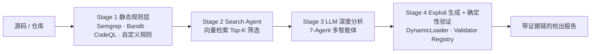

<div align="center">


# 🔒 HOS-LS

## AI 生成代码安全扫描 · 静态规则 + LLM 多智能体混合引擎

<div style="margin: 8px 0;">


<a href="https://www.gnu.org/licenses/agpl-3.0"></a>

</div>

**简体中文** · 面向 AI 生成代码的「静态规则 + 大模型多智能体」混合漏洞扫描系统

</div>

---

## ✨ 核心亮点

<table align="center" style="width:100%; border-collapse:separate; border-spacing:8px; background:transparent;">
  <tr>
    <td style="border:1px solid #30363d; border-radius:12px; background:#0d1117; padding:16px; width:33%; text-align:center;">
      <div style="font-size:28px;">🧪</div>
      <b>确定性验证</b>
      <p style="color:#8b949e; font-size:13px; margin:6px 0 0;">每个检出带证据链（行号 / AST 污点 / 验证状态），不依赖 LLM 自评</p>
    </td>
    <td style="border:1px solid #30363d; border-radius:12px; background:#0d1117; padding:16px; width:33%; text-align:center;">
      <div style="font-size:28px;">🏗️</div>
      <b>三级 SAST→AI Cascade</b>
      <p style="color:#8b949e; font-size:13px; margin:6px 0 0;">Semgrep/bandit 快扫 → CodeQL 深扫（硬检出，0 AI token）→ AI 盲区</p>
    </td>
    <td style="border:1px solid #30363d; border-radius:12px; background:#0d1117; padding:16px; width:33%; text-align:center;">
      <div style="font-size:28px;">🤖</div>
      <b>7-Agent 深度分析</b>
      <p style="color:#8b949e; font-size:13px; margin:6px 0 0;">LangGraph 编排 · 上下文 → 理解 → 枚举 → 验证 → 攻击链 → 对抗 → 裁决</p>
    </td>
  </tr>
  <tr>
    <td style="border:1px solid #30363d; border-radius:12px; background:#0d1117; padding:16px; text-align:center;">
      <div style="font-size:28px;">📚</div>
      <b>RAG + CVE 知识</b>
      <p style="color:#8b949e; font-size:13px; margin:6px 0 0;">BM25 + 向量混合检索，NVD / ExploitDB 集成，CWE 专项指引</p>
    </td>
    <td style="border:1px solid #30363d; border-radius:12px; background:#0d1117; padding:16px; text-align:center;">
      <div style="font-size:28px;">🌍</div>
      <b>多语言支持</b>
      <p style="color:#8b949e; font-size:13px; margin:6px 0 0;">Python / JS / TS / Java / C / C++ / Go / Rust</p>
    </td>
    <td style="border:1px solid #30363d; border-radius:12px; background:#0d1117; padding:16px; text-align:center;">
      <div style="font-size:28px;">💰</div>
      <b>成本可控</b>
      <p style="color:#8b949e; font-size:13px; margin:6px 0 0;">分层扫描 + 早停 + 响应缓存，实测约 1/5 理论费用；内置预估命令</p>
    </td>
  </tr>
</table>

---

## 🏗️ 四阶段分层架构


```mermaid
graph LR
    A[源码 / 仓库] --> B[Stage 1 静态规则层<br/>Semgrep · Bandit · CodeQL · 自定义规则]
    B --> C[Stage 2 Search Agent<br/>向量检索 Top-K 筛选]
    C --> D[Stage 3 LLM 深度分析<br/>7-Agent 多智能体]
    D --> E[Stage 4 Exploit 生成 + 确定性验证<br/>DynamicLoader · Validator Registry]
    E --> F[带证据链的检出报告]
```

> **设计要点**：静态层快速召回候选 → Search Agent 限制深度分析范围 → 多智能体语义判断 → **确定性执行器**验证（不依赖 LLM 自评）。分层扫描将昂贵的 AI 调用严格限制在候选子集，单文件 AI 分析约 130–160s vs 静态层约 5.3s（实测 25–30 倍差距）。

---

## 🚀 快速开始

### 1️⃣ 安装

```bash
# Linux / macOS
./install.sh

# Windows
install.bat

# 或直接使用 Poetry / pip
poetry install
# pip install -r requirements.txt
```

安装后可用 `hos-ls` 命令（`python -m src.cli.main` 亦可）。

### 2️⃣ 配置 API Key（环境变量模式，**切勿硬编码到配置文件**）

```bash
# Windows
set DEEPSEEK_API_KEY=sk-your-key-here

# Linux / macOS
export DEEPSEEK_API_KEY=sk-your-key-here
# 或统一变量名：export HOS_LS_AI_API_KEY=sk-your-key-here
```

配置文件（`hos-ls.yaml` 等）中的 `api_key` 保持为空字符串，运行时从环境变量读取：

```yaml
ai:
  provider: deepseek
  model: deepseek-v4-flash
  api_key: ""   # ← 留空，从 HOS_LS_AI_API_KEY / DEEPSEEK_API_KEY 读取
```

### 3️⃣ 运行扫描

```bash
# Pure-AI 模式（7-Agent 深度分析，推荐）
hos-ls scan . --pure-ai

# 指定配置文件（cascade 等优化门）
hos-ls -c hos-ls-opt.yaml scan . --pure-ai

# 生成 HTML 报告
hos-ls scan . --pure-ai --format html --output report.html

# 只测前 10 个文件（冒烟）
hos-ls scan . --pure-ai --test 10
```

### 4️⃣ 成本预估（扫描前先算账）

```bash
# 预估目录内文件的 token / 费用并查询余额（默认按缓存未命中价 = 费用上界）
hos-ls estimate ./src --provider deepseek --model deepseek-v4-flash
```

> 已按实测校准（10+50 样本双侧均值 70,807 token/文件，误差 ±6%）；实际扣费受缓存命中折扣影响，通常约为预估的 **1/5**。

---

## 🤖 7-Agent 深度分析

| Agent | 名称 | 职责 | 验证状态 |
|:---:|------|------|:---:|
| 0 | 上下文构建 | 构建代码上下文、分析文件依赖 | ✅ |
| 1 | 代码理解 | 深度理解代码逻辑、分析数据流 | ✅ |
| 2 | 风险枚举 | 枚举候选风险点、生成风险信号 | ✅ |
| 3 | 漏洞验证 | 代码级验证、判断攻击路径可行性 | ✅ |
| 4 | 攻击链分析 | 分析漏洞关联、构建攻击路径 | ✅ |
| 5 | 对抗验证 | 对抗性测试、验证漏洞可利用性 | ✅ |
| 6 | 最终裁决 | 综合决策、确定漏洞最终状态 | ✅ |

- **验证稳定性**：Agent-3 验证覆盖率 ≥50%，不足时自动串行；Agent-3 CONFIRMED 优先于 Agent-6 REJECTED。
- **信号状态机**：风险信号 `NEW → REFINED → ACCEPTED / REJECTED`。
- **Token 跟踪**：每个 Agent 执行后记录 token 用量，供成本分析与优化。

---

## 🏭 三级 SAST → AI Cascade（OPT-SASTR）

`hos-ls-opt.yaml` 默认开启的深度前置过滤流水线，把「规则召回 → 深度分析 → AI 兜底」做成闭环：

```yaml
sast_prefilter:
  enabled: true
  mode: cascade        # cascade / hard-first / skip / evidence-only / off
  skip_ai_if_no_hits: false
  inject_evidence: true
  backends: ["codeql", "semgrep", "bandit"]
  codeql_pack_dir: "envs/codeql-packs"
  semgrep_rules_dir: "envs/semgrep-rules/python"
```

| 层 | 引擎 | 作用 | 成本 |
|:---:|------|------|------|
| S1 | Semgrep / Bandit | 全仓快扫，召回候选 | 免费 |
| S2 | **CodeQL** | 全仓建库 + 安全套件深扫，命中 → **硬检出**（免 AI） | 免费 |
| S3 | AI 7-Agent | 候选验证 + 静态盲区兜底 | 仅此层计费 |

> **实测**（仓库级，9 对 RepoPairBench 样本）：CodeQL 对 **5 个目标文件硬命中**（path-injection / url-redirection 等），其中 `d873de7f`、`ee76e0c9` 是函数级 AI 与 DREA 均漏检的盲区样本——**硬检出与 AI 检出互补**。

环境工具链（独立于系统环境，可维护、可重建）：

```
envs/
├── sast-venv/          # semgrep + bandit（requirements-sast.txt）
├── codeql/             # CodeQL CLI（2.26.x 独立二进制）
├── codeql-packs/       # codeql/python-queries 查询包
├── semgrep-rules/      # 社区规则集（python 337 条）
└── scripts/            # install-codeql.ps1 / pull-semgrep-rules.ps1
```

---

## 🧪 确定性验证与证据链

HOS-LS 的验证闭环 **不依赖 LLM 自评**，而是由确定性执行器完成：

| 组件 | 作用 |
|------|------|
| **DynamicLoader** | 动态加载 `dynamic_code/validators/` 下的验证器 |
| **AIPOCGenerator** | 自动生成泛化 POC 验证脚本 |
| **Validator Registry** | 验证器注册表，支持热更新与自定义 |
| **InputTracer** | 输入可控性 / 污点传播确定性追踪 |
| **AST 证据（M4）** | 机器计算的污点 / 可达性预验证（配置门默认关） |

**验证流程**：`扫描报告 → 选择验证策略 → 加载验证器 → 执行验证 → 标记 真实漏洞 / 条件性风险 / 误报 / 需复核`。

> 每个 CONFIRMED 检出均附带**确定性证据链**（文件路径 + 行号 + 代码片段 + 验证状态），可独立核验。

---

## 📊 实测结果（RepoPairBench，Python 漏洞-修复对）

> 评测集：DREA 自建 RepoPairBench（100 对，2021–2025 CVE，48 CWE 类别）。模型：deepseek-v4-flash。口径与样本 ID 全部公开可追溯。

<table align="center" style="width:100%; border-collapse:separate; border-spacing:8px; background:transparent;">
  <tr>
    <td style="border:1px solid #238636; border-radius:12px; background:#0d1117; padding:14px; text-align:center; width:25%;">
      <div style="font-size:24px; color:#3fb950; font-weight:bold;">42.0%</div>
      <div style="color:#8b949e; font-size:12px;">vul CONFIRMED（n=50）</div>
    </td>
    <td style="border:1px solid #238636; border-radius:12px; background:#0d1117; padding:14px; text-align:center; width:25%;">
      <div style="font-size:24px; color:#3fb950; font-weight:bold;">54.0%</div>
      <div style="color:#8b949e; font-size:12px;">高危识别口径（n=50）</div>
    </td>
    <td style="border:1px solid #238636; border-radius:12px; background:#0d1117; padding:14px; text-align:center; width:25%;">
      <div style="font-size:24px; color:#3fb950; font-weight:bold;">28.0%</div>
      <div style="color:#8b949e; font-size:12px;">patched 误报（n=50）</div>
    </td>
    <td style="border:1px solid #238636; border-radius:12px; background:#0d1117; padding:14px; text-align:center; width:25%;">
      <div style="font-size:24px; color:#3fb950; font-weight:bold;">26.0%</div>
      <div style="color:#8b949e; font-size:12px;">Pair-Correct 13/50</div>
    </td>
  </tr>
</table>

### 与裸 LLM 同台受控对比（10 样本，同模型 deepseek-v4-flash）

| 工具 | 检出（vuln） | 误报（patched） | 说明 |
|------|:---:|:---:|------|
| 裸 LLM 零样本 | 9/10 | **9/10** | 高召回但工程上不可用 |
| **HOS-LS** | **8/10** | **3/10** | 多 Agent + 确定性验证闭环，误报压缩三分之二 |

### 与最新 AI SAST 论文的诚实定位

| 系统 | 评测集 | Pair-Correct | 说明 |
|------|--------|:---:|------|
| **HOS-LS（本工作）** | RepoPairBench 50 | **26.0%** | 函数级 + 单轮 + 确定性验证 |
| DREA 函数级基线 | RepoPairBench 100 | 19–26% | 对齐其上界（同数据同 API，真可比） |
| DREA 完整管线 | RepoPairBench 100 | 30–42% | 仓库级 + 多轮探索，设定不同 |
| AEGIS | PrimeVul 435 对 | 28.0%（122/435） | C/C++ + V3.1，评测集/模型不同 |
| VulAgent | PrimeVul 435 对 | 26.6% | 百分比口径 |

**结论**：同设定（函数级）下对齐 DREA 基线上界；真实优势在**确定性证据链**（DREA 自曝 26–55% 真阳性为 Lucky Hits）、**误报率**（28% vs 裸 LLM 90%）与**同数据同 API 可比性**。不笼统声称"全面更高"——口径透明是本项目默认能力。

---

## 🔬 评测与复现（bench-runs）

统一的优化评测入口 `hosls-eval/opt_eval.py`：

```bash
# 统一口径：CONFIRMED / 识别（CONFIRMED 或 high/critical）/ patched 误报 / token
python hosls-eval/opt_eval.py subset <config> <mode> <N> [workers]   # 子集（mode=vuln|patched）
python hosls-eval/opt_eval.py full <config> <mode> [workers]         # 全量 100
python hosls-eval/opt_eval.py multi <config> <mode> <N> [rounds]     # 多轮并集协议（对齐论文表 8）
python hosls-eval/opt_eval.py repo <config> [pairs上限]              # 仓库级评测（父 commit 快照）
python hosls-eval/opt_eval.py summary <results.json>                 # 聚合统计
python hosls-eval/opt_eval.py ledger <results.json> <tag>            # 追加台账
```

- **仓库级评测**：`git worktree` 检出漏洞父 commit，保留仓库上下文扫描（对齐 DREA RepoPairBench 设定）。
- **多轮并集**：漏检样本最多重跑 `rounds` 轮取并集，记录 seed 与轮次明细。
- **三级 cascade 分层测量**：`opt_eval.py cascade <dir> <out.json>`（0 AI token）。

---

## ⚙️ 配置参考

配置文件：`hos-ls.yaml`（基线）/ `hos-ls-opt.yaml`（优化门，默认 cascade）/ `hos-ls-opt-m4.yaml`（AST 证据变体）/ `hos-ls-opt-sast.yaml`（cascade 同构变体）。通过 `-c` 选择：

```yaml
# hos-ls-opt.yaml（节选）
ai:
  provider: deepseek
  model: deepseek-v4-flash
  api_key: ""                    # 环境变量模式
  temperature: 0.0               # 确定性：降低 2→1→0 波动
  max_tokens: 4096
  timeout: 60
  allow_fallback: false          # 禁用回退链，只使用 DeepSeek

  # [OPT] 优化门（A/B 可消融）
  ast_evidence_enabled: false    # M4 AST/污点确定性证据
  cwe_guidance_enabled: false    # M7 CWE 专项指引
  deterministic_promote_enabled: true  # Agent-3 CONFIRMED + 高危 → 覆盖 Agent-6 保守裁决
  cpg_context_enabled: true      # CPG 跨文件被调函数注入

scan:
  max_workers: 4
  incremental: true
  cache_enabled: true
```

**配置优先级**：命令行参数 > 环境变量 > 配置文件 > 默认配置。

---

## 📋 常用命令速查

<table style="width:100%; border-collapse:separate; border-spacing:8px; background:transparent;">
  <tr>
    <td style="border:1px solid #30363d; border-radius:10px; background:#0d1117; padding:10px; width:50%;">
      <code>hos-ls scan . --pure-ai</code><br/><span style="color:#8b949e; font-size:12px;">纯 AI 深度分析</span>
    </td>
    <td style="border:1px solid #30363d; border-radius:10px; background:#0d1117; padding:10px; width:50%;">
      <code>hos-ls -c hos-ls-opt.yaml scan .</code><br/><span style="color:#8b949e; font-size:12px;">带 cascade 优化门</span>
    </td>
  </tr>
  <tr>
    <td style="border:1px solid #30363d; border-radius:10px; background:#0d1117; padding:10px;">
      <code>hos-ls scan . --test 10</code><br/><span style="color:#8b949e; font-size:12px;">冒烟（前 10 文件）</span>
    </td>
    <td style="border:1px solid #30363d; border-radius:10px; background:#0d1117; padding:10px;">
      <code>hos-ls scan . --resume</code><br/><span style="color:#8b949e; font-size:12px;">断点续扫</span>
    </td>
  </tr>
  <tr>
    <td style="border:1px solid #30363d; border-radius:10px; background:#0d1117; padding:10px;">
      <code>hos-ls scan . --truncate-output --max-duration 3600</code><br/><span style="color:#8b949e; font-size:12px;">时长截断</span>
    </td>
    <td style="border:1px solid #30363d; border-radius:10px; background:#0d1117; padding:10px;">
      <code>hos-ls scan . --format json --output out.json</code><br/><span style="color:#8b949e; font-size:12px;">JSON 报告</span>
    </td>
  </tr>
  <tr>
    <td style="border:1px solid #30363d; border-radius:10px; background:#0d1117; padding:10px;">
      <code>hos-ls estimate ./src</code><br/><span style="color:#8b949e; font-size:12px;">费用预估 + 余额查询</span>
    </td>
    <td style="border:1px solid #30363d; border-radius:10px; background:#0d1117; padding:10px;">
      <code>hos-ls scan . --tool-chain semgrep,trivy,gitleaks</code><br/><span style="color:#8b949e; font-size:12px;">工具链扫描</span>
    </td>
  </tr>
</table>

支持报告格式：**HTML**（交互式）/ **PDF** / **JSON** / **CSV** / **Markdown**。

---

## ❓ FAQ

<details>
<summary><b>Pure-AI 模式与完整版有什么区别？</b></summary>

Pure-AI 模式是轻量级纯 AI 深度语义解析模式，无需 Neo4j / FAISS / PostgreSQL 等重型组件，适合日常开发与快速扫描；完整版提供 RAG 知识库、CVE 集成、攻击链分析等全功能，适合深度审计与大型项目。

</details>

<details>
<summary><b>为什么检出必须带证据链？</b></summary>

当前 LLM 漏洞检测普遍存在「标签对、推理错」的 *Lucky Hits*（DREA 论文自曝 26–55% 真阳性为此类）。HOS-LS 的 CONFIRMED 要求验证链完整（行号 / AST 污点 / 验证状态）才计入——把确定性验证做成**默认能力**而非事后加分项。

</details>

<details>
<summary><b>如何控制成本？</b></summary>

1. 分层扫描：静态层召回 + Search Agent Top-K 限制 AI 分析范围；
2. `hos-ls estimate` 扫前预估（按缓存未命中价 = 费用上界）；
3. 响应缓存（diskcache）+ DeepSeek 缓存命中折扣，实际扣费约为预估 1/5；
4. cascade 模式下 CodeQL 硬检出文件 0 AI token。

</details>

<details>
<summary><b>如何切换 AI 模型 / 提供商？</b></summary>

```yaml
ai:
  provider: deepseek        # deepseek / aliyun / openai / anthropic
  model: deepseek-v4-flash
  allow_fallback: false     # true 允许自动切换其他 provider
```

</details>

<details>
<summary><b>如何降低误报？</b></summary>

上下文调用链追踪、类型安全感知（如 Integer 在 LIMIT 中安全）、框架安全模型（MyBatis-Plus 等封装理解）、输入可控性分析（验证攻击前置条件）、以及最终确定性验证。

</details>

<details>
<summary><b>扫描中断了怎么办？</b></summary>

```bash
hos-ls scan . --resume                      # 断点续扫
hos-ls scan . --truncate-output --max-duration 3600   # 到时截断并输出报告
```

截断模式与续传模式不能同时启用。

</details>

---

## 🖥️ 系统兼容性

| 组件 | 最低版本 | 推荐版本 |
|------|:---:|:---:|
| Python | 3.8 | 3.11+ |
| 操作系统 | Windows 10 / Linux / macOS | Windows 11 / Ubuntu 22.04 |
| PostgreSQL | 12 | 15+ |
| Neo4j | 4.4 | 5.x |
| RAM | 8GB | 16GB+ |
| GPU | 可选 | CUDA 兼容显卡 |

---

## 🤝 贡献与许可

- **贡献**：Fork → 分支 → 提交 → PR。贡献代码即表示同意 [DCO](https://developercertificate.org/)，详见 [CONTRIBUTING.md](CONTRIBUTING.md)。
- **测试**：`pytest`（32 个测试用例）+ `flake8`（致命错误阻塞）。
- **License**：本项目采用 **GNU AGPLv3**（OSI 认证的强互惠许可证）。作为 SaaS / 云服务对外提供服务时，必须向所有用户公开完整的服务端源码；商业使用请联系维护者。

<a href="https://www.gnu.org/licenses/agpl-3.0"></a>

---

<div align="center">

⭐️ 如果您觉得 HOS-LS 有用，请给我们一个 Star！

**GitHub**: [github.com/lxcxjxhx/HOS-LS](https://github.com/lxcxjxhx/HOS-LS) · **Email**: aqfxz_zh@qq.com

</div>
