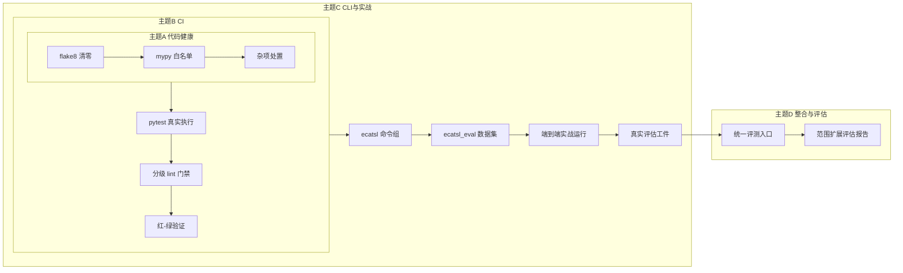

# Technical Design: ECATSL Operationalization and Bench Integration

## Overview

本设计将已完成的 ECATSL 实现（`src/ecatsl/`，PR #63）推向可运行的产品形态：先清偿代码健康与 CI 债务（主题 A/B），再通过 CLI 暴露 `ECATSLService`（主题 C-1），在真实 VulnGym/SecureVibeBench 数据上构建评估数据集并产出第一份真实评估报告（主题 C-2/C-3），最后整合 PureAI 分数卡并出具范围扩展可行性评估（主题 D）。实现顺序即依赖顺序：A → B → C → D，每主题独立可交付、可验证。

## Background（工作区盘点结论，设计依据）

- `src/ecatsl/` 共 19 个模块 ≈9465 行；`ECATSLService`、`dataset_release.build_release()`、`evaluation.build_evaluation_report()`、`reporting.build_cost_report()` 均已实现并有 property/integration 覆盖，但**没有 CLI 入口**——唯一可达方式是测试代码。
- `.github/workflows/ci.yml` pytest 步骤为 `pytest --collect-only`（第 48 行附近）：CI 从未执行过任何测试。flake8 分两级：blocking 选择器 `E9,F63,F7,F82` 与 informational `--extend-ignore=... || true`；mypy 为 `mypy . || echo`（continue-on-error）。
- `flake8 src` 当前 680 项；`mypy src` 290 项（ECATSL 内 29 项 pre-existing，触及文件已清零）。
- VulnGym `entries.jsonl`：408 条，`vuln_ids` 为 CVE/GHSA（**无 CWE 字段**）；L1 分类中 `命令注入`(14)/`代码注入`(21)/`SSRF`(9) 与 ECATSL 的 CWE-78/918 映射直接相关；`project` 字段显示主体为 openclaw(188)/n8n(52)/Flowise(39) 等 JS/TS 生态，Python 生态样本需按 `repo_url`/`trace` 字段进一步甄别（预估 >=60 可达，验证阶段确认）。
- 既有分数卡流程 `bench/benchmark.py`：子进程扫描 `--pure-ai` 模式，ThreadPoolExecutor（Windows 沙箱兼容），输出 `bench/artifacts/<tag>/scorecard.json`，评测集默认在仓库外 `hosls-eval/`。
- 未跟踪杂项：`_pr_body_*.md`(2)、`*.rar`(1)、`scripts/mcp_*`(3)、`reasonix.toml`、spec 三件套(3) + `.config.kiro`。

## Architecture



### 组件落点（严格复用既有实现）

| 新增 | 位置 | 复用的既有实现 |
|---|---|---|
| `ecatsl` Click 命令组 | `src/cli/commands/ecatsl_cmd.py`（新文件） | `ECATSLService`、`ECATSLConfig`、`dataset_release`、`evaluation`、`reporting` 全部决策层函数 |
| 数据集构建器 | `src/ecatsl/eval_dataset.py`（新文件，纯函数层） | `dataset_release.build_release()`、`load_vulngym_entries()`、`BenchmarkSample` 模型 |
| 实战样本 manifest | `bench/datasets/ecatsl_eval/manifest.json` + 清单（哈希/标签，大文件不入库） | VulnGym `entries.jsonl`（只读）、SecureVibeBench 清单（只读） |
| 统一评测入口 | `bench/run_evaluation.py`（新文件） | `bench/benchmark.py` 全部能力（子进程调用，不 import 内部函数） |
| 评估运行编排 | `src/ecatsl/eval_runner.py`（新文件） | `ECATSLService` 既有分析管道、`artifact_repository` 工件回读 |
| 文档产出 | `docs/ecatsl-run-report.md`、`docs/ecatsl-scope-expansion-assessment.md` | 5.4/7.x 的实证数据 |

**不新增**：扫描器、目录导入器、静态分析 runner、第二套评估计算（评估数字一律来自 `evaluation.py`/`reporting.py` 既有函数）。

## Components and Interfaces

### 1. `hos-ls ecatsl` 命令组（Req 3）

```python
# src/cli/commands/ecatsl_cmd.py（骨架示意）
@cli.group()
def ecatsl(): """Evidence-Constrained Taint Specification Learning（仅完整受支持静态路径可确认）"""

@ecatsl.command()
@click.argument("target", type=click.Path(exists=True))
@click.option("--config", "-c", ...)          # ECATSLConfig 覆盖（YAML/TOML）
@click.option("--json/--table", "as_json", default=False)
@click.option("--database", "-d", ...)        # 默认复用现有 SQLite 目录路径
def analyze(target, config, as_json, database): ...

@ecatsl.command()
@click.option("--manifest", required=True)    # bench/datasets/ecatsl_eval/manifest.json
def dataset(manifest): ...

@ecatsl.command()
@click.option("--manifest", required=True)
@click.option("--results", required=True)     # analyze 批量输出目录
def evaluate(manifest, results): ...

@ecatsl.command()
@click.option("--evaluation", required=True)
@click.option("--experiment", default=None)   # 缺省 → 无 claim，missing_evidence 完整
def report(evaluation, experiment): ...
```

设计要点：

- **配置门禁**：`analyze` 的 `--config` 经 `ECATSLConfig`（pydantic，extra=forbid）解析；任何非法值 raise `click.UsageError`（exit 2）。CLI **不暴露** `confirmation_provider` 以外的确认相关选项，且该值仅接受 `static_adapter`（Req 3.4）。
- **批量运行**：`analyze` 对目录目标逐文件调用 `ECATSLService` 既有分析链；单文件异常捕获为终端 `FAILED`/`UNAVAILABLE` 记录并继续（复用 5.x 失败隔离语义）；结束输出 JSON 摘要（confirmed/unconfirmed/failed 计数、finding 标识、telemetry 汇总）。
- **exit code**：0 完成（含零 findings）、1 部分工件落库失败（`missing_metadata`/`AuditFailureRecord` 存在）、2 用法/配置错误。
- **时钟注入**：批量运行使用可注入时钟（沿用 8.2 smoke 的 `_FrozenDatetime` 模式在生产侧改为 `default_clock` 参数），保证 Req 5.5 幂等重放。

### 2. 评估数据集构建器（Req 4）

`src/ecatsl/eval_dataset.py` 纯函数：

- `build_manifest(entries: list[dict], source: str) -> EvalManifest`：从 VulnGym 行筛选 Python 生态样本（按 `repo_url`/`trace`/`project` 字段判定的确定性规则，规则本身写入 manifest 便于审计），保留 `vuln_ids`（CVE/GHSA）原值，CWE 映射允许 `null` 并计 `unmapped_count`。
- `emit_release(manifest_path: Path) -> tuple[BenchmarkManifest, DataQualityReport]`：读取 manifest → 逐样本哈希校验 → `build_release()`（复用 9.1–9.11 全部语义）→ 幂等重放产出逐字节相同 JSON（时钟字段由注入时钟固定）。
- SecureVibeBench 补充样本走同一 manifest 格式，`source` 字段区分来源；总配对样本 < 60 时 `Data_Quality_Report` 记 `insufficient_samples` 并如实输出实际数（Req 4.4 不虚增）。
- 子模块 `bench/datasets/VulnGym` 只读；派生物仅写 `bench/datasets/ecatsl_eval/` 与运行输出目录。

### 3. 实战运行编排（Req 5）

`src/ecatsl/eval_runner.py`：

```
for sample in release.samples:
    result = service.analyze(sample.workdir)     # 既有管道，含 discovery→adapter→confirmation
    classifications[sample.id] = result.verified_status
report = build_evaluation_report(manifest, quality, classifications, telemetry)
cost   = build_cost_report(report)
```

- 分类回填直接复用 7.2 的 `confusion_matrix()` 语义（仅 `CONFIRMED` 计 predicted）。
- 工件 JSON 落 `bench/artifacts/ecatsl/<tag>/`（`evaluation_report.json`、`cost_report.json`、`data_quality_report.json`、`summary.json`），提交入库作为第一份真实评估存档（Req 5.2）。
- 实测统计（样本数/失败分布/耗时/token）汇总进 `docs/ecatsl-run-report.md`（Req 5.4）。

### 4. 统一评测入口（Req 6）

`bench/run_evaluation.py`（argparse，风格与 `bench/benchmark.py` 一致）：

```
python -m bench.run_evaluation --suite ecatsl --tag <tag> [--with-pureai]
```

- ECATSL 路径：调用 `eval_runner`（同进程）产工件 → 写 `bench/artifacts/<tag>/ecatsl/`。
- PureAI 路径（`--with-pureai`）：以子进程复用 `bench/benchmark.py`（输出格式/路径不变），在 `scorecard.json` 增加可选字段 `ecatsl_manifest_id` 交叉引用（Req 6.2 的"仅新增字段"边界）。
- `--with-pureai` 缺省关闭，ECATSL-only 模式零网络依赖（Req 6.4）。

### 5. CI 门禁改造（Req 1.5 / Req 2）

```yaml
# ci.yml 关键变更
- run: pytest tests/unit/ecatsl tests/integration/ecatsl tests/unit/core -q   # 真实执行，blocking
- run: pytest tests -q                                                        # full-tests job（非 blocking check）
- run: flake8 src/ecatsl tests --count --max-line-length=120                  # blocking（清零后）
- run: flake8 src --count ... --statistics || true                            # informational，输出计数
- run: mypy --ignore-missing-imports .                                        # 白名单驱动，0 白名单外错误
```

mypy 白名单落 `pyproject.toml` `[tool.mypy]` per-module overrides（每条带 `# reason:` 注释），目标：白名单外 0 项；后续循环逐目录从白名单移除。

## Data Models

- 无新持久化 schema；全部复用 `src/ecatsl/models.py` 既有不可变工件（`BenchmarkManifest`/`DataQualityReport`/`EvaluationReport`/`CostReport`/`OptimizationExperiment`/`AuditFailureRecord` 等，均已在 task-1.1 reuse inventory 注册）。
- 新增两个纯 Python 数据类（`eval_dataset.py` 内，不进 registry）：`EvalSampleEntry`（manifest 行：sample_id、source、repo_url、vuln_ids、label、cwe_map、workdir、hash）与 `EvalManifest`（entries、source_release、build_command、built_at、filter_rules）。

## Correctness Properties（本循环新增属性测试）

- **Property P1（数据集构建确定性）**：生成 manifest 输入扰动（行序、重复、坏哈希），断言 `emit_release` 输出与输入行序无关、坏哈希行恒被排除且原因精确、<60 配对时 `insufficient_samples` 如实出现。（验证 Req 4.1–4.4）
- **Property P2（CLI 配置门禁封闭性）**：生成非法 CLI 配置（越界 CWE、brittle routes、confirmatory 误配、未知 adapter），断言 exit 2、无任何仓库写入、错误消息含违规字段名。（验证 Req 3.2/3.4）
- **Property P3（评估回填一致性）**：生成 verified classifications 扰动，断言 eval_runner 产出与直接调用 `build_evaluation_report()` 的参考结果逐字段一致，且无完成实验时报告恒无 claim。（验证 Req 5.1/5.3）

每个属性 >=100 生成例，标签 `Feature: ecatsl-operationalization-and-bench-integration, Property N`。

## Design Decisions

1. **CLI 为新文件而非改 `scan_cmd.py`**：`scan` 命令已含 30+ 参数且刚修复回滚缺陷，独立 `ecatsl_cmd.py` 避免再次耦合；`src/cli/main.py` 仅加一行注册。
2. **评估编排放 `src/ecatsl/` 而非 `bench/`**：`bench/` 保持"数据与运行脚本"层，编排复用 `ECATSLService` 链路需要库内访问权；`bench/run_evaluation.py` 只做进程级编排。
3. **先 A/B 后 C/D**：主题 C 的 CLI 与实战测试需要干净的 blocking 门禁保护；若无真实 CI，主题 C/D 的每一步都回归"本地自证"状态。
4. **范围扩展只评估不实现**：VulnGym 数据分布（JS 生态为主、无 CWE 字段）说明扩展方向需要真实运行数据支撑决策，且既有 spec 的 scope 版本化机制允许后续平滑立项——用文档而不是半成品代码承载该决策。
5. **分数卡整合用子进程复用而非 import**：`bench/benchmark.py` 为子进程沙箱兼容设计（Windows 命名管道规避），保持其进程模型不变。

## Risks

- **Python 样本量不足 60**：出现时按 Req 4.4 如实记录并回退 SecureVibeBench 补充；不虚增、不放宽筛选规则凑数。
- **VulnGym 样本的可运行性**：实战样本是历史漏洞 commit 的仓库片段，`analyze` 需要样本能被 InputTracer/SastPrefilter 接受；不可运行样本计入 `Data_Quality_Report` 排除原因，不阻塞其余样本。
- **mypy 白名单蔓延**：白名单每条必须带 reason 注释并在 tasks.md 记录总数，防止"顺手加白"。
- **CI 时长**：真实执行子集（约306 项，预估 <10 min）与全量 job 分离已规避；若超时，子集进一步收窄到 ECATSL 单元+集成。
